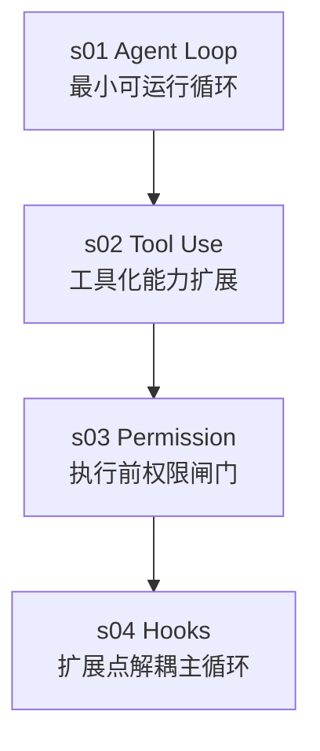

# learn-claude-code-s01-s04-agent-harness学习记录

## Related
- [[learn-claude-code]]
- [[AI Agent]]
- [[Agent Harness]]

## 学习背景
我当前在项目中新增了 workspace 目录用于测试与打印 model 输入输出。
目前已实践到 s04，本笔记用于沉淀 s01 到 s04 的构造步骤和核心思想。

## 一句话总览
s01 到 s04 的主线是：
先让模型可以连续行动（Loop），再让它有可用能力（Tools），再给能力加安全边界（Permission），最后把扩展逻辑从主循环剥离（Hooks）。

## 章节演进图
%%{init: {"flowchart": {"curve": "linear"}} }%%

## s01 Agent Loop
### 解决的问题
模型会给出命令，但不会自己执行，也不会基于执行结果继续下一步推理。

### 核心机制
- 用 while 循环承接多轮模型调用。
- 当 stop_reason 是 tool_use 时：执行工具并把结果喂回模型。
- 当 stop_reason 不是 tool_use 时：结束本轮任务。

### 我理解的关键思想
- Agent Harness 的本质不是“智能”，而是“运行时闭环”。
- 模型负责决策，Harness 负责执行和反馈。
- 后续复杂能力几乎都建立在这个不变内核上。

### 最小心智模型
输入问题 -> 模型决定是否调用工具 -> Harness 执行工具 -> 结果回灌模型 -> 重复直到模型停止。

## s02 Tool Use
### 解决的问题
只有 bash 时，模型需要把意图翻译为命令，成本高、易错、可控性差。

### 核心机制
- 增加专用工具：read_file、write_file、edit_file、glob。
- 引入 TOOL_HANDLERS 分发表，把工具名映射到处理函数。
- 主循环不变，仅把工具执行从硬编码改为按工具名分发。

### 我理解的关键思想
- 扩展工具能力时，优先保持主循环稳定。
- “新增工具”应成为低成本动作：定义 schema + 注册 handler。
- 工具化让模型从“拼命令”转向“表达意图”。

### 设计收益
- 能力边界更清晰。
- 可测试性更好。
- 为后续权限、hook、并发调度打下接口基础。

## s03 Permission
### 解决的问题
有能力后会带来风险，尤其是 bash 和写操作。

### 核心机制
在工具执行前增加权限管线（三道闸门）：
1. 硬拒绝：绝对不允许的高危模式。
2. 规则匹配：基于上下文识别潜在危险操作。
3. 用户审批：命中规则后由人决定是否继续。

### 我理解的关键思想
- 安全不是提示词问题，而是执行前控制问题。
- 权限系统应前置于工具执行路径，而不是事后补救。
- 安全机制要默认可组合，能和后续扩展机制协同。

### 目前局限
- 教学版以简单匹配为主，真实生产需更严谨的解析、策略来源和审计能力。

## s04 Hooks
### 解决的问题
如果每增加一项能力都直接改 agent_loop，循环会快速膨胀且难维护。

### 核心机制
- 建立事件与回调的注册机制：UserPromptSubmit、PreToolUse、PostToolUse、Stop。
- 循环只触发事件，不直接内嵌扩展逻辑。
- s03 的 permission 逻辑迁移为 PreToolUse hook。

### 我理解的关键思想
- 稳定内核 + 可插拔扩展 是 Harness 的可演进结构。
- 把变化留给 hook，把稳定留给 loop。
- 这一步是从“能跑”走向“可维护、可扩展”的分水岭。

### 架构分层（到 s04）
- Core Loop: 负责对话推进与工具调用闭环。
- Tool Layer: 提供可调用能力与分发机制。
- Permission Layer: 在执行前做风险拦截与审批。
- Hook Layer: 在关键生命周期节点注入横切能力。

## 截止 s04 的方法论总结
1. 先保证闭环，再谈能力。
2. 能力增加后，先补边界控制。
3. 复杂性上升时，不要继续堆进主循环，改为事件化扩展。
4. 任何阶段都尽量保持“主路径稳定，扩展点开放”。

## 我当前实践（对应你的进度）
- 已完成：s01 到 s04。
- 已有实验手段：workspace 目录用于工具调用测试与 model I/O 观察。
- 当前收获：已经掌握 Agent Harness 的最小可用骨架与首层工程化思路。

## 下一步学习建议（衔接 s05）
1. 在现有代码里统计一次完整任务的工具调用轨迹（次数、顺序、阻断原因）。
2. 为 PreToolUse 和 PostToolUse 增加统一日志格式，便于后续分析。
3. 进入 s05 时重点关注“计划-执行”分离，观察 Todo 对多步任务稳定性的提升。

## 可复用检查清单
- Loop 是否保持极简且不被业务逻辑污染。
- 新工具是否只需“定义 + 注册”即可接入。
- 所有副作用工具是否都经过权限前置检查。
- 新增横切能力是否通过 hook 注入而不是改循环主干。
- 是否能从日志中重建一次任务执行链路。

## 个人反思
当前前四章最有价值的不是功能数量，而是工程方向：
把 Agent 看成一个可演化系统，而不是一次性脚本。
当这个方向建立起来，后续 s05+ 的能力会自然落在正确位置上。
