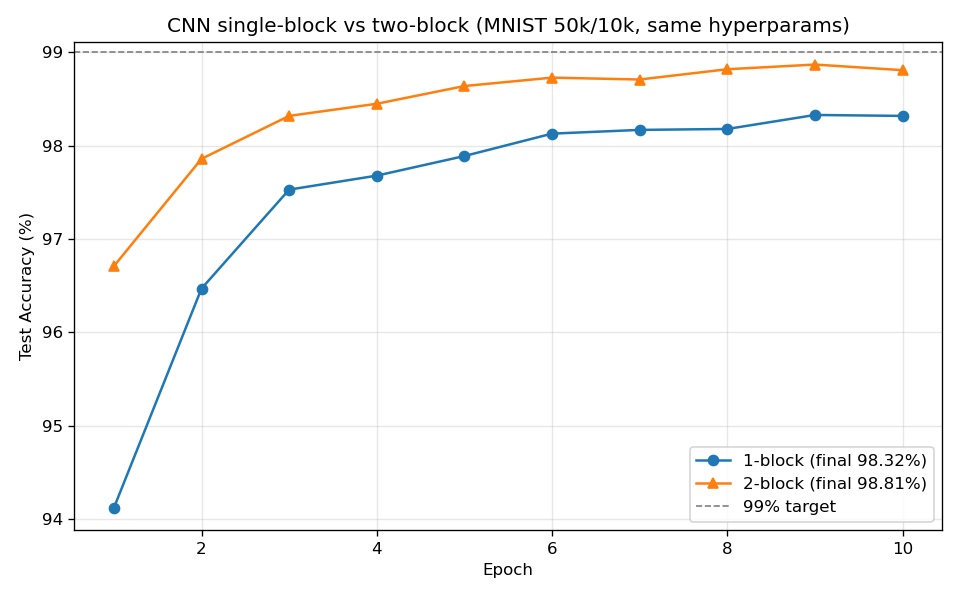
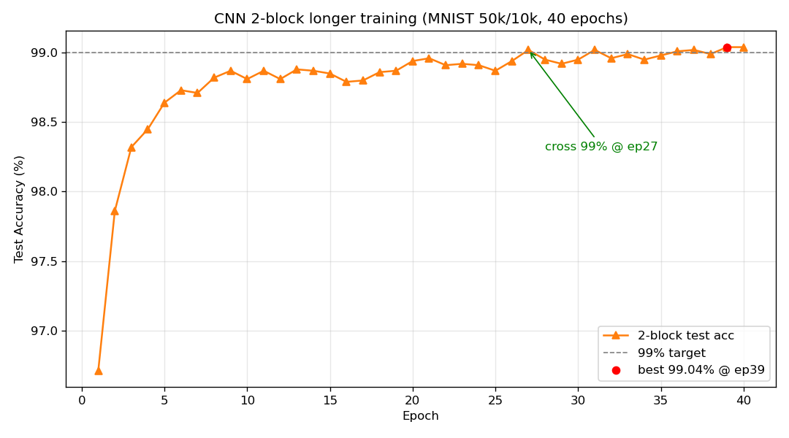
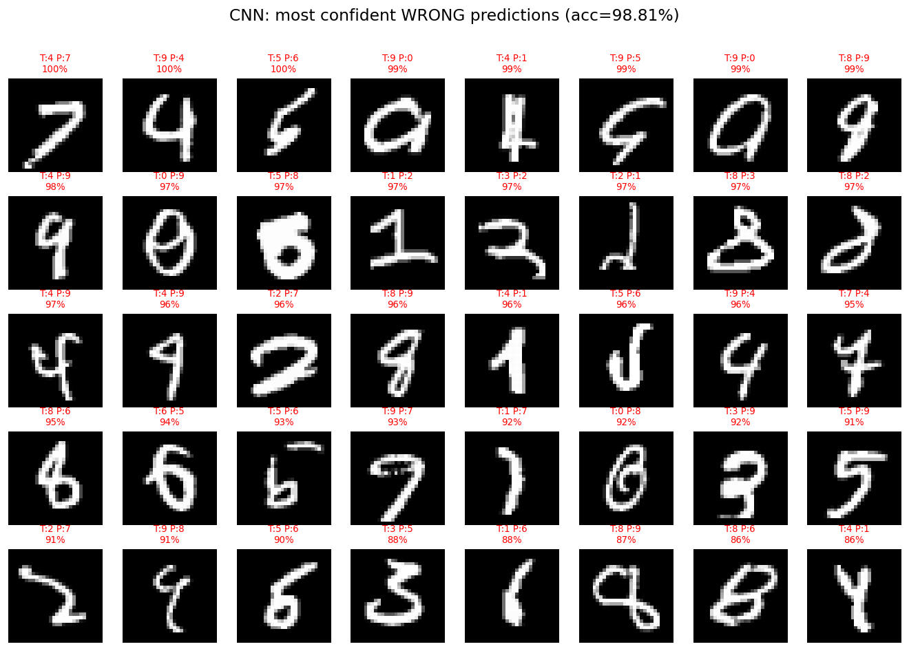
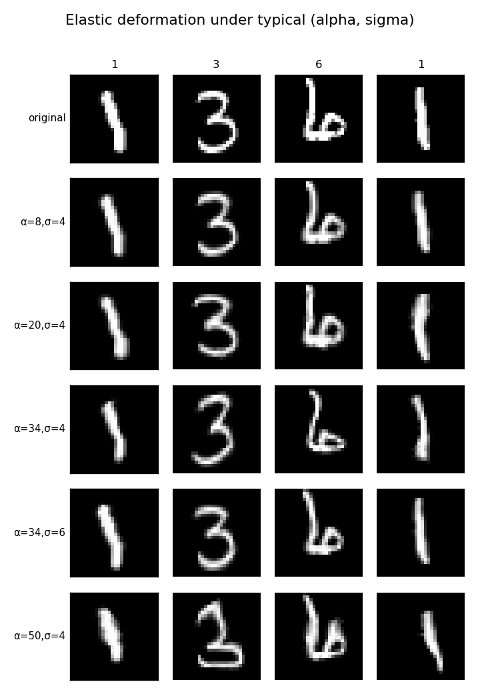
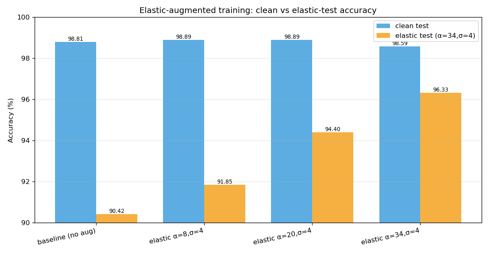
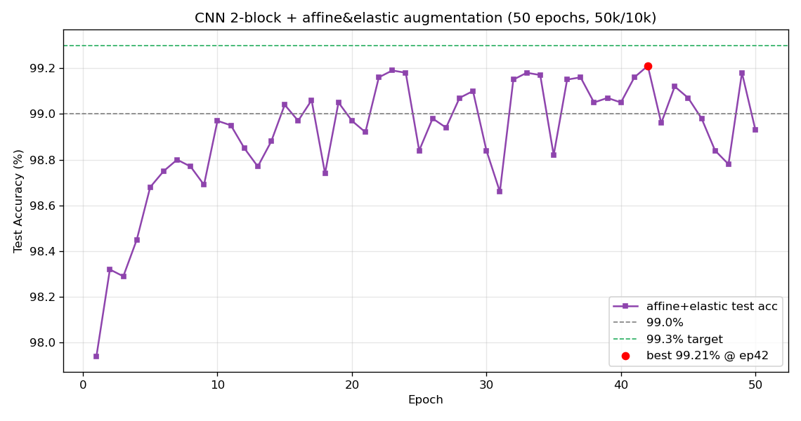
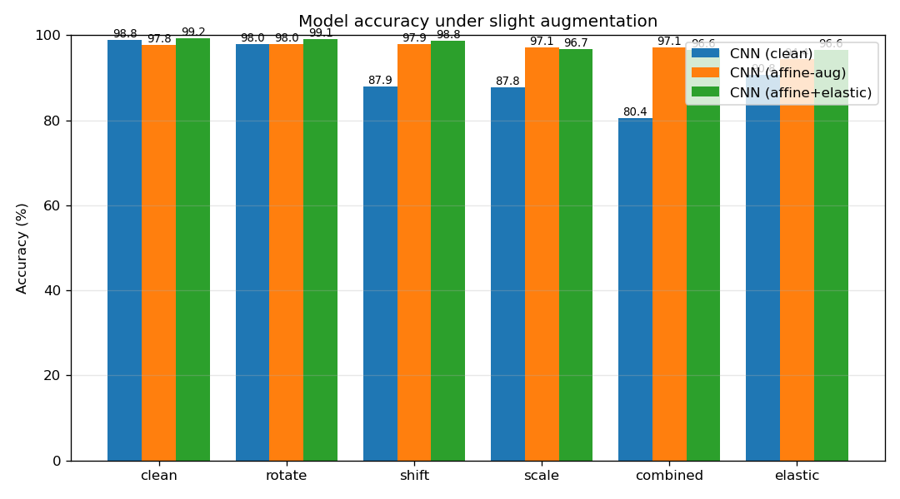
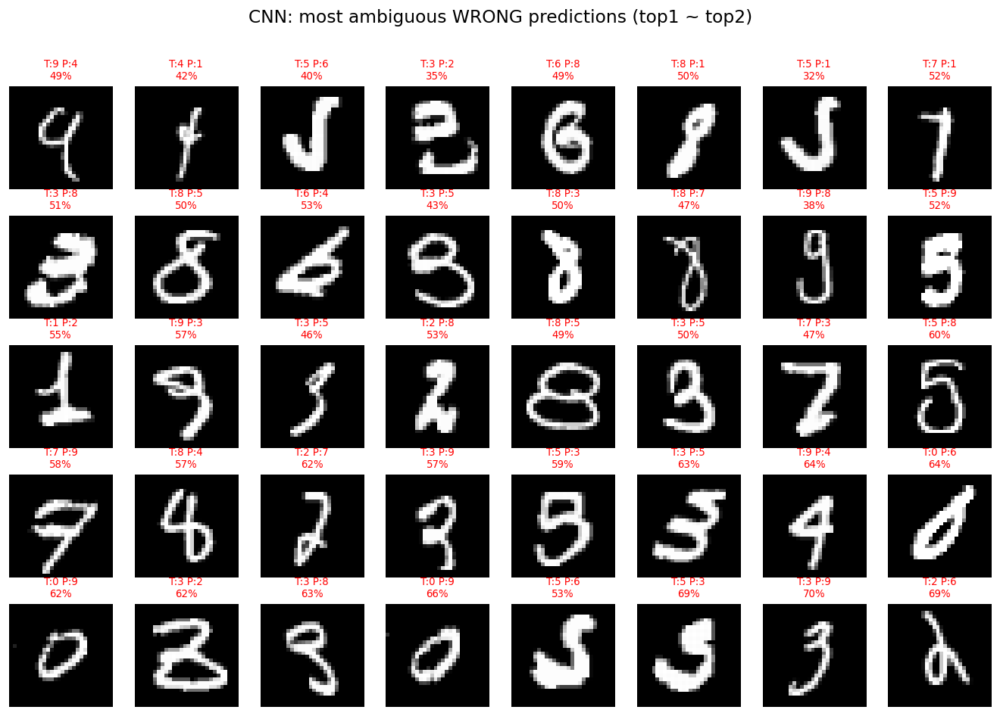

# CNN 手写数字识别与实验 · 2026-06-08（同步更新 2026-06-12）

> [!info] 与 MLP 笔记的分工
> **MLP** 的推导、超参实验、错误分析与增强鲁棒性（全连接视角）已写在：[[mlp-mnist-experiments]]。  
> **本文记录 CNN**：双块结构、**CPU（NumPy）/ GPU（CuPy）**、默认与加长训练结果、单双块对照、**仿射 / 弹性 / 仿射+弹性** 增强与鲁棒性；数字与图表与仓库 **`cnn/README.md`**（2026-06-12 同步）一致。文末含 **附录 A**（卷积概念归纳）与 **附录 B**（本篇修订记录）。

> [!summary] 一页总览
> **实现**：同一套 **`cnn.py`** 可选 `device="cpu"` 或 `device="cuda"`（CuPy）；`load_data` 仍为 NumPy；`predict` / `predict_proba` 仍返回 NumPy。  
> **结构**：`Conv(3×3,F=32)→ReLU→MaxPool → Conv(3×3,F₂=64)→ReLU→MaxPool`（28→14→7）→ Flatten **3136** → FC → Softmax；划分 **前 5 万训练 / 后 1 万测试**。  
> **默认 `train_eval.py`（10 epoch）**：clean **98.81%**（119 / 10000 错）。**`sweep_epochs.py`（40 epoch）**：最佳约 **99.04%**。**仿射+弹性 + 加大容量（64/128，50 epoch）**：clean **99.21%**（仓库当前最高）。  
> **配图**：本目录 **`images/cnn_*.png`**，与 `neuralnetworks/cnn/images/` 定期 `Copy-Item` 同步。

---

## 1. 工程与数据

- 数据集：仓库根 `neuralnetworks/data/mnist.npz`（与 `mlp/` 共用）；在 `cnn/` 下运行，路径 `../data/mnist.npz`。
- 产物：`cnn/images/`（展示图）、`cnn/out/`（权重、报告，可重生成）。

### 1.1 脚本一览（与 README「项目结构」一致）

| 脚本 | 作用 |
|------|------|
| `draw_network_structure.py` | 生成结构示意图 |
| `train_eval.py` | 训练 + 评估 + 错误分析 |
| `compare_blocks.py` | 单块 vs 双块（同划分同超参） |
| `sweep_epochs.py` | 加长 epoch 冲 99%（`CNN_EPOCHS` 可覆盖） |
| `augment_eval.py` | 旋转 / 平移 / 缩放：clean vs aug-trained |
| **`elastic_eval.py`** | 弹性形变 (α,σ) 示例 + clean / elastic 测试对比 |
| **`affine_elastic_push.py`** | 温和仿射 + 弹性叠加，冲 clean 高分（容量/epoch 可配） |
| **`aug_push_robustness.py`** | 多模型在 6 种扰动下的鲁棒性对比（读 `out/` 权重） |

**快速开始（仓库 `cnn/` 下）**：

```bash
python draw_network_structure.py
python train_eval.py
python compare_blocks.py
python sweep_epochs.py
python augment_eval.py
python elastic_eval.py
python affine_elastic_push.py
python aug_push_robustness.py
```

### 1.2 CPU / CUDA

- **`CNN(..., device="cpu")`**：NumPy；**`device="cuda"`**：CuPy（需匹配 CUDA 的 wheel，如 `cupy-cuda12x`）。说明：[CuPy 安装](https://docs.cupy.dev/en/stable/install.html)；可选依赖见仓库 `cnn/requirements-cuda.txt`。
- **`CNN_DEVICE`**：`cpu` / `cuda`，用于 `train_eval.py`、`augment_eval.py` 等。
- **`python cnn.py`**：无参时自动检测 GPU → 有则只跑 GPU 自检，否则只跑 CPU；**`--cuda`** / **`--cpu`** / **`--cuda --cpu`** 见仓库 README。

---

## 2. 网络结构


$$
\text{Input}(1\times28\times28)\to\text{Block1: Conv }3\times3\,(F{=}32)\to\text{ReLU}\to\text{MaxPool}\to\text{Block2: Conv }3\times3\,(F_{2}{=}64)\to\text{ReLU}\to\text{MaxPool}\to\text{Flatten}(7{\times}7{\times}64)\to\text{FC}\to\text{Softmax}
$$

- 卷积：**im2col / col2im**（`CNN._im2col` / `_col2im`，`self.xp`）；same padding；He 初始化。
- 训练默认：`train_eval.py` — Adam `lr=1e-3`（每 epoch ×0.97）、L2 `1e-4`、Dropout `0.05`、`batch_size=512`、**10 epoch**。
- **`two_blocks=False`**：仅一块 Conv→ReLU→Pool（28→14），展平 **14×14×F**，无 `Wc2`。

---

## 3. 训练结果与单 / 双块对照

| 模型 | 测试准确率 | 错误数 |
|---|---|---|
| 优化 MLP（对照） | 97.86% | 214 / 10000 |
| **CNN clean（双块默认 10 epoch）** | **98.81%** | **119 / 10000** |

**单块 vs 双块**（`compare_blocks.py`，CUDA，10 epoch，同超参）：单块约 **98.32%**（168 错），双块 **98.81%**（119 错）；双块 `fc_in` 更小、全连接参数更少，但第二块卷积使推理更慢（量级见 `out/block_comparison_report.txt`）。



**加长 epoch**（`sweep_epochs.py`，40 epoch）：约第 **27** epoch 首次 ≥99%，最佳 **99.04%**（epoch 39）；曲线见下图。






> 完整损失 MAP 推导、反向传播公式与代码行号对照见仓库 **`cnn/README.md`** §3–§5（本文不重复粘贴）。

---

## 4. 旋转 / 平移 / 缩放（`augment_eval.py`）

**CNN (clean)** 与 **CNN (aug-trained)** 结构相同（双块）；MLP 列来自 `mlp/augment_test.py`。下表与 README §8 一致（CUDA，10 epoch）。

| 增强 | CNN (clean) | CNN (aug-trained) | MLP (optimized) |
|---|---|---|---|
| clean | **98.81%** | 97.78% | 97.86% |
| rotate | 97.98% | **97.98%** | 96.94% |
| shift | 87.93% | **97.86%** | 70.17% |
| scale | 87.80% | **97.10%** | 72.46% |
| combined | 80.44% | **97.14%** | 57.54% |


---

## 5. 弹性形变（`elastic_eval.py`，README §8.1）

弹性形变（Simard et al., 2003）：随机位移场 + 高斯平滑 + 强度 α，模拟笔画局部弯曲；与仿射（全局线性）互补。实现见仓库 `scripts/augment.py` 的 `elastic_transform`。

| 训练设置 | clean 测试 | elastic 测试（α=34, σ=4） |
|---|---|---|
| baseline（无增强） | **98.81%** | 90.42% |
| elastic α=8, σ=4 | **98.89%** | 91.85% |
| elastic α=20, σ=4 | **98.89%** | 94.40% |
| elastic α=34, σ=4 | 98.59% | **96.33%** |





> 复现：`CNN_DEVICE=cuda python elastic_eval.py`；报告 `out/cnn_elastic_report.txt`。

---

## 6. 仿射 + 弹性冲刺与鲁棒对比（README §8.2）

**`affine_elastic_push.py`**：batch 内温和仿射（旋转 ±10°、平移 ±2px、缩放 0.9–1.1）+ 弹性（α=10, σ=4），目标在保住 clean 的同时推高准确率。

| 配置 | 容量 F/F2 | epoch | 首次 ≥99.0% | 最佳 clean |
|---|---|---|---|---|
| 无增强 | 32 / 64 | 40 | epoch 27 | 99.04% |
| 仿射+弹性 | 32 / 64 | 45 | epoch 29 | 99.10% |
| **仿射+弹性（加大容量）** | **64 / 128** | 50 | **epoch 15** | **99.21%** |



**`aug_push_robustness.py`**：在 clean / rotate / shift / scale / combined / elastic 六种扰动下对比 **CNN (clean)**、**CNN (affine-aug)**、**CNN (affine+elastic)**（权重 `out/cnn_aug_push_best.npz`）。

| 扰动 | CNN (clean) | CNN (affine-aug) | CNN (affine+elastic) |
|---|---|---|---|
| clean | 98.81% | 97.78% | **99.21%** |
| rotate | 97.98% | 97.98% | **99.12%** |
| shift | 87.93% | 97.86% | **98.80%** |
| scale | 87.80% | **97.10%** | 96.68% |
| combined | 80.44% | **97.14%** | 96.56% |
| elastic | 90.76% | 94.40% | **96.57%** |



**要点（与 README §9 一致）**：仿射+弹性 + 64/128 在 **clean / rotate / shift / elastic** 上最均衡；**scale / combined** 因训练用温和缩放，略低于纯仿射 aug 模型——鲁棒性随训练扰动强度变化。仓库结论：**~99.2% 附近接近当前结构上限**，稳定 99.3%+ 需更深/更宽、60k 训练或 lr 调度 + EMA 等。

---

## 7. README §9 总览表（精简）

| 模型 | clean | shift | scale | combined | elastic |
|---|---|---|---|---|---|
| 优化 MLP | 97.86 | 70.17 | 72.46 | 57.54 | — |
| CNN (clean) | 98.81 | 87.93 | 87.80 | 80.44 | 90.76 |
| CNN (affine-aug) | 97.78 | **97.86** | **97.10** | **97.14** | 94.40 |
| **CNN (affine+elastic)** | **99.21** | 98.80 | 96.68 | 96.56 | **96.57** |

（表中为百分比数值，与 `cnn/README.md` §9 相同。）

---

## 附录 A 卷积核心概念归纳

> 对应学习路径里「平移不变性 / 感受野 / 参数共享 / 池化」等条目；与 **[[mlp-mnist-experiments]]** 中「MLP 拉平丢结构」对照阅读。

### 参数共享（Parameter sharing）

同一组卷积核在**整张特征图的空间上共用权重**：检测同一种局部模式（如短边、弧段）时不必为每个像素位单独学一套权重。相对「输入每个位置连到每个隐藏元」的全连接，参数量从大致 $O(HW\cdot C_{\mathrm{in}}\cdot C_{\mathrm{out}})$ 量级降到 $O(k^{2}\cdot C_{\mathrm{in}}\cdot C_{\mathrm{out}})$（其中 $k$ 为核宽）。这是 CNN 在图像上**样本高效**的关键之一。

### 感受野（Receptive field）

某一输出位置在输入上能「看到」的区域范围。**堆叠卷积 + 池化**使深层单元的感受野逐层变大：浅层对局部边缘、纹理，深层整合更大范围的形状。本笔记双块结构里，第二块已在 **14×14** 的特征图上卷积，再经池化到 **7×7**，全连接层接收的是**大感受野**上的语义汇总（仍非全局平移严格不变，见下）。

### 平移：等变性 vs 不变性

- **卷积本身**对平移是**等变（equivariant）**的：输入特征整体平移，输出特征也平移（忽略边界 padding 带来的差异）。
- **分类所要的近似不变性**还来自 **池化、深度堆叠与训练数据**：小范围平移时，池化窗口内最大值可能不变， logits 相对稳定；但**大位移**仍可能移出感受野组合方式，输出会变——因此仅有卷积+池化**不等于**任意平移都不变。
- **与 MLP 对比**：MLP 把 **28×28 拉成 784 维**，像素邻接关系丢失，**几乎没有**平移利用结构；CNN 利用局部与共享，故在 `augment_eval` 的 shift/scale 上显著优于 MLP，但仍需 **训练时增强** 才能在大几何扰动下保持高分。

### 池化（Pooling）

本模型使用 **MaxPool 2×2**：在局部窗口内取最大响应，**降采样**并扩大等效感受野。作用包括：压缩空间维、降低后续计算量、引入**一定程度的平移/尺度鲁棒性**（窗口内微移可能不改变 argmax）。代价是**丢弃精确空间位置**——对需要精确定位的任务需用全卷积、特征金字塔等别的设计。

---

## 8. 犹豫型错误样本



---

## 9. TODO

- [x] 双卷积块、`cnn.py` CPU/CUDA
- [x] 99%+（sweep 99.04%；仿射+弹性 **99.21%**）
- [x] `augment_eval` / **elastic_eval** / **affine_elastic_push** / **aug_push_robustness** 与 README 表格
- [ ] 若结构升级（第三卷积块或 FC 隐层）：更新本页与 `images/` 同步
- [ ] 可选：参数量 / 推理耗时单独一页（数据已在 `out/block_comparison_report.txt`）

## 附录 B 本篇修订记录

> 仅记录 **本文件** `CNN手写数字识别与优化.md` 的演进。说明根据 **`git log --follow` 的 diff 与当前正文** 整理；vault 默认提交信息多为 `vault backup`，故不重复原文。仓库 `cnn/README.md` 的变更请在其 **git** 或 README 内查看。

- **2026-06-10**（vault 提交 `936eb07`）  
  - 将本笔记纳入 `C:\work\note` 版本库（`git numstat`：**+137** 行）：初版已含双块 CNN、50k/10k 划分、默认 **98.81%**、`sweep` **99.04%**、仿射/弹性/aug_push 表格与配图路径、`CNN_DEVICE` / `cnn.py` 自检说明等。

- **2026-06-11～2026-06-12**（工作区，待你下次 vault 备份提交）  
  - 文首 `updated` 与标题同步日期；**附录 A** 补充卷积概念（参数共享、感受野、平移等变/不变、池化）。  
  - **本附录** 改为只维护本篇记录（删除原先附带的 `cnn/README`、学习路径等「他文件」git 表）。  
  - 其余正文与仓库 `cnn/README` 对齐的实验数字、图片文件名等，以你实际保存为准。

## 参考

- 姊妹篇：[[mlp-mnist-experiments]]
- 权威长文：`C:/work/code/others/neuralnetworks/cnn/README.md`、`cnn/cnn.py`
- 技能：`.cursor/skills/nn-project-builder/SKILL.md`
- CuPy：[安装说明](https://docs.cupy.dev/en/stable/install.html)
