# MLP 手写数字识别与优化（2026-06-08 · 首份完整日报）

> [!summary] 总览
> 用**纯 NumPy 从零实现**的两层 MLP 做 MNIST 手写数字分类（手动推导前向/反向传播，无任何深度学习框架）。默认配置约 **91%**，经过「全量数据 + ReLU + Adam + 正则化」优化到 **98.14%**。完成了错误分析、超参数实验、统一划分对比、数据增强鲁棒性测试，确认了纯 MLP 缺乏平移/尺度不变性的**结构性瓶颈**，下一步用 **CNN** 突破。本篇为第一份日报，汇总此前全部内容。

---

## 0. 今日完成的事项（时间线）

1. 错误分析：找出默认配置下最易识别错误的图片并总结原因。
2. 工程整理：把 `data/` 移到仓库根目录共享；新建 `cnn/` 目录。
3. 模型优化（步骤 1 & 2）：全量数据 + ReLU + Adam + L2 + Dropout + lr 衰减。
4. 统一划分对比：前 50000 训练 / 后 10000 测试，对比基本 vs 优化模型。
5. 数据增强鲁棒性测试：旋转/平移/缩放，验证 MLP 的空间不变性弱点。
6. 文档与目录规范：README 中展示图统一放 `images/`，其余产物放 `out/`（可重生成、gitignore）。
7. 沉淀方法论：创建 `nn-project-builder` 技能，支持后续一键生成同类项目。
8. 学习记录：建立本 Obsidian 日报。

---

## 1. 网络结构

输入层（784）→ 全连接隐藏层（Sigmoid / ReLU）→ 全连接输出层（Softmax，10 类）。

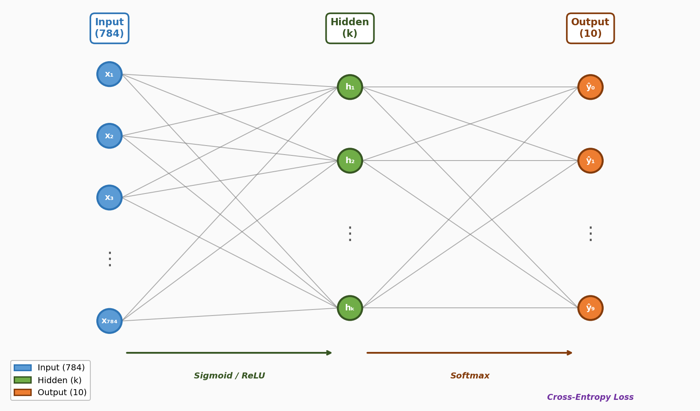

**参数与形状：**

| 参数 | 形状 | 说明 |
|---|---|---|
| $W_1$ | $(hidden, 784)$ | 隐藏层权重 |
| $b_1$ | $(hidden, 1)$ | 隐藏层偏置 |
| $W_2$ | $(10, hidden)$ | 输出层权重 |
| $b_2$ | $(10, 1)$ | 输出层偏置 |
| $X$ | $(784, m)$ | 输入（列 = 样本） |
| $A_1$ | $(hidden, m)$ | 隐藏层激活 |
| $A_2$ | $(10, m)$ | 输出概率 |
| $Y$ | $(10, m)$ | one-hot 标签 |

---

## 2. 前向传播（Forward）

$$Z_1 = W_1 X + b_1, \qquad A_1 = \sigma(Z_1)\ \text{或}\ \mathrm{ReLU}(Z_1)$$
$$Z_2 = W_2 A_1 + b_2, \qquad A_2 = \mathrm{softmax}(Z_2)$$

其中
$$\sigma(z)=\frac{1}{1+e^{-z}}, \qquad \mathrm{ReLU}(z)=\max(0,z)$$
$$A_{2,j}^{(i)} = \frac{e^{Z_{2,j}^{(i)}}}{\sum_{k=1}^{10}e^{Z_{2,k}^{(i)}}}$$

> [!tip] 数值稳定
> softmax 实现时先减去整列最大值 $e^{z - \max(z)}$，避免指数溢出。

---

## 3. 损失函数

平均交叉熵：
$$L = -\frac{1}{m}\sum_{i=1}^{m}\sum_{k=1}^{10} Y_k^{(i)}\log A_{2,k}^{(i)}$$

由于标签是 one-hot，每个样本退化为「正确类别概率的负对数」：$L^{(i)} = -\log A^{(i)}_{2,\,y^{(i)}}$。

---

## 4. 反向传播（Backward）—— 完整推导

### 4.1 输出层误差 $dZ_2$

对 softmax + 交叉熵组合，单样本对 $z_j$ 求导：
$$\frac{\partial L^{(i)}}{\partial a_j^{(i)}} = -\frac{y_j^{(i)}}{a_j^{(i)}}, \qquad \frac{\partial a_j^{(i)}}{\partial z_l^{(i)}} = a_j^{(i)}(\delta_{jl}-a_l^{(i)})$$

链式法则并利用 $\sum_l y_l^{(i)}=1$：
$$\frac{\partial L^{(i)}}{\partial z_j^{(i)}}
= -\sum_l \frac{y_l^{(i)}}{a_l^{(i)}}\,a_l^{(i)}(\delta_{jl}-a_j^{(i)})
= a_j^{(i)} - y_j^{(i)}$$

因此批量形式非常简洁：
$$\boxed{dZ_2 = A_2 - Y}$$

### 4.2 输出层梯度
$$dW_2 = \frac{1}{m} dZ_2 A_1^T, \qquad db_2 = \frac{1}{m}\sum_{i} dZ_2^{(i)}$$

### 4.3 隐藏层误差
$$dZ_1 = (W_2^T dZ_2)\odot \sigma'(Z_1), \qquad \sigma'(z)=\sigma(z)(1-\sigma(z))$$
ReLU 版本：
$$dZ_1 = (W_2^T dZ_2)\odot \mathbb{1}\bigl[ Z_1>0 \bigr]$$

### 4.4 隐藏层梯度
$$dW_1 = \frac{1}{m} dZ_1 X^T, \qquad db_1 = \frac{1}{m}\sum_i dZ_1^{(i)}$$

### 4.5 参数更新（SGD）
$$W \leftarrow W - \eta\, dW, \qquad b \leftarrow b - \eta\, db$$

### 4.6 代码 ↔ 公式对应

| 代码 | 公式 |
|---|---|
| `dZ2 = output - Y` | $dZ_2 = A_2 - Y$ |
| `dW2 = (1/m)*np.dot(dZ2, A1.T)` | $dW_2 = \frac{1}{m} dZ_2 A_1^T$ |
| `dZ1 = np.dot(W2.T, dZ2) * (A1*(1-A1))` | $dZ_1 = W_2^T dZ_2 \odot A_1(1-A_1)$ |
| `dW1 = (1/m)*np.dot(dZ1, X.T)` | $dW_1 = \frac{1}{m} dZ_1 X^T$ |

---

## 5. 模型的具体配置

### 5.1 基线 MLP（`mlp.py`）
- `input=784, hidden=64, output=10`
- 初始化：$W \sim \mathcal{N}(0,1)\times 0.01$，$b=0$
- 激活：Sigmoid；输出：Softmax
- 优化：Mini-Batch SGD，`lr=0.5, batch_size=128, epochs=10`
- 训练数据：训练集前 `subset=10000`

### 5.2 优化版 MLP（`optimize.py` 的 `MLPOptimized`）
- `input=784, hidden=128, output=10`
- 初始化：He init $W\sim\mathcal{N}(0,1)\times\sqrt{2/\text{fan-in}}$（与代码中 `fan_in` 变量同义，即上一层输入维数）
- 激活：ReLU；输出：Softmax
- 优化器：**Adam** `lr=1e-3, β1=0.9, β2=0.999, eps=1e-8`
- 正则化：**L2** `λ=1e-4`、**Dropout** `p=0.2`（inverted dropout）
- **学习率衰减**：每 epoch ×0.95
- `batch_size=128, epochs=15`

**Adam 更新公式：**
$$m\leftarrow\beta_1 m+(1-\beta_1)g,\quad v\leftarrow\beta_2 v+(1-\beta_2)g^2$$
$$\hat m=\frac{m}{1-\beta_1^t},\quad \hat v=\frac{v}{1-\beta_2^t},\quad \theta\leftarrow\theta-\eta\frac{\hat m}{\sqrt{\hat v}+\epsilon}$$

---

## 6. 超参数实验（来自 README 实验）

### 6.1 隐藏层大小（全量数据, epochs=5, lr=0.5）
| hidden_size | 64 | 32 | 16 | 10 | 8 | 6 |
|---|---|---|---|---|---|---|
| 测试准确率 % | 94.91 | 94.63 | 93.68 | 92.05 | 91.52 | 88.61 |

### 6.2 学习率（hidden=32, 全量数据）
| lr      | 0.1   | 0.3   | 0.5   | 0.7   | 1.0   |
| ------- | ----- | ----- | ----- | ----- | ----- |
| 测试准确率 % | 90.93 | 93.52 | 94.54 | 95.37 | 95.51 |

### 6.3 ReLU vs Sigmoid（hidden=32, subset=10000）
| 激活 | 准确率 % | 训练(s) | 推理(s) |
|---|---|---|---|
| Sigmoid | 89.66 | 153.5 | 1.373 |
| ReLU | 91.42 | 138.6 | 0.150 |

### 6.4 Epoch 数 vs 准确率
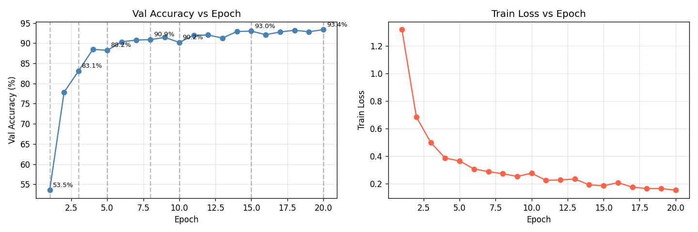
前 5 epoch 收敛最快（53%→88%），15 epoch 后趋于饱和。

### 6.5 Batch Size 的影响
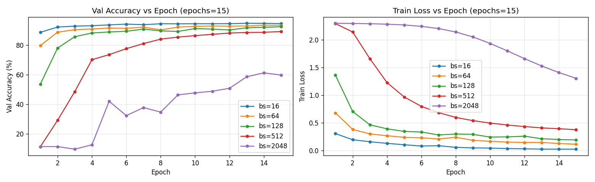

| batch | 16 | 64 | 128 | 512 | 2048 |
|---|---|---|---|---|---|
| 最终 Val Acc % | 94.67 | 93.55 | 92.53 | 89.29 | 59.79 |

小 batch 收敛快但抖动大；极大 batch 每 epoch 更新次数太少几乎不收敛。

### 6.6 第一个 epoch 内 batch loss 抖动
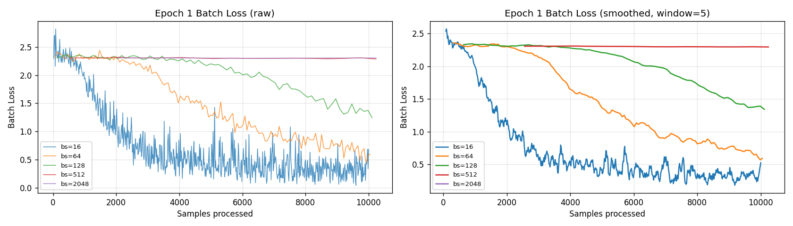

---

## 7. 错误分析（默认配置 ~90.95%，905/10000 错）

**最易混淆数字对：**

| 混淆对 | 次数 | 直观原因 |
|---|---|---|
| 5 → 8 | 71 | 5 连笔写圆后形似 8 |
| 9 → 7 | 58 | 9 上圈写小、竖钩拉直像 7 |
| 2 → 8 | 57 | 2 底部带圈像 8 |
| 3 → 8 | 55 | 3 左侧封口就成 8 |
| 9 → 4 / 4 → 9 | 37 / 34 | 圈是否闭合，互相像 |

**每类错误率**：最高 5(17.7%)、9(15.8%)、3(14.2%)、2(11.5%)；最稳 0、1(~3%)。

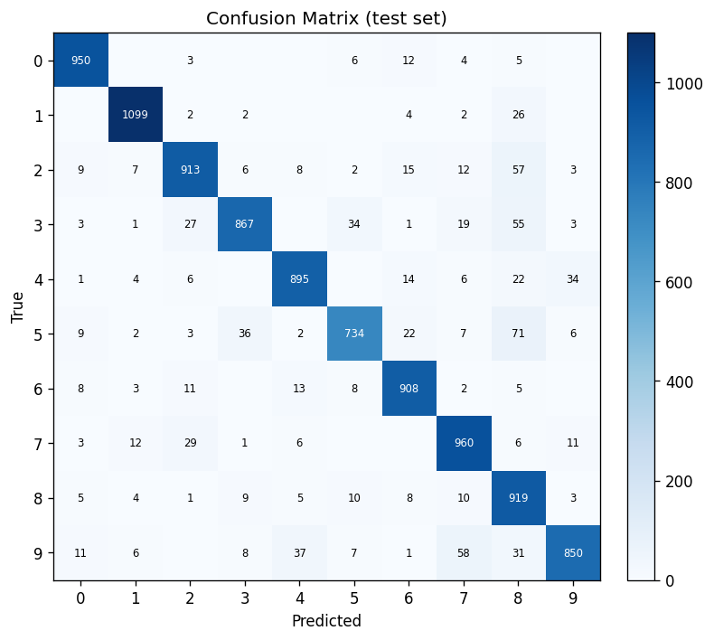

最自信但答错的样本（置信度 95–99%，多为潦草/连笔/断笔）：
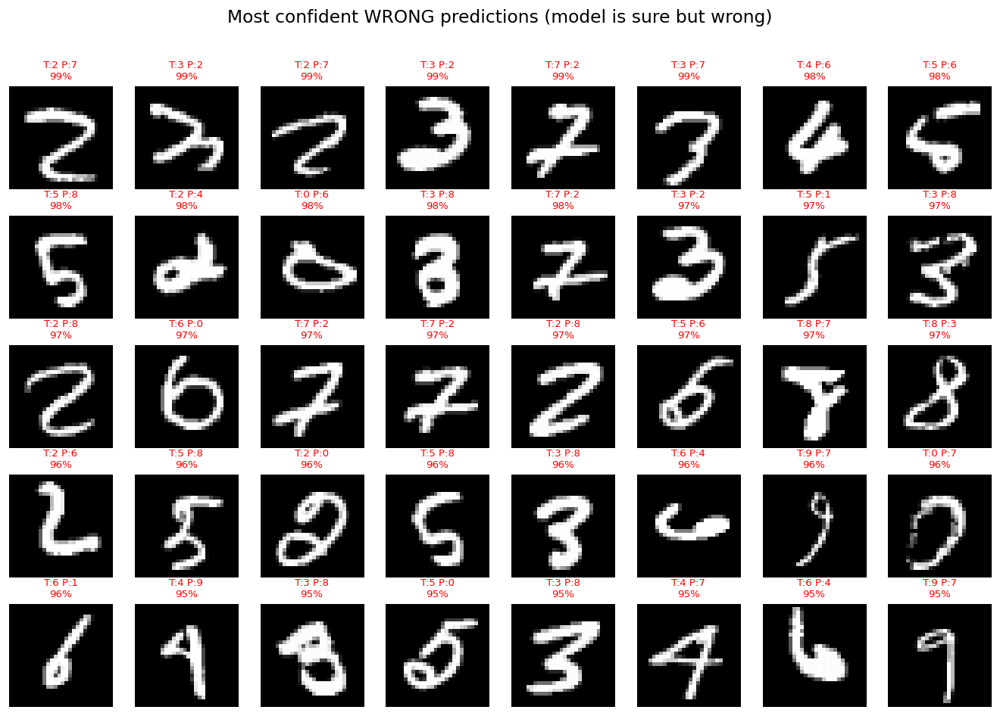

最犹豫的错误（top1≈top2，决策边界附近）：
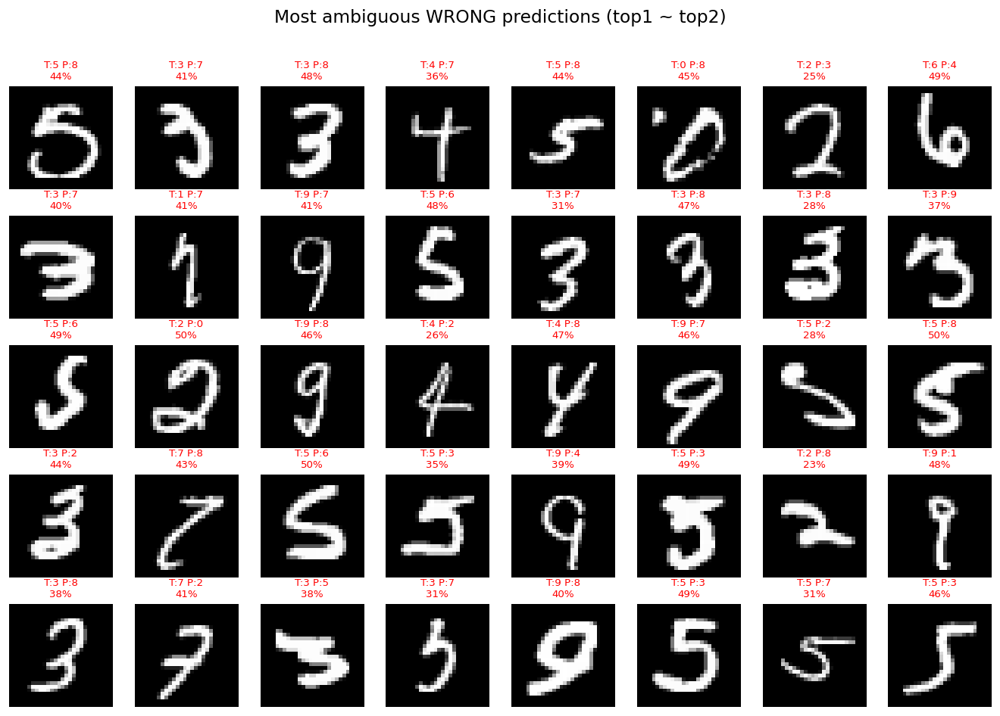

> [!note] 根本原因
> MLP 把 28×28 图片**拉平成 784 维向量逐像素加权，丢失了像素的空间相邻关系**，不具备平移不变性，无法稳健区分拓扑相近的数字。结构性瓶颈，调参无法根治。

---

## 8. 固定样本下的优化（步骤 1 & 2）

| 配置 | 测试准确率 | 耗时 |
|---|---|---|
| Baseline（10000 子集, hidden=64, sigmoid, SGD 0.5, 10ep） | 90.95% | 3.1s |
| Step 1（全量 60000 + ReLU + SGD 1.0, 15ep） | **97.52%** | 19.7s |
| Step 2（+ Adam + L2 + Dropout + lr衰减 + hidden=128, 15ep） | **98.14%** | 60.4s |

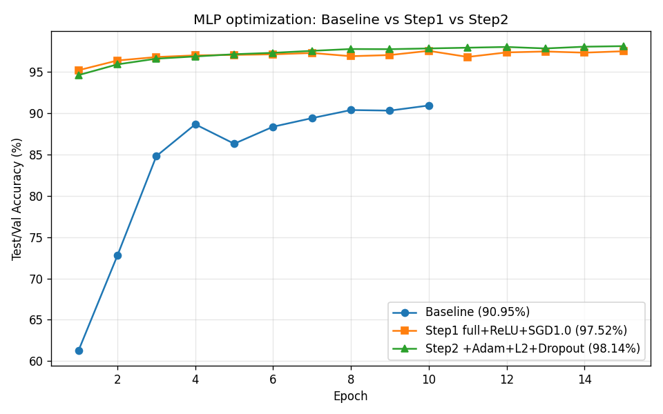

- 步骤 1 提升最大（+6.57），全量数据 + ReLU 性价比最高（原基线只用 1/6 数据且欠拟合）。
- 步骤 2 再 +0.62，已接近**纯 MLP 在 MNIST 的实际天花板（~98%）**。

---

## 9. 统一划分对比（前 50000 训练 / 后 10000 测试）

| 模型 | 测试准确率 | 错误数 |
|---|---|---|
| 基本 MLP（hidden=64, sigmoid, SGD 0.5, 10ep） | 96.15% | 385 |
| 优化 MLP（hidden=128, ReLU, Adam, L2, Dropout, 15ep） | 97.86% | 214 |

错误减少 **44.4%**。注意基本 MLP 用满 50000 后从 ~91% 升到 96.15%，说明此前很大一部分差距来自训练数据量。

| 基本 MLP 错误 | 优化 MLP 错误 |
|---|---|
| 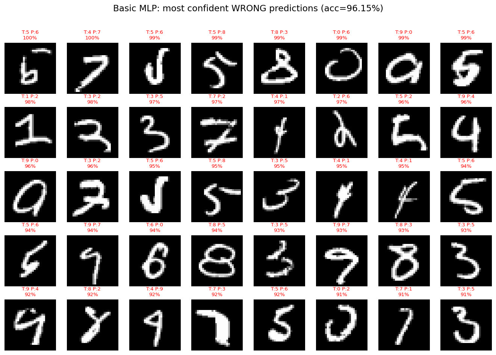 | 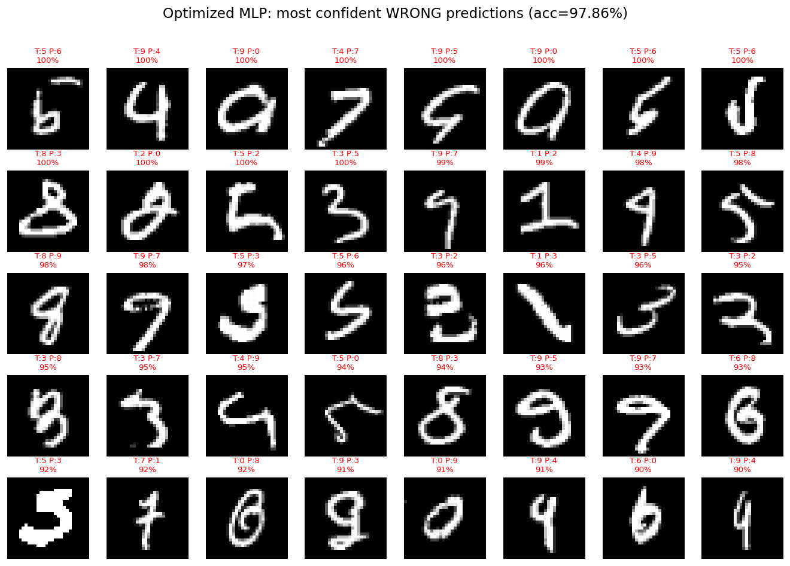 |

---

## 10. 数据增强鲁棒性测试（CNN 的动机）

对测试图做轻微旋转(±15°)/平移(±3px)/缩放(0.5–1.5，放大按内容包围盒封顶，保证不出界)，实时评估当前模型：

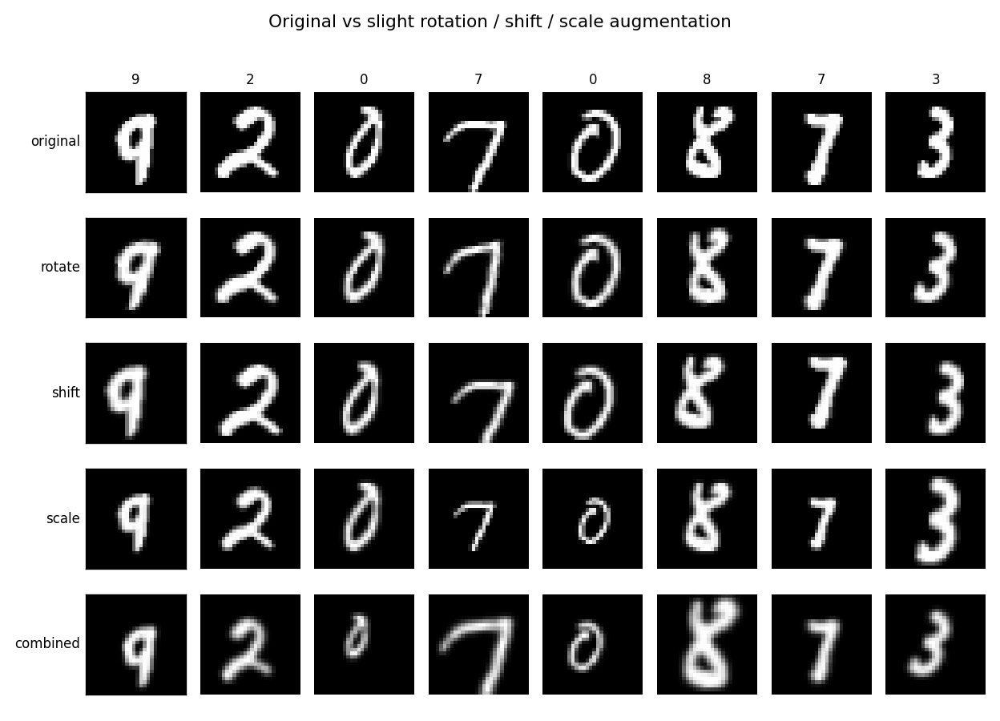

| 增强类型 | 基本 MLP | 优化 MLP | 基本 Δ | 优化 Δ |
|---|---|---|---|---|
| clean | 96.15% | 97.86% | +0.00 | +0.00 |
| rotate | 94.47% | 96.94% | -1.68 | -0.92 |
| **shift** | **61.13%** | **70.17%** | **-35.02** | **-27.69** |
| **scale** | **67.54%** | **72.46%** | **-28.61** | **-25.40** |
| **combined** | **52.14%** | **57.54%** | **-44.01** | **-40.32** |

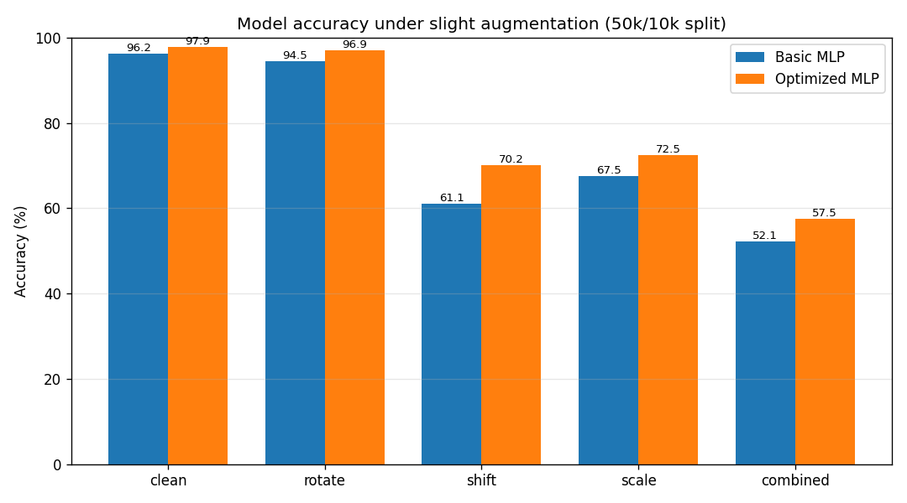

> [!warning] 关键发现
> 仅 ±3 像素的平移，基本 MLP 准确率就从 96% 暴跌到 61%。MLP **完全没有平移/尺度不变性**——这正是 CNN（局部感受野 + 权值共享 + 池化）要解决的问题。

---

## 11. 工程与目录规范

- `data/`（共享数据集）移到仓库根目录，脚本从子目录用 `../data/mnist.npz` 读取。
- `images/`：仅放 README 展示的图（提交到 git）。
- `out/`：其余样本/结果图 + 所有 `*_report.txt`（gitignore，**可重复生成**）。
- `data` 与 `out` 都加入 `.gitignore`；固定 `SEED=42` 保证可复现。
- 沉淀为项目级技能 `nn-project-builder`（六阶段工作流 + 通用脚本），后续做 CNN 可一键复用。

---

## 12. 关键结论

1. 固定样本下，纯 MLP 充分优化可达 ~98%，但这是**结构性天花板**。
2. 错误与脆弱性都源于「全连接 + 拉平」丢失空间结构。
3. 几何扰动下准确率剧烈下降，证明缺乏空间不变性。

## 13. 下一步 / TODO

- [x] 在 `cnn/` 用纯 NumPy 实现 CNN（单块结构），见实验记录：[[cnn-mnist-experiments]]
- [x] 更深结构冲 **99%+**（已由姊妹篇双块 + 增强达成 **99.21%** clean，见 [[cnn-mnist-experiments]]）
- [ ] 参数量 / 推理耗时对比表（CNN 侧见仓库 `out/block_comparison_report.txt`）
- [x] 与姊妹篇保持双链维护

## 附录 本篇修订记录

> 仅记录 **本文件** `MLP手写数字识别与优化.md`。根据 **`git log --follow` 的改名/行数变化与 diff 含义** 归纳；不粘贴无信息量的 `vault backup` 原文。

- **2026-06-08**（提交 `9262d41`）  
  - 首版写入 vault（`git numstat`：**+288** 行）：MLP 首份完整日报体例——结构、前向/反向、损失、超参实验、错误分析、优化步骤、统一划分对比、增强鲁棒性（§10）等。

- **2026-06-09**（提交 `9ab5559`）  
  - 文件随目录从 `personal/aiml/study/` 迁至 `personal/technology/aiml/study/`（路径调整）；正文小改（约 ±11 行）。

- **2026-06-10**（提交 `936eb07`）  
  - 重命名为 **`MLP手写数字识别与优化.md`**，并更新与 CNN 姊妹篇的双链等（`git numstat`：约 +14 / −13）。

- **2026-06-12**（工作区，待提交）  
  - `updated` 刷新；配图统一为 **`images/mlp_*.png`**；**TODO** 与 CNN 姊妹篇对齐；**本附录** 改为仅本篇修订记录（移除原先附带的 `mlp/README`、学习路径等「他文件」git 表）。

> **卷积侧概念**（平移、感受野、参数共享、池化）见姊妹篇 **[[cnn-mnist-experiments#附录 A 卷积核心概念归纳]]**。

## 参考

- 姊妹篇（**CNN 专用笔记**）：[[cnn-mnist-experiments]]
- 代码仓库：`c:/work/code/others/neuralnetworks/mlp`
- 技术文档：`mlp/README.md`（含完整推导与全部实验）
- 方法论技能：`.cursor/skills/nn-project-builder`
