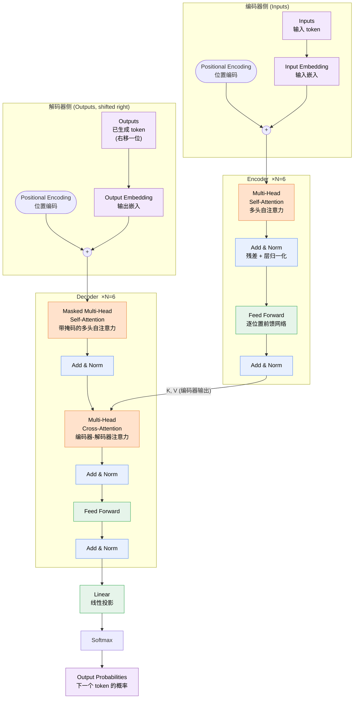

# Attention Is All You Need —— 全文翻译与详细解析

> [!info] 论文信息
> - **标题**：Attention Is All You Need（注意力就是你所需要的一切）
> - **作者**：Ashish Vaswani, Noam Shazeer, Niki Parmar, Jakob Uszkoreit, Llion Jones, Aidan N. Gomez, Łukasz Kaiser, Illia Polosukhin（Google Brain / Google Research / University of Toronto）
> - **发表**：NeurIPS (NIPS) 2017 · [arXiv:1706.03762](https://arxiv.org/abs/1706.03762)
> - **代码**：[tensorflow/tensor2tensor](https://github.com/tensorflow/tensor2tensor)
> - **配套阅读**：[The Illustrated Transformer](https://jalammar.github.io/illustrated-transformer/) · [The Annotated Transformer](https://nlp.seas.harvard.edu/annotated-transformer/)

> [!abstract] 本文档说明
> 本文档由原始 LaTeX 论文源码转换而来，按「**原文 → 中文翻译 → 详细解析**」三段式逐节组织，方便对照学习。
> 解析部分为译注者补充，旨在拆解论文中一笔带过但极其关键的设计动机与数学细节。

---

## 摘要 Abstract

> [!quote] 原文
> The dominant sequence transduction models are based on complex recurrent or convolutional neural networks that include an encoder and a decoder. The best performing models also connect the encoder and decoder through an attention mechanism. We propose a new simple network architecture, the **Transformer**, based solely on attention mechanisms, dispensing with recurrence and convolutions entirely. Experiments on two machine translation tasks show these models to be superior in quality while being more parallelizable and requiring significantly less time to train. Our model achieves **28.4 BLEU** on the WMT 2014 English-to-German translation task, improving over the existing best results, including ensembles, by over 2 BLEU. On the WMT 2014 English-to-French translation task, our model establishes a new single-model state-of-the-art BLEU score of **41.8** after training for 3.5 days on eight GPUs, a small fraction of the training costs of the best models from the literature. We show that the Transformer generalizes well to other tasks by applying it successfully to English constituency parsing both with large and limited training data.

**中文翻译**

主流的序列转换（sequence transduction）模型都建立在复杂的循环神经网络（RNN）或卷积神经网络（CNN）之上，包含一个编码器（encoder）和一个解码器（decoder）。性能最好的模型还会通过一个注意力机制把编码器和解码器连接起来。我们提出一种全新且简单的网络架构——**Transformer**，它**完全**基于注意力机制，彻底摒弃了循环与卷积。在两个机器翻译任务上的实验表明，这类模型不仅翻译质量更高，而且更易于并行化，所需训练时间也大幅减少。我们的模型在 WMT 2014 英译德任务上取得了 **28.4 BLEU**，比包括集成模型在内的已有最优结果提升了超过 2 BLEU。在 WMT 2014 英译法任务上，我们的模型在 8 块 GPU 上训练 3.5 天后，取得了 **41.8** 的单模型 BLEU 新纪录，而其训练成本仅为文献中最优模型的一小部分。我们还通过将 Transformer 成功应用于英语成分句法分析（在大数据和有限数据两种情形下），证明了它能很好地泛化到其他任务。

**详细解析**

- **「sequence transduction」** 指把一个序列转换成另一个序列的任务（翻译、摘要、语音识别等），是比「机器翻译」更广的概念。
- 摘要用一句话点明了论文的颠覆性：在 2017 年，「RNN/CNN + Attention」是范式标配，而本文主张 **Attention 单独就够了**（标题即论点）。
- 三个核心卖点贯穿全文：**质量更高**、**可并行**、**训练更快**。其中「可并行」是最本质的优势——它来自于去掉了 RNN 沿时间步的串行依赖（详见第 4 节）。
- BLEU 是机器翻译的标准评测指标（0–100，越高越好），衡量译文与参考译文的 n-gram 重叠程度。

---

## 1 引言 Introduction

> [!quote] 原文（节选）
> Recurrent neural networks, long short-term memory and gated recurrent neural networks in particular, have been firmly established as state of the art approaches in sequence modeling and transduction problems... Recurrent models typically factor computation along the symbol positions of the input and output sequences. Aligning the positions to steps in computation time, they generate a sequence of hidden states $h_t$, as a function of the previous hidden state $h_{t-1}$ and the input for position $t$. This inherently sequential nature precludes parallelization within training examples... Attention mechanisms have become an integral part of compelling sequence modeling... allowing modeling of dependencies without regard to their distance in the input or output sequences. In all but a few cases, however, such attention mechanisms are used in conjunction with a recurrent network. In this work we propose the Transformer, a model architecture eschewing recurrence and instead relying entirely on an attention mechanism to draw global dependencies between input and output.

**中文翻译**

循环神经网络（RNN），尤其是长短期记忆网络（LSTM）和门控循环网络（GRU），已被牢固确立为序列建模与转换问题（如语言建模、机器翻译）的最先进方法。循环模型通常沿着输入和输出序列的符号位置来展开计算：把位置与计算的时间步一一对齐，模型依次生成一串隐藏状态 $h_t$，其中 $h_t$ 是前一个隐藏状态 $h_{t-1}$ 与位置 $t$ 输入的函数。这种与生俱来的**串行特性**使得训练样本内部无法并行——在序列较长时这一点尤为致命，因为显存限制了跨样本的批处理能力。

注意力机制已成为各类序列建模任务中不可或缺的组成部分，它**允许建模依赖关系而无需考虑这些依赖在输入或输出序列中的距离**。但在绝大多数情况下，这类注意力机制都是与循环网络配合使用的。

在本文中，我们提出 Transformer——一种**回避循环、完全依赖注意力机制**来刻画输入与输出之间全局依赖关系的模型架构。Transformer 可以显著提高并行度，在 8 块 P100 GPU 上仅训练 12 小时就能达到翻译质量的新高度。

**详细解析**

- **RNN 的根本瓶颈**：递推式 $h_t = f(h_{t-1}, x_t)$ 意味着第 $t$ 步必须等第 $t-1$ 步算完。训练时即使我们已经拥有完整的输入和目标序列，也无法一次性并行处理所有位置——这浪费了 GPU 的并行算力。
- **为什么距离很重要**：在 RNN 中，位置 1 的信息要传到位置 $n$，必须经过 $n$ 步传播，信息在长距离上容易衰减/丢失（梯度消失）。注意力则能让任意两个位置**直接**交互（路径长度 $O(1)$），这是第 4 节的核心论据。
- 引言的逻辑链：RNN 强但串行 → Attention 能建模任意距离依赖但通常仍依附 RNN → **那干脆只用 Attention**。

---

## 2 背景 Background

> [!quote] 原文
> The goal of reducing sequential computation also forms the foundation of the Extended Neural GPU, ByteNet and ConvS2S, all of which use convolutional neural networks as basic building block... In these models, the number of operations required to relate signals from two arbitrary input or output positions grows in the distance between positions, linearly for ConvS2S and logarithmically for ByteNet. This makes it more difficult to learn dependencies between distant positions. In the Transformer this is reduced to a constant number of operations, albeit at the cost of reduced effective resolution due to averaging attention-weighted positions, an effect we counteract with Multi-Head Attention... Self-attention, sometimes called intra-attention is an attention mechanism relating different positions of a single sequence in order to compute a representation of the sequence... To the best of our knowledge, however, the Transformer is the first transduction model relying entirely on self-attention to compute representations of its input and output without using sequence-aligned RNNs or convolution.

**中文翻译**

减少串行计算这一目标，也是 Extended Neural GPU、ByteNet 和 ConvS2S 等模型的出发点，它们都以卷积神经网络为基本构件，对所有输入/输出位置并行地计算隐藏表示。但在这些模型中，将两个任意位置的信号关联起来所需的操作数会随两位置间的距离增长——ConvS2S 是线性增长，ByteNet 是对数增长。这使得学习远距离位置之间的依赖变得更困难。在 Transformer 中，这一操作数被降低为**常数级**；代价是注意力加权平均会降低有效分辨率，而我们用**多头注意力（Multi-Head Attention）**来抵消这一影响。

**自注意力（Self-attention）**，有时也称为内部注意力（intra-attention），是一种将单个序列内不同位置关联起来、从而计算该序列表示的注意力机制。自注意力已成功应用于阅读理解、抽象摘要、文本蕴含以及学习与任务无关的句子表示等多种任务。

据我们所知，Transformer 是第一个**完全依赖自注意力**来计算输入和输出表示、而不使用序列对齐的 RNN 或卷积的转换模型。

**详细解析**

- 这一节在做「定位」：交代前人（ByteNet/ConvS2S）已经在尝试用 CNN 替代 RNN 来获得并行性，但它们没能解决「远距离依赖路径长」的问题。
- **「常数级操作数」**：自注意力中任意两个位置一步直连，关联代价与距离无关，这正是表 1（第 4 节）中 Self-Attention 的最大路径长度为 $O(1)$ 的由来。
- **「有效分辨率降低」的隐忧与解法**：softmax 加权平均本质是把很多位置「糊」成一个向量，可能丢失细节。多头注意力让模型在多个不同子空间里分别做注意力，相当于保留了多组「视角」，缓解了这个问题。

---

## 3 模型架构 Model Architecture

> [!quote] 原文
> Most competitive neural sequence transduction models have an encoder-decoder structure. Here, the encoder maps an input sequence of symbol representations $(x_1, ..., x_n)$ to a sequence of continuous representations $\mathbf{z} = (z_1, ..., z_n)$. Given $\mathbf{z}$, the decoder then generates an output sequence $(y_1,...,y_m)$ of symbols one element at a time. At each step the model is auto-regressive, consuming the previously generated symbols as additional input when generating the next. The Transformer follows this overall architecture using stacked self-attention and point-wise, fully connected layers for both the encoder and decoder.

**中文翻译**

大多数有竞争力的神经序列转换模型都采用编码器-解码器结构。其中，编码器把输入符号表示序列 $(x_1, ..., x_n)$ 映射为一串连续表示 $\mathbf{z} = (z_1, ..., z_n)$；给定 $\mathbf{z}$，解码器随后**逐个元素地**生成输出符号序列 $(y_1, ..., y_m)$。在每一步，模型都是**自回归（auto-regressive）**的——生成下一个符号时，会把先前已生成的符号作为额外输入。Transformer 遵循这一总体架构，编码器和解码器都由堆叠的自注意力层与逐位置（point-wise）全连接层构成。

**详细解析**

- **自回归（auto-regressive）**：生成第 $i$ 个词时依赖前面已生成的 $1 \dots i-1$ 个词。这是解码端必须加「掩码」的根本原因（见 3.2.3）。
- 整体结构可记为：**编码器读懂输入 → 解码器边看输入边逐词生成输出**。Transformer 的创新不在这个宏观框架，而在于把框架内部的 RNN/CNN 全部换成了注意力 + 前馈网络。

> [!note] 图 1：Transformer 整体结构（对应论文 Figure 1）
> 左侧为编码器（Encoder，堆叠 $N=6$ 层），右侧为解码器（Decoder，堆叠 $N=6$ 层）。
> 每个子层都包裹「残差连接 + 层归一化」，即 $\mathrm{LayerNorm}(x + \mathrm{Sublayer}(x))$。

**读图要点**

- **数据流方向**：编码器侧自下而上把输入编码为表示；解码器侧自下而上、自回归地生成输出；最顶端经 `Linear + Softmax` 得到下一个 token 的概率分布。
- **三处注意力一目了然**：编码器的「自注意力」、解码器底部的「带掩码自注意力」、以及中间把**编码器输出作为 K/V**、解码器表示作为 Q 的「交叉注意力」（图中横向箭头）。
- **每个子层都是 `Add & Norm` 包裹**：残差连接 + 层归一化，是 6 层乃至更深堆叠得以稳定训练的关键。
- **`Outputs (shifted right)`**：训练时目标序列整体右移一位输入，配合掩码，保证预测位置 $i$ 时只能看到 $< i$ 的词。

### 3.1 编码器与解码器堆栈 Encoder and Decoder Stacks

> [!quote] 原文
> **Encoder:** The encoder is composed of a stack of $N=6$ identical layers. Each layer has two sub-layers. The first is a multi-head self-attention mechanism, and the second is a simple, position-wise fully connected feed-forward network. We employ a residual connection around each of the two sub-layers, followed by layer normalization. That is, the output of each sub-layer is $\mathrm{LayerNorm}(x + \mathrm{Sublayer}(x))$... all sub-layers in the model, as well as the embedding layers, produce outputs of dimension $\dmodel=512$.
>
> **Decoder:** The decoder is also composed of a stack of $N=6$ identical layers. In addition to the two sub-layers in each encoder layer, the decoder inserts a third sub-layer, which performs multi-head attention over the output of the encoder stack... We also modify the self-attention sub-layer in the decoder stack to prevent positions from attending to subsequent positions. This masking, combined with fact that the output embeddings are offset by one position, ensures that the predictions for position $i$ can depend only on the known outputs at positions less than $i$.

**中文翻译**

**编码器：** 编码器由 $N=6$ 个相同的层堆叠而成。每层包含两个子层：第一个是多头自注意力机制，第二个是简单的、逐位置的全连接前馈网络。我们在每个子层周围都使用**残差连接**，其后接**层归一化（Layer Normalization）**。也就是说，每个子层的输出为：

$$\mathrm{LayerNorm}(x + \mathrm{Sublayer}(x))$$

其中 $\mathrm{Sublayer}(x)$ 是子层自身实现的函数。为了便于使用这些残差连接，模型中所有子层以及嵌入层的输出维度都为 $d_{\text{model}}=512$。

**解码器：** 解码器同样由 $N=6$ 个相同的层堆叠而成。除了每个编码器层中的两个子层之外，解码器还插入了第三个子层，用于对编码器堆栈的输出执行多头注意力。与编码器类似，每个子层周围都使用残差连接并接层归一化。此外，我们**修改了解码器堆栈中的自注意力子层，以防止某个位置注意到它之后的位置**。这种掩码（masking），加上「输出嵌入向右偏移一个位置」这一事实，共同确保了对位置 $i$ 的预测只能依赖于位置小于 $i$ 的已知输出。

**详细解析**

- **一个编码器层 = 多头自注意力 + 前馈网络**，两个子层各自包了「残差 + LayerNorm」。
- **残差连接** $x + \mathrm{Sublayer}(x)$：来自 ResNet，让梯度有一条「高速公路」直接回传，使得堆叠 6 层（乃至后来的几十上百层）成为可能。这也解释了为什么要求**所有子层输出维度统一为 512**——否则 $x$ 和 $\mathrm{Sublayer}(x)$ 无法相加。
- **LayerNorm（层归一化）** 而非 BatchNorm：对单个样本的特征维做归一化，不依赖 batch 内其他样本，适合变长序列与小 batch。
- **解码器三个子层**：① 带掩码的自注意力（看已生成的输出）；② 编码器-解码器注意力（看输入）；③ 前馈网络。
- **掩码（masked self-attention）是关键**：训练时整句目标一次性喂入以并行计算，但必须保证预测第 $i$ 个词时「看不到」第 $i$ 个及之后的词，否则就是「偷看答案」。实现方式见 3.2.3：把非法位置的注意力分数置为 $-\infty$。

### 3.2 注意力 Attention

> [!quote] 原文
> An attention function can be described as mapping a query and a set of key-value pairs to an output, where the query, keys, values, and output are all vectors. The output is computed as a weighted sum of the values, where the weight assigned to each value is computed by a compatibility function of the query with the corresponding key.

**中文翻译**

一个注意力函数可以描述为：把一个**查询（query）**和一组**键值对（key-value pairs）**映射到一个输出，其中查询、键、值和输出都是向量。输出被计算为**值的加权和**，而分配给每个值的权重，由查询与其对应键之间的**兼容性函数（compatibility function）**计算得出。

**详细解析**

- 注意力的精髓用一句话概括：**「用 query 去和每个 key 算相似度，得到一组权重，再用这组权重对 value 加权求和。」**
- 一个生活化的类比：query 是「检索词」，key 是「每个条目的标签」，value 是「条目的内容」。注意力 = 软性（soft）的数据库查找——不是只取最匹配的一条，而是按匹配程度对所有条目加权混合。

#### 3.2.1 缩放点积注意力 Scaled Dot-Product Attention

> [!quote] 原文
> We call our particular attention "Scaled Dot-Product Attention". The input consists of queries and keys of dimension $d_k$, and values of dimension $d_v$. We compute the dot products of the query with all keys, divide each by $\sqrt{d_k}$, and apply a softmax function to obtain the weights on the values... We compute the matrix of outputs as:
> $$\mathrm{Attention}(Q, K, V) = \mathrm{softmax}\left(\frac{QK^T}{\sqrt{d_k}}\right)V$$
> ...While for small values of $d_k$ the two mechanisms perform similarly, additive attention outperforms dot product attention without scaling for larger values of $d_k$. We suspect that for large values of $d_k$, the dot products grow large in magnitude, pushing the softmax function into regions where it has extremely small gradients. To counteract this effect, we scale the dot products by $\frac{1}{\sqrt{d_k}}$.

**中文翻译**

我们把所采用的注意力称为「**缩放点积注意力**」。输入由维度为 $d_k$ 的查询和键、以及维度为 $d_v$ 的值组成。我们计算查询与所有键的点积，将每个结果除以 $\sqrt{d_k}$，再施加 softmax 函数得到作用在值上的权重。实践中，我们把一组查询打包成矩阵 $Q$ 同时计算，键和值也分别打包为矩阵 $K$ 和 $V$，输出矩阵计算为：

$$\mathrm{Attention}(Q, K, V) = \mathrm{softmax}\left(\frac{QK^T}{\sqrt{d_k}}\right)V$$

两种最常用的注意力函数是**加性注意力（additive attention）**和**点积（乘性）注意力**。点积注意力与我们的算法相同，只是少了 $\frac{1}{\sqrt{d_k}}$ 这个缩放因子。加性注意力用一个带单隐层的前馈网络来计算兼容性函数。虽然两者理论复杂度相近，但点积注意力在实践中更快、更省空间，因为它可以用高度优化的矩阵乘法代码实现。

当 $d_k$ 较小时两种机制表现相近；但当 $d_k$ 较大时，**不带缩放**的点积注意力会逊于加性注意力。我们怀疑，当 $d_k$ 很大时，点积的数值会变得很大，从而把 softmax 推入梯度极小的区域。为抵消这一效应，我们把点积乘以 $\frac{1}{\sqrt{d_k}}$ 进行缩放。

> [!note] 原文脚注（为何点积会变大）
> 假设 $q$ 和 $k$ 的各分量是均值为 0、方差为 1 的独立随机变量，那么它们的点积 $q \cdot k = \sum_{i=1}^{d_k} q_i k_i$ 的均值为 0，方差为 $d_k$。

**详细解析**

- **公式逐项拆解**（设序列长 $n$，则 $Q, K \in \mathbb{R}^{n \times d_k}$，$V \in \mathbb{R}^{n \times d_v}$）：
  1. $QK^T \in \mathbb{R}^{n \times n}$：第 $(i,j)$ 项是「查询 $i$ 与键 $j$」的点积，即两者的相似度分数。
  2. $\div \sqrt{d_k}$：缩放，防止分数过大。
  3. $\mathrm{softmax}(\cdot)$：对每一行归一化为概率分布（每个 query 对所有 key 的注意力权重之和为 1）。
  4. $\times V$：用权重对所有 value 加权求和，得到 $n \times d_v$ 的输出。
- **为什么要除以 $\sqrt{d_k}$（全文最常被考的细节）**：
  - 由脚注的统计推导，点积的方差正比于 $d_k$，标准差正比于 $\sqrt{d_k}$。当 $d_k=64$ 时分数尺度可能高达 $\pm 8$ 量级。
  - softmax 在输入数值很大时会**饱和**——输出几乎是 one-hot，对应位置的梯度趋近于 0，反向传播几乎学不动。
  - 除以 $\sqrt{d_k}$ 把方差重新拉回到约 1，使 softmax 工作在梯度健康的区域。这就是「scaled」一词的全部含义。
- **点积 vs 加性**：作者选点积是出于**工程效率**——一个 `matmul` 就能批量算完，能充分利用 GPU 的高度优化矩阵乘；而加性注意力需要额外的前馈网络，慢且占显存。

#### 3.2.2 多头注意力 Multi-Head Attention

> [!quote] 原文
> Instead of performing a single attention function with $\dmodel$-dimensional keys, values and queries, we found it beneficial to linearly project the queries, keys and values $h$ times with different, learned linear projections to $d_k$, $d_k$ and $d_v$ dimensions, respectively. On each of these projected versions... we then perform the attention function in parallel, yielding $d_v$-dimensional output values. These are concatenated and once again projected... Multi-head attention allows the model to jointly attend to information from different representation subspaces at different positions. With a single attention head, averaging inhibits this.
> $$\mathrm{MultiHead}(Q, K, V) = \mathrm{Concat}(\mathrm{head_1}, ..., \mathrm{head_h})W^O$$
> $$\text{where}~\mathrm{head_i} = \mathrm{Attention}(QW^Q_i, KW^K_i, VW^V_i)$$
> ...In this work we employ $h=8$ parallel attention layers, or heads. For each of these we use $d_k=d_v=\dmodel/h=64$. Due to the reduced dimension of each head, the total computational cost is similar to that of single-head attention with full dimensionality.

**中文翻译**

与其用 $d_{\text{model}}$ 维的键、值、查询执行**单个**注意力函数，我们发现更有益的做法是：用不同的、可学习的线性投影，把查询、键、值分别投影 $h$ 次，投影到 $d_k$、$d_k$、$d_v$ 维。在每一组投影后的查询、键、值上**并行地**执行注意力函数，得到 $d_v$ 维的输出。把这些输出拼接（concat）起来，再做一次投影，得到最终结果。

多头注意力允许模型**在不同位置、从不同的表示子空间联合地获取信息**。若只用单个注意力头，加权平均会抑制这种能力。

$$\mathrm{MultiHead}(Q, K, V) = \mathrm{Concat}(\mathrm{head}_1, ..., \mathrm{head}_h)W^O$$
$$\text{其中}\quad \mathrm{head}_i = \mathrm{Attention}(QW^Q_i, KW^K_i, VW^V_i)$$

其中投影矩阵为 $W^Q_i \in \mathbb{R}^{d_{\text{model}} \times d_k}$，$W^K_i \in \mathbb{R}^{d_{\text{model}} \times d_k}$，$W^V_i \in \mathbb{R}^{d_{\text{model}} \times d_v}$，$W^O \in \mathbb{R}^{hd_v \times d_{\text{model}}}$。

本文采用 $h=8$ 个并行的注意力层（头），每个头取 $d_k = d_v = d_{\text{model}}/h = 64$。由于每个头的维度降低了，总计算量与全维度的单头注意力相近。

**详细解析**

- **核心动机**：单头注意力的 softmax 加权平均，倾向于学出「一种」对齐模式；而多头让模型同时拥有 $h$ 套独立的 $(W^Q, W^K, W^V)$，每个头可以关注不同类型的关系（如句法依存、指代消解、邻近词等）。第 6 节的可视化正是证据。
- **维度账（务必算清）**：$d_{\text{model}}=512$，$h=8$，故每头 $d_k=d_v=64$。$8 \times 64 = 512$，拼接后正好回到 512 维，再经 $W^O$ 投影。
- **「免费的午餐」**：因为每头维度从 512 降到 64，8 个头的总计算量 ≈ 1 个 512 维单头，所以**多头几乎不增加计算成本**，却大幅增强表达力。
- 直觉类比：单头像用一只眼睛看；多头像 8 双眼睛各自盯着句子的不同关系，最后汇总。

#### 3.2.3 注意力在模型中的三处应用 Applications of Attention in our Model

> [!quote] 原文
> The Transformer uses multi-head attention in three different ways:
> - In "encoder-decoder attention" layers, the queries come from the previous decoder layer, and the memory keys and values come from the output of the encoder. This allows every position in the decoder to attend over all positions in the input sequence.
> - The encoder contains self-attention layers. In a self-attention layer all of the keys, values and queries come from the same place... Each position in the encoder can attend to all positions in the previous layer of the encoder.
> - Similarly, self-attention layers in the decoder allow each position in the decoder to attend to all positions in the decoder up to and including that position. We need to prevent leftward information flow in the decoder to preserve the auto-regressive property. We implement this inside of scaled dot-product attention by masking out (setting to $-\infty$) all values in the input of the softmax which correspond to illegal connections.

**中文翻译**

Transformer 以三种不同的方式使用多头注意力：

1. **编码器-解码器注意力层**：查询来自前一个解码器层，而（记忆）键和值来自编码器的输出。这使得解码器中的每个位置都能注意到输入序列的所有位置。这模仿了 seq2seq 模型中典型的编码器-解码器注意力机制。
2. **编码器自注意力层**：所有的键、值、查询都来自同一个地方——即编码器中前一层的输出。编码器中的每个位置都能注意到编码器前一层的所有位置。
3. **解码器自注意力层**：允许解码器中的每个位置注意到**截至并包括该位置**的所有位置。为保持自回归特性，我们需要阻止解码器中信息的向左流动（即不能看未来）。我们在缩放点积注意力内部实现这一点：把 softmax 输入中所有对应非法连接的值**掩码掉（置为 $-\infty$）**。

**详细解析**

- **三种注意力的 Q/K/V 来源对比**（这是理解 Transformer 数据流的关键）：

| 位置 | Query 来自 | Key/Value 来自 | 是否掩码 |
| --- | --- | --- | --- |
| 编码器自注意力 | 编码器上一层 | 编码器上一层 | 否（可看全句） |
| 解码器自注意力 | 解码器上一层 | 解码器上一层 | **是**（只看左侧） |
| 编码器-解码器注意力 | 解码器上一层 | **编码器输出** | 否 |

- **为什么 $-\infty$ 能实现掩码**：softmax 中 $e^{-\infty}=0$，于是非法位置的权重恰好为 0，相当于「看不见」未来的词。工程上常用一个很大的负数（如 `-1e9`）代替。
- 第 1 种（cross-attention）是「解码器去查输入」，是翻译能对齐源语言和目标语言的根本机制。

### 3.3 逐位置前馈网络 Position-wise Feed-Forward Networks

> [!quote] 原文
> In addition to attention sub-layers, each of the layers in our encoder and decoder contains a fully connected feed-forward network, which is applied to each position separately and identically. This consists of two linear transformations with a ReLU activation in between.
> $$\mathrm{FFN}(x)=\max(0, xW_1 + b_1) W_2 + b_2$$
> While the linear transformations are the same across different positions, they use different parameters from layer to layer. Another way of describing this is as two convolutions with kernel size 1. The dimensionality of input and output is $\dmodel=512$, and the inner-layer has dimensionality $d_{ff}=2048$.

**中文翻译**

除了注意力子层之外，编码器和解码器的每一层还包含一个全连接前馈网络，它被**独立且相同地**应用于每个位置。它由两个线性变换组成，中间夹一个 ReLU 激活：

$$\mathrm{FFN}(x)=\max(0,\, xW_1 + b_1)\, W_2 + b_2$$

虽然在不同位置上使用的线性变换是相同的，但不同层之间使用不同的参数。另一种描述方式是：把它看作两个核大小为 1 的卷积。输入和输出的维度都是 $d_{\text{model}}=512$，内层维度为 $d_{ff}=2048$。

**详细解析**

- **「逐位置（position-wise）」** = 同一个 FFN 独立作用在序列每个位置的向量上，位置之间不交互（位置间的交互全靠注意力完成）。
- 维度变化：$512 \to 2048 \to 512$，先升维（让 ReLU 有更大的非线性表达空间）再降维。inner 层是外层的 4 倍，这个 $4\times$ 比例后来成了几乎所有 Transformer 的默认配置。
- **「核大小为 1 的卷积」的理解**：1×1 卷积本质就是对每个位置独立做的全连接，所以这两种说法等价。
- 分工：**注意力负责「跨位置混合信息」，FFN 负责「逐位置深度变换」**，二者交替堆叠是 Transformer 块的固定套路。

### 3.4 嵌入与 Softmax Embeddings and Softmax

> [!quote] 原文
> Similarly to other sequence transduction models, we use learned embeddings to convert the input tokens and output tokens to vectors of dimension $\dmodel$. We also use the usual learned linear transformation and softmax function to convert the decoder output to predicted next-token probabilities. In our model, we share the same weight matrix between the two embedding layers and the pre-softmax linear transformation. In the embedding layers, we multiply those weights by $\sqrt{\dmodel}$.

**中文翻译**

与其他序列转换模型类似，我们使用可学习的嵌入（embedding）把输入 token 和输出 token 转换为 $d_{\text{model}}$ 维的向量；并使用常规的可学习线性变换与 softmax 函数，把解码器输出转换为「下一个 token」的预测概率。在我们的模型中，两个嵌入层与 pre-softmax 线性变换**共享同一个权重矩阵**。在嵌入层中，我们把这些权重乘以 $\sqrt{d_{\text{model}}}$。

**详细解析**

- **权重共享（weight tying）**：输入嵌入、输出嵌入、最后的输出投影三者共用一个矩阵，既减少参数量，又利用了「词到向量」与「向量到词」本质对偶的关系。
- **为什么乘 $\sqrt{d_{\text{model}}}$**：嵌入初始化时方差约为 $1/d_{\text{model}}$，乘上 $\sqrt{d_{\text{model}}}$ 后量级变为约 1，从而与位置编码（取值在 $[-1,1]$）处于同一尺度，相加时不会被淹没。

### 3.5 位置编码 Positional Encoding

> [!quote] 原文
> Since our model contains no recurrence and no convolution, in order for the model to make use of the order of the sequence, we must inject some information about the relative or absolute position of the tokens in the sequence. To this end, we add "positional encodings" to the input embeddings... In this work, we use sine and cosine functions of different frequencies:
> $$PE_{(pos,2i)} = \sin(pos / 10000^{2i/\dmodel})$$
> $$PE_{(pos,2i+1)} = \cos(pos / 10000^{2i/\dmodel})$$
> ...We chose this function because we hypothesized it would allow the model to easily learn to attend by relative positions, since for any fixed offset $k$, $PE_{pos+k}$ can be represented as a linear function of $PE_{pos}$... We chose the sinusoidal version because it may allow the model to extrapolate to sequence lengths longer than the ones encountered during training.

**中文翻译**

由于我们的模型既不含循环也不含卷积，为了让模型利用序列的**顺序**信息，我们必须注入一些关于 token 在序列中相对或绝对位置的信息。为此，我们在编码器和解码器堆栈底部的输入嵌入上**加上**「位置编码」。位置编码与嵌入具有相同的维度 $d_{\text{model}}$，因此二者可以相加。位置编码有多种选择，可以是学习得到的，也可以是固定的。

本文使用不同频率的正弦和余弦函数：

$$PE_{(pos,\,2i)} = \sin\!\left(pos / 10000^{2i/d_{\text{model}}}\right)$$
$$PE_{(pos,\,2i+1)} = \cos\!\left(pos / 10000^{2i/d_{\text{model}}}\right)$$

其中 $pos$ 是位置，$i$ 是维度。也就是说，位置编码的每个维度对应一条正弦曲线，波长构成从 $2\pi$ 到 $10000 \cdot 2\pi$ 的等比数列。我们选择这个函数，是因为我们假设它能让模型轻松地学会**按相对位置**进行注意——因为对于任意固定的偏移量 $k$，$PE_{pos+k}$ 都可以表示为 $PE_{pos}$ 的**线性函数**。

我们也实验了使用可学习的位置嵌入，发现两种版本产生的结果几乎相同（见表 3 的 (E) 行）。我们最终选择正弦版本，因为它可能让模型**外推到比训练时更长的序列长度**。

**详细解析**

- **为什么需要位置编码**：注意力本身是「**置换不变**」的——打乱输入词序，输出集合不变。没有位置信息，"狗咬人"和"人咬狗"对模型完全一样。位置编码就是把顺序信息补回来。
- **为什么用 sin/cos**：
  - 不同维度对应不同频率（波长从 $2\pi$ 到约 $10000 \cdot 2\pi$ 几何递增），低频维度刻画粗粒度位置、高频维度刻画细粒度位置，共同构成位置的「多尺度指纹」。
  - **相对位置的线性性质**：由三角恒等式 $\sin(pos+k)=\sin(pos)\cos(k)+\cos(pos)\sin(k)$，可知 $PE_{pos+k}$ 是 $PE_{pos}$ 的线性变换。这意味着模型只需学一个线性映射就能表达「往后偏移 $k$ 个位置」，便于学习相对位置关系。
  - **可外推**：正弦函数对任意大的 $pos$ 都有定义，所以测试时遇到比训练更长的句子也能给出合理编码；而可学习位置嵌入只能覆盖训练时见过的最大长度。
- 位置编码与词嵌入**相加**（而非拼接），所以二者维度都必须是 $d_{\text{model}}$。

---

## 4 为什么用自注意力 Why Self-Attention

> [!quote] 原文
> In this section we compare various aspects of self-attention layers to the recurrent and convolutional layers... Motivating our use of self-attention we consider three desiderata. One is the total computational complexity per layer. Another is the amount of computation that can be parallelized... The third is the path length between long-range dependencies in the network... The shorter these paths between any combination of positions in the input and output sequences, the easier it is to learn long-range dependencies.

**中文翻译**

在本节中，我们从多个方面将自注意力层与常用于序列转换的循环层、卷积层进行比较。促使我们使用自注意力的考量有**三点诉求**：

1. **每层的总计算复杂度**；
2. **可以并行化的计算量**，以所需的最少串行操作数来衡量；
3. **网络中长距离依赖之间的路径长度**。学习长距离依赖是许多序列转换任务的关键挑战。影响这种学习能力的一个关键因素，是前向和反向信号在网络中必须穿越的路径长度——任意两个位置之间的路径越短，学习长距离依赖就越容易。

**表 1：不同层类型的最大路径长度、每层复杂度与最少串行操作数**
（$n$ 为序列长度，$d$ 为表示维度，$k$ 为卷积核大小，$r$ 为受限自注意力的邻域大小）

| 层类型 Layer Type | 每层复杂度 Complexity per Layer | 串行操作 Sequential Operations | 最大路径长度 Maximum Path Length |
| --- | --- | --- | --- |
| 自注意力 Self-Attention | $O(n^2 \cdot d)$ | $O(1)$ | $O(1)$ |
| 循环 Recurrent | $O(n \cdot d^2)$ | $O(n)$ | $O(n)$ |
| 卷积 Convolutional | $O(k \cdot n \cdot d^2)$ | $O(1)$ | $O(\log_k(n))$ |
| 受限自注意力 Self-Attention (restricted) | $O(r \cdot n \cdot d)$ | $O(1)$ | $O(n/r)$ |

> [!quote] 原文（续）
> As noted in Table 1, a self-attention layer connects all positions with a constant number of sequentially executed operations, whereas a recurrent layer requires $O(n)$ sequential operations. In terms of computational complexity, self-attention layers are faster than recurrent layers when the sequence length $n$ is smaller than the representation dimensionality $d$, which is most often the case... As side benefit, self-attention could yield more interpretable models.

**中文翻译（续）**

如表 1 所示，自注意力层用**常数级**的串行操作就能连接所有位置，而循环层需要 $O(n)$ 次串行操作。在计算复杂度方面，当序列长度 $n$ 小于表示维度 $d$ 时（这是当下最先进翻译模型中最常见的情形，如 word-piece、byte-pair 表示），自注意力层比循环层更快。对于涉及极长序列的任务，可以把自注意力限制为只考虑输入序列中以对应输出位置为中心、大小为 $r$ 的邻域，这会把最大路径长度增大到 $O(n/r)$。

作为附带好处，自注意力还可能产生**更具可解释性**的模型。我们检查了模型中的注意力分布，发现不仅各个注意力头清晰地学会了执行不同的任务，许多头还表现出与句子句法和语义结构相关的行为。

**详细解析**

- **这张表是全文论证的「钢钉」**，逐列解读：
  - **串行操作数**：自注意力 $O(1)$ vs 循环 $O(n)$。这正是 Transformer 能充分并行、训练飞快的根本原因——一层之内所有位置同时算完。
  - **最大路径长度**：自注意力 $O(1)$，即任意两词一步直连；RNN 是 $O(n)$；CNN 是 $O(\log_k n)$。路径越短，长距离依赖的梯度越不易消失，越好学。
  - **每层复杂度**：自注意力 $O(n^2 \cdot d)$ 对 $n$ 是**平方**的。当 $n < d$（如句子长度 < 512）时它比 RNN 的 $O(n \cdot d^2)$ 更省；但当 $n$ 很大（长文档、高分辨率图像）时，$n^2$ 会爆炸——这正是后续大量「高效 Transformer / 稀疏注意力 / 线性注意力」研究要解决的痛点。
- **受限自注意力**：作者已预见 $n^2$ 问题，提出只在局部邻域 $r$ 内做注意力作为折中（代价是路径长度升到 $O(n/r)$）。
- **可解释性**作为彩蛋，引出第 6 节的注意力可视化。

---

## 5 训练 Training

### 5.1 训练数据与批处理 Training Data and Batching

> [!quote] 原文
> We trained on the standard WMT 2014 English-German dataset consisting of about 4.5 million sentence pairs. Sentences were encoded using byte-pair encoding, which has a shared source-target vocabulary of about 37000 tokens. For English-French, we used the significantly larger WMT 2014 English-French dataset consisting of 36M sentences and split tokens into a 32000 word-piece vocabulary. Sentence pairs were batched together by approximate sequence length. Each training batch contained a set of sentence pairs containing approximately 25000 source tokens and 25000 target tokens.

**中文翻译**

我们在标准的 WMT 2014 英德数据集上训练，该数据集包含约 450 万个句子对。句子使用字节对编码（BPE）进行编码，源-目标共享词表约 37000 个 token。对于英法任务，我们使用了大得多的 WMT 2014 英法数据集（3600 万个句子），并把 token 切分为 32000 个 word-piece 的词表。句子对按近似序列长度分批，每个训练批次包含约 25000 个源 token 和 25000 个目标 token。

**详细解析**

- **BPE / word-piece（子词切分）**：把词拆成更小的子词单元，既能控制词表大小，又能处理罕见词和未登录词（OOV）。这是现代 NLP 的标配，沿用至今的各类 LLM tokenizer 都源于此。
- **按长度分批 + 按 token 数计 batch**（而非按句子数）：让每个 batch 的总计算量更均衡，减少 padding 浪费。

### 5.2 硬件与训练时间表 Hardware and Schedule

> [!quote] 原文
> We trained our models on one machine with 8 NVIDIA P100 GPUs. For our base models... each training step took about 0.4 seconds. We trained the base models for a total of 100,000 steps or 12 hours. For our big models, step time was 1.0 seconds. The big models were trained for 300,000 steps (3.5 days).

**中文翻译**

我们在一台配备 8 块 NVIDIA P100 GPU 的机器上训练模型。对于使用全文超参数的 base 模型，每个训练步约 0.4 秒，共训练 10 万步（约 12 小时）。对于 big 模型，每步约 1.0 秒，共训练 30 万步（约 3.5 天）。

**详细解析**

- 这组数字在当年极具冲击力：**12 小时 / 3.5 天**就刷新 SOTA，而对手动辄数周。这把「训练成本」从论文的次要指标抬升为核心卖点。

### 5.3 优化器 Optimizer

> [!quote] 原文
> We used the Adam optimizer with $\beta_1=0.9$, $\beta_2=0.98$ and $\epsilon=10^{-9}$. We varied the learning rate over the course of training, according to the formula:
> $$lrate = \dmodel^{-0.5} \cdot \min({step\_num}^{-0.5}, {step\_num} \cdot {warmup\_steps}^{-1.5})$$
> This corresponds to increasing the learning rate linearly for the first $warmup\_steps$ training steps, and decreasing it thereafter proportionally to the inverse square root of the step number. We used $warmup\_steps=4000$.

**中文翻译**

我们使用 Adam 优化器，参数 $\beta_1=0.9$、$\beta_2=0.98$、$\epsilon=10^{-9}$。在训练过程中，我们按如下公式动态调整学习率：

$$lrate = d_{\text{model}}^{-0.5} \cdot \min\!\left({step\_num}^{-0.5},\; {step\_num} \cdot {warmup\_steps}^{-1.5}\right)$$

这相当于：在前 $warmup\_steps$ 步内**线性地增大**学习率，此后则按步数的**平方根倒数**比例**减小**学习率。我们取 $warmup\_steps=4000$。

**详细解析**

- 这就是著名的 **「Noam 学习率调度」**（warmup + 反平方根衰减）。
  - **Warmup（预热）阶段**（step < 4000）：学习率从 0 线性爬升。训练初期参数随机、梯度噪声大，直接用大学习率容易发散；先用小学习率「热身」让模型进入稳定区。
  - **衰减阶段**（step > 4000）：学习率按 $\propto 1/\sqrt{step}$ 缓慢下降，让模型在后期精细收敛。
- $\beta_2=0.98$（而非常见的 0.999）：让二阶矩估计更「灵敏」，对 Transformer 训练更稳定。
- Transformer 对学习率调度**极其敏感**，warmup 几乎是训练成功的必要条件，这一调度被后续无数工作沿用。

### 5.4 正则化 Regularization

> [!quote] 原文
> **Residual Dropout** We apply dropout to the output of each sub-layer, before it is added to the sub-layer input and normalized. In addition, we apply dropout to the sums of the embeddings and the positional encodings... For the base model, we use a rate of $P_{drop}=0.1$.
> **Label Smoothing** During training, we employed label smoothing of value $\epsilon_{ls}=0.1$. This hurts perplexity, as the model learns to be more unsure, but improves accuracy and BLEU score.

**中文翻译**

我们在训练中采用三类正则化：

**残差 Dropout**：我们在每个子层的输出上施加 dropout（在它被加到子层输入并归一化之前）。此外，我们还在编码器和解码器堆栈中、嵌入与位置编码之和上施加 dropout。base 模型使用的丢弃率为 $P_{drop}=0.1$。

**标签平滑（Label Smoothing）**：训练时我们采用 $\epsilon_{ls}=0.1$ 的标签平滑。这会**损害困惑度（perplexity）**——因为模型被训练得更「不确定」——但能**提升准确率和 BLEU 分数**。

**详细解析**

- **Dropout** 撒在每个子层输出 + 嵌入/位置编码之和上，是防止过拟合的主力（消融实验表明去掉 dropout，$P_{drop}=0$ 时 BLEU 明显下降）。
- **标签平滑**：把硬标签（正确类 1，其余 0）改成软标签（正确类 0.9，其余均分 0.1）。
  - 副作用：模型不再对正确答案给出极端高的概率，所以困惑度变差（看起来「更不确定」）。
  - 收益：抑制过度自信、提升泛化，实际翻译质量（BLEU）反而更好。这是「评测指标 ≠ 真实目标」的经典案例。

---

## 6 结果 Results

### 6.1 机器翻译 Machine Translation

**表 2：WMT 2014 英德、英法 newstest2014 测试集上的 BLEU 与训练成本**

| 模型 Model | EN-DE BLEU | EN-FR BLEU | 训练成本 (FLOPs) |
| --- | --- | --- | --- |
| ByteNet | 23.75 | — | — |
| GNMT + RL | 24.6 | 39.92 | $2.3\cdot10^{19}$ / $1.4\cdot10^{20}$ |
| ConvS2S | 25.16 | 40.46 | $9.6\cdot10^{18}$ / $1.5\cdot10^{20}$ |
| MoE | 26.03 | 40.56 | $2.0\cdot10^{19}$ / $1.2\cdot10^{20}$ |
| GNMT + RL Ensemble | 26.30 | 41.16 | $1.8\cdot10^{20}$ / $1.1\cdot10^{21}$ |
| ConvS2S Ensemble | 26.36 | **41.29** | $7.7\cdot10^{19}$ / $1.2\cdot10^{21}$ |
| **Transformer (base)** | 27.3 | 38.1 | $3.3\cdot10^{18}$ |
| **Transformer (big)** | **28.4** | **41.8** | $2.3\cdot10^{19}$ |

> [!quote] 原文
> On the WMT 2014 English-to-German translation task, the big transformer model outperforms the best previously reported models (including ensembles) by more than $2.0$ BLEU, establishing a new state-of-the-art BLEU score of $28.4$... Even our base model surpasses all previously published models and ensembles, at a fraction of the training cost.

**中文翻译**

在 WMT 2014 英译德任务上，big Transformer 模型比此前所有最优模型（包括集成模型）高出 **2.0 BLEU 以上**，确立了 **28.4** 的 SOTA 新纪录，训练仅用 8 块 P100 GPU、3.5 天。即便是 base 模型，也以**远低于**任何竞争模型的训练成本，超越了此前所有已发表的单模型和集成模型。

在英译法任务上，big 模型取得 **41.8** BLEU（原文表格记为 41.8），以不到此前 SOTA **四分之一**的训练成本超越所有此前发表的单模型。推理时我们对 base 模型平均最后 5 个 checkpoint、对 big 模型平均最后 20 个，使用 beam size = 4、长度惩罚 $\alpha=0.6$ 的束搜索。

**详细解析**

- 注意训练成本一列的**数量级**：Transformer base 是 $3.3\cdot10^{18}$ FLOPs，比集成模型（$10^{21}$ 级）低**约 3 个数量级**，却质量更优。这就是「质量 + 效率」双赢的实锤。
- **checkpoint averaging（检查点平均）**、**beam search（束搜索）**、**长度惩罚**都是提升推理质量的常用技巧，非 Transformer 独有。

### 6.2 模型变体 Model Variations

**表 3（节选）：Transformer 架构的各种变体在英德开发集 newstest2013 上的表现**

| 配置 | $N$ | $d_{\text{model}}$ | $d_{ff}$ | $h$ | $d_k$ | $d_v$ | $P_{drop}$ | $\epsilon_{ls}$ | PPL(dev) | BLEU(dev) | 参数量($\times10^6$) |
| --- | --- | --- | --- | --- | --- | --- | --- | --- | --- | --- | --- |
| **base** | 6 | 512 | 2048 | 8 | 64 | 64 | 0.1 | 0.1 | 4.92 | 25.8 | 65 |
| (A) | | | | 1 | 512 | 512 | | | 5.29 | 24.9 | |
| (A) | | | | 16 | 32 | 32 | | | 4.91 | 25.8 | |
| (A) | | | | 32 | 16 | 16 | | | 5.01 | 25.4 | |
| (B) | | | | | 16 | | | | 5.16 | 25.1 | 58 |
| (C) | 2 | | | | | | | | 6.11 | 23.7 | 36 |
| (C) | | 1024 | | | | | | | 4.66 | 26.0 | 168 |
| (D) | | | | | | | 0.0 | | 5.77 | 24.6 | |
| (D) | | | | | | | 0.2 | | 4.95 | 25.5 | |
| (E) | | 用可学习位置嵌入替代正弦编码 | | | | | | | 4.92 | 25.7 | |
| **big** | 6 | 1024 | 4096 | 16 | | | 0.3 | | **4.33** | **26.4** | 213 |

> [!quote] 原文
> In rows (A), we vary the number of attention heads... While single-head attention is 0.9 BLEU worse than the best setting, quality also drops off with too many heads. In rows (B), we observe that reducing the attention key size $d_k$ hurts model quality... we further observe in rows (C) and (D) that, as expected, bigger models are better, and dropout is very helpful in avoiding over-fitting. In row (E) we replace our sinusoidal positional encoding with learned positional embeddings, and observe nearly identical results.

**中文翻译**

- **(A) 改变头数 $h$**：单头注意力比最佳设置低 0.9 BLEU；但头太多质量也会下降。说明头数存在一个「甜蜜点」。
- **(B) 减小 key 维度 $d_k$**：会损害模型质量。这暗示「判断兼容性」并不容易，也许比点积更复杂的兼容性函数会有益。
- **(C)/(D) 模型规模与 dropout**：不出所料，**模型越大越好**；dropout 对防止过拟合非常有帮助。
- **(E) 位置编码**：用可学习位置嵌入替换正弦编码，结果几乎完全相同（这也是 3.5 节最终仍选正弦编码的依据——效果相当但能外推）。

**详细解析**

- 这张消融表是「**做实验的范本**」：每次只改一个超参，观察 BLEU/PPL/参数量的变化，从而定位每个设计的贡献。
- 几个可直接复用的经验结论：① 多头有用但非越多越好；② key 维不能太小；③ 在数据充足时放大模型几乎稳赚；④ dropout 与标签平滑都不可省；⑤ 正弦 vs 可学习位置编码效果相当。

### 6.3 英语成分句法分析 English Constituency Parsing

> [!quote] 原文
> To evaluate if the Transformer can generalize to other tasks we performed experiments on English constituency parsing. This task presents specific challenges: the output is subject to strong structural constraints and is significantly longer than the input... Our results show that despite the lack of task-specific tuning our model performs surprisingly well, yielding better results than all previously reported models with the exception of the Recurrent Neural Network Grammar.

**中文翻译**

为评估 Transformer 能否泛化到其他任务，我们在英语成分句法分析上做了实验。这个任务有其特殊挑战：输出受到强结构约束，且明显长于输入。我们在 Penn Treebank 的华尔街日报（WSJ）部分（约 4 万句）上训练了一个 4 层、$d_{\text{model}}=1024$ 的 Transformer，并在半监督设置下用约 1700 万句的更大语料训练。结果表明，**即便几乎没有针对该任务做调参**，模型也表现得出奇地好——除循环神经网络语法（RNNG）外，优于此前所有报告的模型；在仅用 4 万句 WSJ 训练集时，甚至超过了 BerkeleyParser。

**详细解析**

- 这一节的目的是证明 **Transformer 不是只会翻译的「偏科生」**，而是通用的序列建模架构。这一泛化性预言了它日后席卷整个 NLP（乃至 CV、语音、多模态）。
- 句法分析的输出是树形结构（被线性化为序列），且比输入长，对模型的结构建模与长度泛化是严苛考验。

---

## 7 结论 Conclusion

> [!quote] 原文
> In this work, we presented the Transformer, the first sequence transduction model based entirely on attention, replacing the recurrent layers most commonly used in encoder-decoder architectures with multi-headed self-attention. For translation tasks, the Transformer can be trained significantly faster than architectures based on recurrent or convolutional layers... We are excited about the future of attention-based models and plan to apply them to other tasks... to investigate local, restricted attention mechanisms to efficiently handle large inputs and outputs such as images, audio and video. Making generation less sequential is another research goals of ours.

**中文翻译**

在本文中，我们提出了 Transformer——第一个**完全基于注意力**的序列转换模型，用多头自注意力取代了编码器-解码器架构中最常用的循环层。在翻译任务上，Transformer 的训练速度显著快于基于循环或卷积的架构。在 WMT 2014 英德和英法翻译任务上，我们都取得了新的 SOTA；其中在英德任务上，我们最好的模型甚至超过了此前报告的所有集成模型。

我们对基于注意力的模型的未来感到兴奋，并计划将其应用于其他任务：把 Transformer 扩展到文本以外的输入/输出模态；研究**局部的、受限的注意力机制**，以高效处理图像、音频、视频等大型输入输出；让生成过程更少串行，也是我们的研究目标之一。

模型训练与评估的代码已开源在 [tensorflow/tensor2tensor](https://github.com/tensorflow/tensor2tensor)。

**详细解析**

- 结论里埋下的几个「预言」后来全部应验：
  - **「扩展到其他模态」** → ViT（图像）、Whisper（语音）、多模态大模型。
  - **「局部/受限注意力处理大输入」** → Longformer、稀疏注意力、FlashAttention 等长上下文技术。
  - **「让生成更少串行」** → 非自回归生成（NAR）研究方向。
- 站在今天回看，这篇论文是**大模型时代的奠基石**：BERT、GPT 系列、T5 等几乎所有现代大模型都直接构建在 Transformer 之上。

---

## 8 注意力可视化 Attention Visualizations（附录）

> [!quote] 原文
> Figure: An example of the attention mechanism following long-distance dependencies in the encoder self-attention in layer 5 of 6. Many of the attention heads attend to a distant dependency of the verb `making', completing the phrase `making...more difficult'... Two attention heads, also in layer 5 of 6, apparently involved in anaphora resolution... Many of the attention heads exhibit behaviour that seems related to the structure of the sentence.

**中文翻译**

- **图（长距离依赖）**：编码器第 5/6 层自注意力中，许多注意力头都关注到动词 `making` 的远距离依赖，从而补全了短语 `making … more difficult`（此处仅展示 `making` 一词的注意力，不同颜色代表不同的头）。
- **图（指代消解）**：同样在第 5/6 层，两个注意力头似乎参与了指代消解（anaphora resolution）。它们对 `its` 一词的注意力非常「尖锐」（集中）。
- **图（句法结构）**：许多注意力头表现出与句子结构相关的行为，不同的头清晰地学会了执行不同的任务。

**详细解析**

- 这些可视化是第 4 节「可解释性」论断的实证：注意力权重让我们能「看见」模型在关注什么。
- **不同头分工明确**——有的头负责长距离动词-补语搭配，有的头负责代词指代——这正是多头注意力设计的直接验证，也成为后来「探针（probing）/可解释性」研究的起点。

---

## 附录：核心公式速查表

| 名称 | 公式 |
| --- | --- |
| 缩放点积注意力 | $\mathrm{Attention}(Q,K,V) = \mathrm{softmax}\!\left(\dfrac{QK^T}{\sqrt{d_k}}\right)V$ |
| 多头注意力 | $\mathrm{MultiHead}(Q,K,V) = \mathrm{Concat}(\mathrm{head}_1,\dots,\mathrm{head}_h)W^O$ |
| 单个头 | $\mathrm{head}_i = \mathrm{Attention}(QW^Q_i, KW^K_i, VW^V_i)$ |
| 前馈网络 | $\mathrm{FFN}(x) = \max(0,\, xW_1 + b_1)W_2 + b_2$ |
| 子层输出 | $\mathrm{LayerNorm}(x + \mathrm{Sublayer}(x))$ |
| 位置编码 | $PE_{(pos,2i)} = \sin(pos/10000^{2i/d_{\text{model}}});\quad PE_{(pos,2i+1)} = \cos(pos/10000^{2i/d_{\text{model}}})$ |
| 学习率调度 | $lrate = d_{\text{model}}^{-0.5}\cdot\min(step^{-0.5},\, step\cdot warmup^{-1.5})$ |

**Base 模型关键超参**：$N=6$，$d_{\text{model}}=512$，$d_{ff}=2048$，$h=8$，$d_k=d_v=64$，$P_{drop}=0.1$，$\epsilon_{ls}=0.1$，$warmup=4000$。

---

> [!tip] 延伸学习
> - 直觉图解：[The Illustrated Transformer](https://jalammar.github.io/illustrated-transformer/)
> - 逐行代码：[The Annotated Transformer](https://nlp.seas.harvard.edu/annotated-transformer/) · [Karpathy nanoGPT](https://github.com/karpathy/nanoGPT)
> - 视频精讲：[Let's build GPT (Andrej Karpathy)](https://www.youtube.com/watch?v=kCc8FmEb1nY)
> - 交互可视化：[Transformer Explainer](https://poloclub.github.io/transformer-explainer/)

## Related

- [[navigation-ai-ml]]
- [[AI]]
- [[Machine Learning]]
