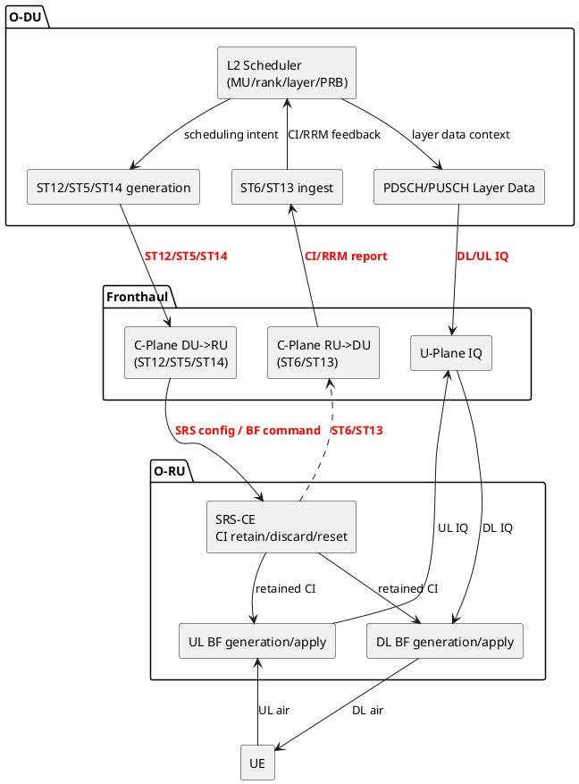

# O-RAN SRS-BF Architecture Overview

```plantuml

@startuml O-RAN SRS-BF Architecture Overview
!pragma graphviz svg
' scale 1920*1080

' skinparam linetype ortho
set namespaceSeparator ::

top to bottom direction

package "O-DU" as DU_P {
  rectangle "L2 Scheduler\n(MU/rank/layer/PRB)" as SCH
  rectangle "ST12/ST5/ST14 generation" as C_TX
  rectangle "ST6/ST13 ingest" as C_RX
  rectangle "PDSCH/PUSCH Layer Data" as DU_UP

  SCH -d-> C_TX : scheduling intent
  C_RX -u-> SCH : CI/RRM feedback
  SCH -d-> DU_UP : layer data context
}

package "Fronthaul" as FH_P {
  rectangle "C-Plane DU->RU\n(ST12/ST5/ST14)" as FH_C_DL
  rectangle "U-Plane IQ" as FH_U
  rectangle "C-Plane RU->DU\n(ST6/ST13)" as FH_C_UL
}

package "O-RU" as RU_P {
  rectangle "SRS-CE\nCI retain/discard/reset" as RU_SRS
  rectangle "DL BF generation/apply" as RU_DL
  rectangle "UL BF generation/apply" as RU_UL
}

rectangle "UE" as UE

DU_P -[hidden]d-> FH_P
FH_P -[hidden]d-> RU_P
RU_P -[hidden]d-> UE

C_TX -d-> FH_C_DL : <color:red><b>ST12/ST5/ST14</b></color>
FH_C_DL -d-> RU_SRS : <color:red><b>SRS config / BF command</b></color>
RU_SRS ..> FH_C_UL : <color:red><b>ST6/ST13</b></color>
FH_C_UL -u-> C_RX : <color:red><b>CI/RRM report</b></color>
DU_UP -d-> FH_U : <color:red><b>DL/UL IQ</b></color>
FH_U -d-> RU_DL : DL IQ
RU_UL -u-> FH_U : UL IQ
RU_DL -d-> UE : DL air
UE -u-> RU_UL : UL air
RU_SRS -d-> RU_DL : retained CI
RU_SRS -d-> RU_UL : retained CI
@enduml
```
