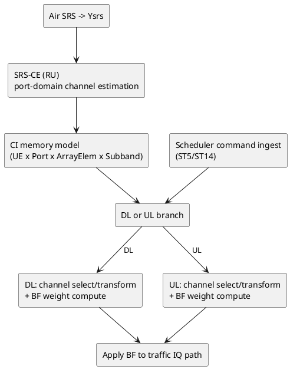

# O-RAN SRS-BF Computational Flow

```plantuml

@startuml O-RAN SRS-BF Computational Flow
!pragma graphviz svg
' scale 1920*1080

top to bottom direction
rectangle "Air SRS -> Ysrs" as IN
rectangle "SRS-CE (RU)\nport-domain channel estimation" as CE
rectangle "CI memory model\n(UE x Port x ArrayElem x Subband)" as MEM
rectangle "Scheduler command ingest\n(ST5/ST14)" as CMD
rectangle "DL or UL branch" as Q
rectangle "DL: channel select/transform\n+ BF weight compute" as DLP
rectangle "UL: channel select/transform\n+ BF weight compute" as ULP
rectangle "Apply BF to traffic IQ path" as APPLY

IN --> CE
CE --> MEM
CMD --> Q
MEM --> Q
Q --> DLP : DL
Q --> ULP : UL
DLP --> APPLY
ULP --> APPLY
@enduml
```
