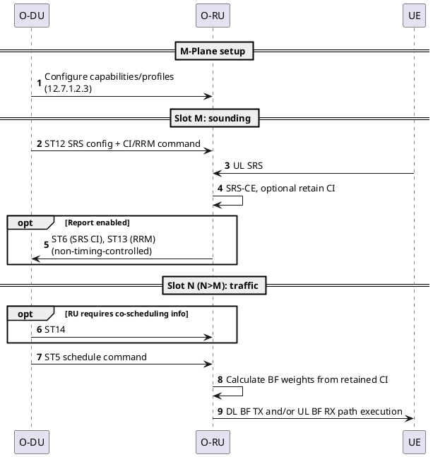

# O-RAN SRS-BF E2E Sequence

```plantuml

@startuml O-RAN SRS-BF E2E Sequence
autonumber
participant "O-DU" as DU
participant "O-RU" as RU
participant "UE" as UE

== M-Plane setup ==
DU -> RU : Configure capabilities/profiles\n(12.7.1.2.3)

== Slot M: sounding ==
DU -> RU : ST12 SRS config + CI/RRM command
UE -> RU : UL SRS
RU -> RU : SRS-CE, optional retain CI
opt Report enabled
  RU -> DU : ST6 (SRS CI), ST13 (RRM)\n(non-timing-controlled)
end

== Slot N (N>M): traffic ==
opt RU requires co-scheduling info
  DU -> RU : ST14
end
DU -> RU : ST5 schedule command
RU -> RU : Calculate BF weights from retained CI
RU -> UE : DL BF TX and/or UL BF RX path execution
@enduml
```
