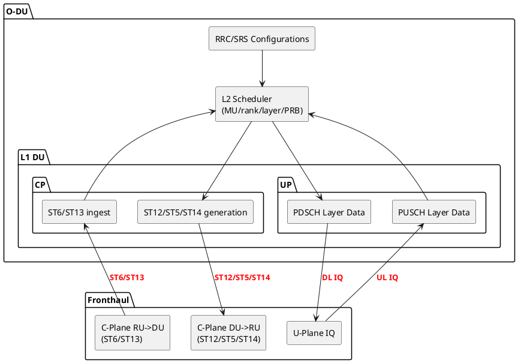

# O-RAN SRS-BF O-DU View

```plantuml

@startuml O-RAN SRS-BF O-DU View
!pragma graphviz svg
' scale 1920*1080

' skinparam linetype ortho
set namespaceSeparator ::

package "O-DU" as DU_P {
  rectangle "RRC/SRS Configurations" as RRC
  rectangle "L2 Scheduler\n(MU/rank/layer/PRB)" as SCH

  package "L1 DU" as L1 {
    package "CP" as CP_DU {
      rectangle "ST12/ST5/ST14 generation" as C_TX
      rectangle "ST6/ST13 ingest" as C_RX
    }

    package "UP" as UP_DU {
      rectangle "PDSCH Layer Data" as PDSCH
      rectangle "PUSCH Layer Data" as PUSCH
    }
  }

  RRC -d-> SCH
  C_RX -u-> SCH
  SCH -d-> C_TX
  SCH -d-> PDSCH
  PUSCH -u-> SCH
}

package "Fronthaul" as FH_P {
  rectangle "C-Plane DU->RU\n(ST12/ST5/ST14)" as FH_C_DL
  rectangle "C-Plane RU->DU\n(ST6/ST13)" as FH_C_UL
  rectangle "U-Plane IQ" as FH_U
}

C_TX -d-> FH_C_DL : <color:red><b>ST12/ST5/ST14</b></color>
FH_C_UL -u-> C_RX : <color:red><b>ST6/ST13</b></color>
PDSCH -d-> FH_U : <color:red><b>DL IQ</b></color>
PUSCH <-d- FH_U : <color:red><b>UL IQ</b></color>
@enduml
```
