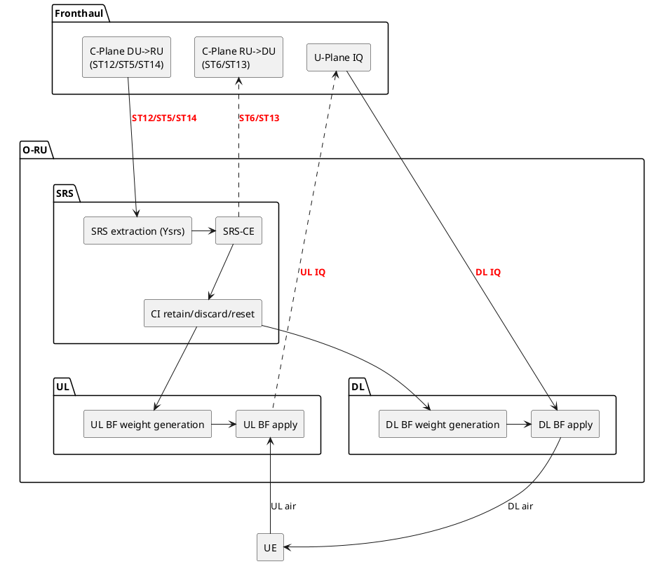

# O-RAN SRS-BF O-RU View

```plantuml

@startuml O-RAN SRS-BF O-RU View
!pragma graphviz svg
' scale 1920*1080

' skinparam linetype ortho
set namespaceSeparator ::

package "Fronthaul" as FH_P {
  rectangle "U-Plane IQ" as FH_U
  rectangle "C-Plane RU->DU\n(ST6/ST13)" as FH_C_UL
  rectangle "C-Plane DU->RU\n(ST12/ST5/ST14)" as FH_C_DL

  FH_U -[hidden]l-> FH_C_UL
  FH_C_UL -[hidden]l-> FH_C_DL
}

package "O-RU" as RU_P {
  package "SRS" as RU_SRS {
    rectangle "SRS extraction (Ysrs)" as SRSX
    rectangle "SRS-CE" as CE
    rectangle "CI retain/discard/reset" as MEM
    SRSX -l-> CE
    CE -d-> MEM
  }

  package "DL" as RU_DL {
    rectangle "DL BF weight generation" as DLW
    rectangle "DL BF apply" as DLB
    DLW -r-> DLB
  }

  package "UL" as RU_UL {
    rectangle "UL BF weight generation" as ULW
    rectangle "UL BF apply" as ULB
    ULW -l-> ULB
  }

  RU_SRS -[hidden]l-> RU_DL
  RU_SRS -[hidden]r-> RU_UL
  MEM -d-> DLW
  MEM -d-> ULW
}

rectangle "UE" as UE

FH_P -[hidden]d-> RU_P
RU_P -[hidden]d-> UE

FH_C_DL -d-> SRSX : <color:red><b>ST12/ST5/ST14</b></color>
CE ..> FH_C_UL : <color:red><b>ST6/ST13</b></color>
FH_U -d-> DLB : <color:red><b>DL IQ</b></color>
ULB -u..> FH_U : <color:red><b>UL IQ</b></color>
DLB -d-> UE : DL air
UE -u-> ULB : UL air
@enduml
```
