# O-RAN WG4 CUS R005 Section 12.7 Analysis  
## SRS-based Beamforming (SRS-BF) System Architecture Deep Dive

> Source baseline: `O-RAN.WG4.TS.CUS.0-R005-v21.00.04`, Clause `12.7` (and cross-references in `7.4.14`, `7.7.33`, `7.7.34`, `9.2`, `12.6`, `4.4.8`).

---

## 1) Section 12.7 hierarchy and technical focus

**中文解读：**  
这一章的核心是把 `12.7` 拆成“能力声明（M-Plane）—配置与控制（ST12/ST5/ST14）—观测回传（ST6/ST13）—执行路径（DL/UL BF）—与其他 BF 方法交互”五个层面。  
从系统工程角度，`12.7.1` 更偏“接口契约与约束”，`12.7.2` 更偏“运行时控制与执行语义”。

### 12.7
- Defines SRS-BF as the overall method family and positions it against other BF methods.

### 12.7.1 SRS-BF general aspects
- `12.7.1.1` Overview: defines the three core functions:
  - `SRS-CE`
  - `SRS-BF-DL`
  - `SRS-BF-UL`
- `12.7.1.2` M-Plane capabilities/configuration:
  - feature declaration and endpoint capability exposure
  - O-DU per-endpoint configuration rules
  - includes `SRS-CI-USE-FOR-DMRS-BF`
- `12.7.1.3` ST12 SRS configuration modeling:
  - symbol-level message partitioning
  - SRS block definition
  - `srsUeIdApId` indexing and reset semantics
- `12.7.1.4` ST6 channel information conveyance:
  - non-timing-controlled reporting
  - CI granularity/range control
  - retain/discard policy and reset behavior
- `12.7.1.5` ST13 RRM measurement provision:
  - mandatory and optional SRS-based measurements
  - T-Matrix reporting/update policy
- `12.7.1.6` ST5/ST14 execution command:
  - how O-DU scheduling decisions become RU BF execution
  - ueId interpretation and DL/UL operation constraints
- `12.7.1.7` Interaction with other BF methods:
  - fallback methods, CIBF coexistence constraints
  - SRS CI reuse for DMRS-BF dimensionality reduction

### 12.7.2 SRS-BF Control
- `12.7.2.1` Control overview and use cases.
- `12.7.2.2` SRS-CE memory model and CI usage constraints.
- `12.7.2.3` DL control modes:
  - layer index
  - layer channel index
  - port channel index
  - mixed interpretation with `SE33`
- `12.7.2.4` UL control modes:
  - joint UL BF
  - stream-based UL BF
  - port-based UL BF
  - stream-and-port dynamic mode

---

## 2) Functional architecture (system view)

**中文解读：**  
功能架构可概括为：**DU 决策、RU 观测与执行**。  
DU 通过 ST12 描述“如何观测”，通过 ST5/ST14 描述“如何在业务时隙使用观测结果”；RU 负责把 SRS 变成可用的 CI，并在 DL/UL 路径上做实际 BF 权重计算与施加。  
这也是 12.7 与传统“纯 DU 算法路径”最大的系统分工差异。

### Core architectural principle
- O-RU does observation + heavy spatial math close to array (`SRS-CE`, BF weight generation/apply).
- O-DU retains scheduling authority (`ST5`, optional `ST14`) and policy.
- M-Plane declares feasible envelope; C-Plane carries intent; U-Plane carries payload IQ.

### Extracted figure from document
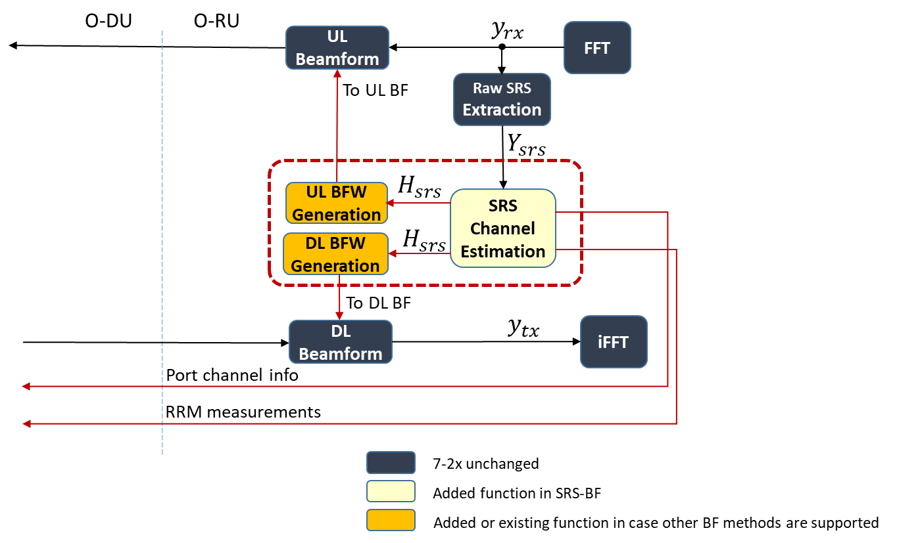

**Technical interpretation of the extracted figure (Figure 12.7.1.1-1):**
- **$y_{rx}$ -> $Y_{srs}$** shows that RU-side processing starts from antenna-domain UL receive data, then isolates SRS resources before CE.
- **`SRS Channel Estimation`** is the functional core of `SRS-CE`, generating $H_{srs}$ (port-domain channel information).
- **`DL BFW Generation` and `UL BFW Generation`** are downstream consumers of retained SRS CI; this is the key split between observation (`SRS-CE`) and execution (`SRS-BF-DL/UL`).
- **`Port channel info` and `RRM measurements` back to O-DU** correspond to ST6/ST13 reporting paths, which are non-timing-controlled in the 12.7 design.
- The dashed red function group indicates the SRS-BF-specific enhancement in O-RU while keeping the rest of the 7-2x PHY chain (`FFT/iFFT`, BF apply blocks) architecturally continuous.
- Architecturally, the figure confirms the control contract: O-DU provides configuration/scheduling intent, O-RU performs channel-derived weight computation and applies BF on traffic path.

**Signal notation (LaTeX):**
- Received antenna-domain UL samples at O-RU: $\mathbf{y}_{rx}(t,f) \in \mathbb{C}^{N_{ant}}$
- SRS resource extraction from received UL: $\mathbf{Y}_{SRS} = \mathcal{P}_{SRS}\!\left(\mathbf{y}_{rx}\right)$
- SRS-based channel estimation: $\mathbf{H}_{SRS} = \mathcal{C}\mathcal{E}\!\left(\mathbf{Y}_{SRS}\right)$
- RU-side beamforming weight generation: $\mathbf{W}_{DL} = f_{DL}\!\left(\mathbf{H}_{SRS}, \mathcal{S}_{DL}\right), \quad \mathbf{W}_{UL} = f_{UL}\!\left(\mathbf{H}_{SRS}, \mathcal{S}_{UL}\right)$
- CI memory abstraction (UE, port, array element, subband): $\mathcal{M}[u,p,a,b] \triangleq H_{SRS}(u,p,a,b)$

### Functional architecture (normalized view)
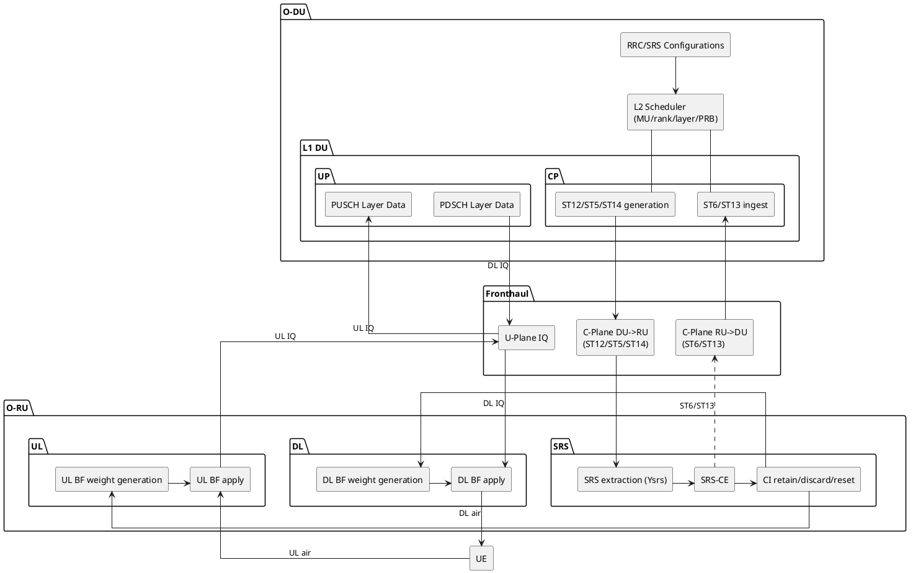

**Reference figure from spec (general C-Plane procedure, Clause 12.7.1.1):**  
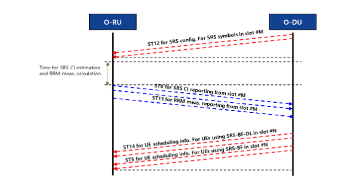

- **Clause mapping:** Figure `12.7.1.1-2` (general C-Plane procedure of SRS-BF).
- **Technical reading:** This figure anchors the two-slot logic (`M` sounding, `N` execution), explicitly separating ST12-driven sensing from ST5/ST14-driven execution and ST6/ST13 asynchronous feedback.

---

## 3) E2E working flow (from config to execution)

**中文解读：**  
E2E 可按“两阶段”理解：  
1) **Slot M（SRS 阶段）**：完成观测、估计、可选上报与保留；  
2) **Slot N（业务阶段）**：消费“已保留”的 CI，执行 DL/UL BF。  
这里最关键的工程点是：**ST6/ST13 是非时窗强约束通道**，不会与 ST5 的实时调度路径完全同频争抢。

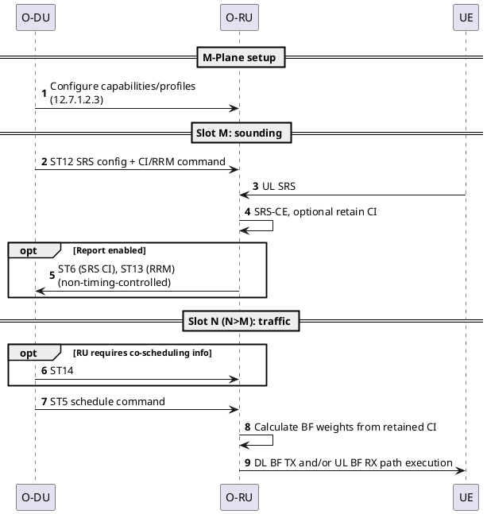

**Reference figure from spec (SRS block definition, Clause 12.7.1.3):**  
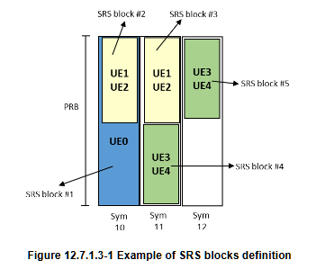

- **Clause mapping:** Figure `12.7.1.3-1` (example of SRS blocks definition).
- **Technical reading:** Shows why one ST12 message is scoped to one SRS symbol, while one symbol can need multiple section descriptions when multiple SRS blocks exist.

**Reference figure from spec (SRS span, Clause 12.7.1.3):**  
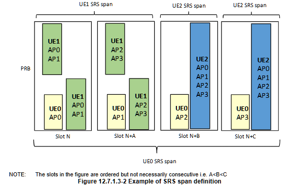

- **Clause mapping:** Figure `12.7.1.3-2` (example of SRS span definition).
- **Technical reading:** Visualizes per-UE antenna-port indexing progression across spans and why `srsUeIdApIdReset` is required when port-order semantics change.

---

## 4) DU/RU responsibility split

**中文解读：**  
可把 DU/RU 的责任边界理解为：  
- DU 负责“谁、何时、在哪些 PRB/层上发收”（调度主权）；  
- RU 负责“在该决策约束下如何形成空间权重并执行”（空间执行主权）。  
因此调优时应避免把 RU 当成“二次调度器”，否则容易破坏一致性和可互通性。

| Domain | O-DU responsibility | O-RU responsibility |
|---|---|---|
| Policy/control | RRC/DCI semantics, scheduling policy, ST12/ST5/ST14 intent | Execute under declared capabilities |
| Observation | Trigger/describe SRS observation via ST12 | Receive SRS, estimate CI, maintain CI memory |
| Measurements | Decide reporting scope and usage | Produce ST6/ST13 as configured |
| Beamforming | Decide who/when/where (UE/layer/PRB/time) | Compute/apply DL/UL BF weights |
| State consistency | Ensure UE index consistency, reset policies | Enforce retain/discard/reset and safety behavior |

---

## 5) Four key function families (clarified separately)

**中文解读：**  
这四类功能建议按“数据生命周期”记忆：  
`SRS-CE` 产出并管理 CI -> `SRS-BF-DL/UL` 消费 CI 执行波束成形 -> `SRS-CI-USE-FOR-DMRS-BF` 作为跨方法复用路径。  
其中最容易出问题的是 UE 标识一致性（ueId/srsUeIdApId）与 reset 时机。

## 5.1 SRS-CE
- Triggered by ST12 and SRS air reception.
- Produces SRS CI (port-domain channel information).
- Optionally reports:
  - ST6 CI
  - ST13 RRM
- Optionally retains CI for later BF.
- Reset semantics:
  - `srsUeIdApIdReset=1` invalidates prior CI context for affected UE index.

## 5.2 SRS-BF-DL
- Input:
  - retained SRS CI
  - ST5 scheduling, optional ST14 co-scheduling info
- Output:
  - DL BF weights and applied DL transmission
- ueId interpretation modes:
  - layer index
  - layer channel index (with T-Matrix association)
  - port channel index
  - dynamic mixed mode using `SE33` where supported/configured

**Reference figure from spec (DL with layer-index ueId):**  
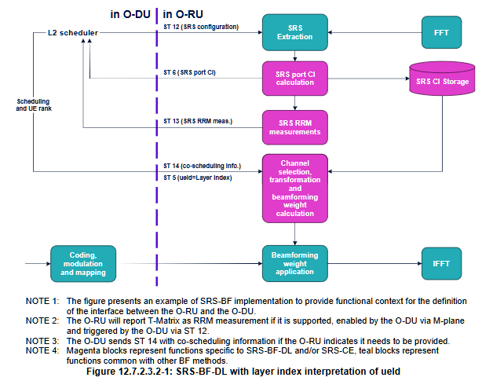

- **Clause mapping:** Figure `12.7.2.3.2-1`.
- **Technical reading:** RU retains autonomy for channel-selection/transform under scheduler context; ueId LSB denotes layer index, with layer mapping finalized at scheduling time.
- **中文技术细节：** layer-index 模式下，DU 主要给出层调度意图，RU 可在本地完成端口到层的具体映射与权重求解，适合 RU 算法能力较强的实现形态。

**Reference figure from spec (DL with layer-channel-index ueId):**  
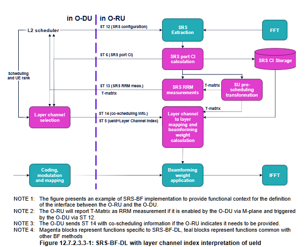

- **Clause mapping:** Figure `12.7.2.3.3-1`.
- **Technical reading:** RU computes SU pre-scheduling transform (T-Matrix) from port-domain CI, then consumes ST5 indices as explicit layer-channel selectors.
- **中文技术细节：** layer-channel-index 模式强调“先变换、后调度消费”；RU 先得到可排序的 layer-channel，再由 DU 通过索引精确挑选，接口确定性更强，但配置与一致性要求更高。

**Reference figure from spec (DL with port-channel-index ueId):**  
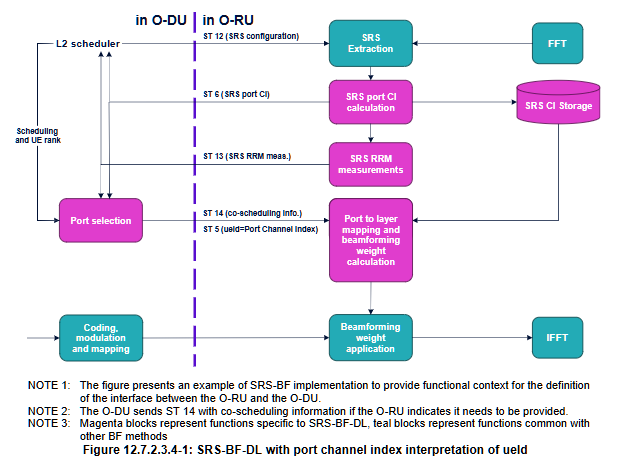

- **Clause mapping:** Figure `12.7.2.3.4-1`.
- **Technical reading:** No RU-side port-to-layer transform stage; ST5 ueId directly points to port-domain channel context from ST12/SRS CE.
- **中文技术细节：** port-channel-index 模式是最直接映射，链路短、解释简单，但对调度侧和端口语义一致性的依赖更高，适合偏保守/可解释实现。

## 5.3 SRS-BF-UL
- Input:
  - retained SRS CI
  - ST5 (+ SE34/SE10 depending on UL BF type)
- Types:
  - joint UL BF
  - stream-based UL BF
  - port-based UL BF
  - stream-and-port dynamic selection (presence/absence of SE34)
- Output:
  - beamformed UL spatial streams conveyed over UL U-Plane.

**Reference figure from spec (Joint UL SRS-BF):**  
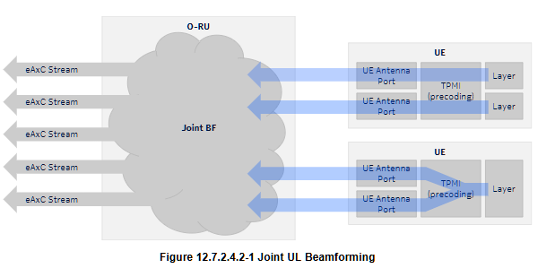

- **Clause mapping:** Figure `12.7.2.4.2-1`.
- **Technical reading:** Joint BF computes coupled weights over co-scheduled UL layers in a PRB block, with SE34 carrying grouping/TPMI context.
- **中文技术细节：** Joint 模式强调“联合最优”，对多层协同增益最好，但计算复杂度与耦合度最高。

**Reference figure from spec (Stream-based UL SRS-BF):**  
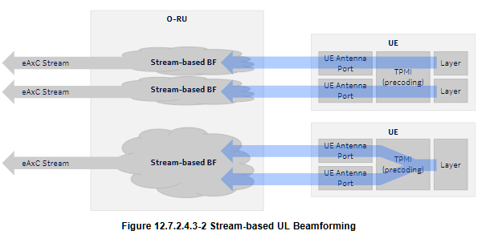

- **Clause mapping:** Figure `12.7.2.4.3-1` (stream-based UL BF; filename keeps source typo `Baesd`).
- **Technical reading:** RU computes per-stream BF, preserving stream granularity while still allowing multi-layer interference handling.
- **中文技术细节：** Stream-based 在性能与复杂度之间更均衡，常用于需要可扩展并发处理的场景。

**Reference figure from spec (Port-based UL SRS-BF):**  
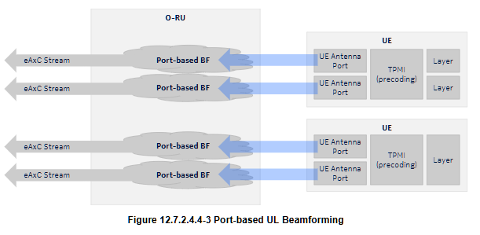

- **Clause mapping:** Figure `12.7.2.4.4-1`.
- **Technical reading:** One SRS port per stream constraint simplifies mapping, using ST5 (+ optional SE10) without SE34 requirements.
- **中文技术细节：** Port-based 约束最清晰，工程实现门槛最低，但在复杂多流场景下灵活性相对较弱。

## 5.4 SRS-CI-USE-FOR-DMRS-BF
- Optional capability enabling SRS CI reuse in DMRS-BF (e.g., dimensionality reduction).
- Requires strict DU consistency:
  - endpoint configuration consistency
  - UE index bit-width consistency between SRS and DMRS contexts
  - physical UE identity continuity across slot timeline
- RU must still handle DMRS-BF even when usable SRS CI is unavailable.

---

## 6) Signal flow and control-plane mapping

**中文解读：**  
`12.7` 的信令设计本质上是把“实时控制”和“弹性反馈”分层：  
- ST12/ST5/ST14：偏时效与调度闭环；  
- ST6/ST13：偏测量回传与策略输入。  
这种分层能减少实时窗口压力，是多厂互通时的重要稳定器。

| Stage | Primary message | Purpose |
|---|---|---|
| SRS description | ST12 | SRS timing/frequency/UE-port config + CI/RRM command |
| CI report | ST6 | SRS CI RU->DU (non-timing-controlled) |
| RRM report | ST13 | SRS-based measurements RU->DU (non-timing-controlled) |
| Execution command | ST5 | Slot-level scheduling command for BF application |
| DL co-scheduling | ST14 | Optional/required RU-side DL multi-UE relation info |

Key implication: ST6/ST13 elasticity avoids choking grant-time deterministic control traffic.

---

## 7) Computational flow (where heavy math lives)

**中文解读：**  
计算流的关键是“观测域”和“执行域”分离：  
SRS-CE 在观测域沉淀 CI 状态，调度命令在执行域触发权重求解。  
从容量规划看，RU 侧受阵元规模与 RE 规模影响最大，DU 侧受调度算法复杂度和策略闭环时延影响更明显。

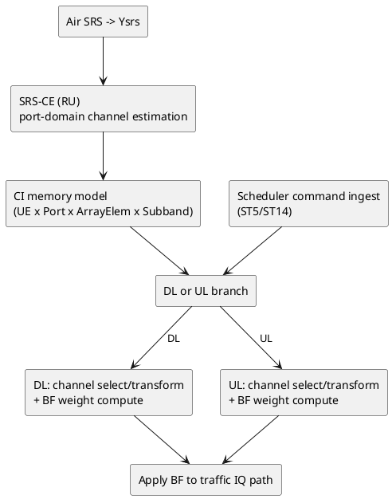

System insight:
- RU handles $O\!\left(N_{\mathrm{ant}}\,N_{\mathrm{RE}}\,N_{\mathrm{port}}\right)$ style observation/weighting.
- DU handles combinational scheduling and policy loop.
- Performance bottleneck is typically one of: RU compute envelope, CI transport/report strategy, or scheduler policy latency.

---

## 8) Scheduler interaction (L2 perspective)

**中文解读：**  
调度器需要把 CI 新鲜度当成“显式状态变量”，而不是隐含背景信息。  
建议在实现中区分“快速调度环”（ST5/ST14）与“慢速观测环”（SRS/ST6/ST13），并建立 fallback 策略（例如切到 PDBF/WDBF）以覆盖 CI 不可用或不可靠场景。

### How scheduler consumes 12.7 outputs
- Uses ST6/ST13 feedback to decide:
  - UE pairing and MU set
  - rank / layers
  - PRB/time allocation
  - whether to use SRS-BF path or fallback BF method

### Two-timescale control loop
- Fast loop: per-slot scheduling and HARQ-linked actions (ST5/ST14).
- Slower loop: SRS refresh, CI quality/freshness, RRM ingestion.

### Scheduling guardrails from 12.7
- Do not schedule SRS-BF before valid retained CI exists for UE.
- Respect RU capability ceilings (layers, streams, ST message structure counts).
- Keep ueId semantics consistent with configured interpretation mode.
- Trigger reset when UE port ordering/context changes.

---

## 9) Interaction with other beamforming methods

**中文解读：**  
`12.7` 对并发场景有明确“未规定”边界，系统设计时不应默认可任意同频同符号混用。  
工程上更稳妥的策略是：先做互斥资源编排和方法切换策略，再做跨方法联合优化。

- RU supporting SRS-BF-DL/UL must support at least one fallback in corresponding direction (minimum PDBF or WDBF; CIBF optional if both sides support).
- Concurrent use in same frequency + same symbol + same direction is explicitly not specified for several combinations.
- SRS-CE can be used to offload SRS observation for PDBF/WDBF decisioning in DU.
- CIBF coexistence requires mutually exclusive ueId sets between CIBF and SRS-BF contexts.

---

## 10) Engineering takeaways (system architecture)

**中文解读：**  
如果把 12.7 落地成一句工程原则：  
**“DU 做决策编排，RU 做空间执行；以统一标识与状态生命周期保证跨时隙一致性。”**  
只要把 `ueId/srsUeIdApId` 映射、reset 规则、ST12/ST5/ST14 与 ST6/ST13 的时序边界管理好，系统稳定性会显著提升。

1. `12.7` is a contract architecture: DU owns policy/scheduling; RU owns spatial execution.
2. Separation of timing-controlled (ST12/ST5/ST14) and non-timing-controlled (ST6/ST13) is central to real-time stability.
3. `srsUeIdApId` semantics and reset correctness are first-order interoperability risks.
4. `SE33` (DL mixed interpretation) and `SE34/SE10` (UL grouping/type) are key scheduler-RU coupling points.
5. `SRS-CI-USE-FOR-DMRS-BF` is powerful but requires strict identity/config consistency discipline.

---

## 11) Traceability of this analysis

- Document clause analyzed: `12.7`, `12.7.1`, `12.7.2`.
- Cross-clause references included: `4.4.8`, `7.4.14`, `7.7.33`, `7.7.34`, `9.2`, `12.6`, `12.7.1.7`.
- Output file path: `C:\work\note\personal\technology\o-ran\R005_12.7_SRS-BF_System_Architecture_Analysis.md`

