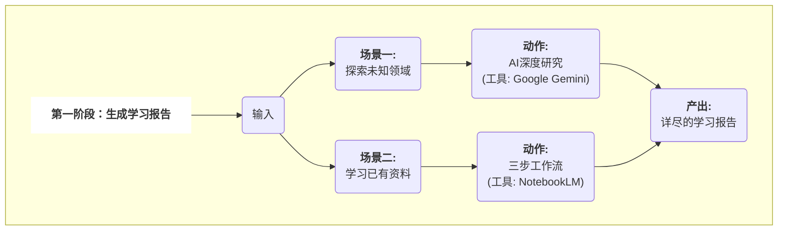
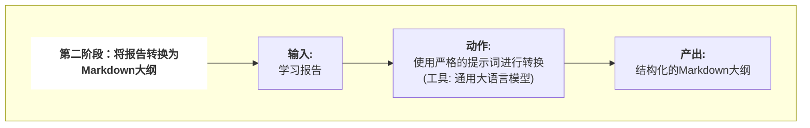
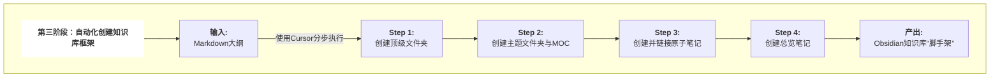
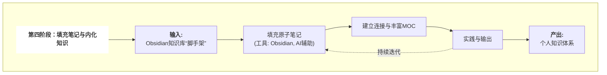

  
# 学习一个陌生知识领域_建立学习路径和知识库框架
利用人工智能（AI）作为执行工具，在Obsidian中构建结构化、可扩展的个人知识库，并以此为基础进行高效、深入的学习。

**主要涉及工具：**

- **信息规划**：Google Gemini Deep Research (或其他具备Deep Research的AI工具), Google NotebookLM
- **大纲生成**：通用大语言模型 (Gemini, ChatGPT, Deepseek等)
- **框架搭建**：Cursor (或其替代品，如TRAE, Gemini CLI, Claude Code, VS Code + Cline)
- **知识承载与学习**：Obsidian

---

## **第一阶段：生成学习报告**

### **场景一：学习一个全新的领域**

当我们面对一个完全陌生的领域时，我们利用具备深度研究能力的AI模型，为我们系统性地梳理知识。

成功的关键在于向AI提出一个高质量的、复杂的指令。这个指令需要清晰地定义我们的身份背景、最终学习目标、对学习路径的阶段性要求，以及对输出格式的规定。AI在接收到这样的指令后，会启动其深度研究模式，通过自主规划、全网检索、多源分析等一系列动作，最终生成一份结构化的深度报告。

### **场景二：学习已有的私有资料**

当我们已经收集了大量学习资料（如PDF、文档）时，我们使用Google NotebookLM这类工具，让AI成为只基于我们私有资料进行回答的领域专家。

为了保证质量，我们采用一种“对话式”的三步工作流：

1. **宏观理解**：首先让AI通读所有资料，并生成一份核心摘要。我们通过追问来校准AI的宏观理解，直至与我们的预期达成一致。
2. **设计学习路径**：在达成共识的基础上，我们让AI基于摘要，设计一个逻辑清晰的学习路线图，并要求它为每个主题附上在原始资料中的来源引用。
3. **生成最终报告**：当我们对学习路径完全满意后，再让AI输出一份详尽的、包含所有讨论成果的学习报告。

---

## **第二阶段：将报告转换为Markdown大纲**

第一阶段产出的学习报告，是适合人类阅读的“文章”。为了让自动化工具能够理解，我们必须进行第二步：将其转换为机器可读的格式。

目标是将“文章式”的报告，转换成一个纯粹的、结构化的Markdown大纲。我们使用一个强大的大语言模型，通过一个极其严格的指令，让它将输入文本重构成我们预先设计好的、具有三层嵌套逻辑的格式：

- **二级标题 (H2)**：定义顶级的知识分类，将成为顶级文件夹。
- **三级标题 (H3)**：定义该分类下的具体主题，将成为主题文件夹。
- **无序列表项**：定义该主题下最基础的原子知识点，将成为原子笔记。

这个过程将一份充满细节的报告，提纯为一份毫无歧义的、用于下一步自动化操作的结构化指令清单。

---

## **第三阶段：自动化创建知识库框架**

这是整个流程中效率提升最显著的环节。我们将上一步生成的Markdown大纲，交给AI执行工具，让它在几分钟内，为我们搭建起知识库的完整框架。

为保证过程的稳定可控，我们将搭建过程分解为四个清晰的、循序渐进的步骤，通过向Cursor（或其替代品）分步发送指令来完成。

1. **创建顶级分类文件夹**：AI根据大纲的二级标题，在Obsidian库的根目录下创建对应的顶级文件夹。
2. **创建主题文件夹与MOC笔记**：AI根据三级标题，在对应的顶级文件夹内创建主题文件夹，并在其中生成一个以“主题名 MOC.md”命名的、空的索引笔记（内容地图）。
3. **创建并链接原子笔记**：AI根据列表项，在对应的主题文件夹内创建所有空的原子笔记。同时，AI会自动打开每个MOC笔记，并将该主题下所有原子笔记的链接，以Obsidian双向链接的格式写入其中。
4. **创建知识库总览笔记**：最后，AI可以在根目录下创建一个作为整个知识库中央枢纽的总览笔记，并链接到各个核心主题的MOC笔记。

通过这四步，一个纯文本大纲被全自动地转换成了一个结构严谨、层次分明、功能完备的Obsidian知识库“脚手架”。

---

## **第四阶段：填充笔记与内化知识**

### **填充原子笔记**

这是学习的基础。我们每天选择少数几个原子笔记作为目标。针对这些高度聚焦的知识点，可以再次利用AI进行高效的信息输入。但最关键的步骤是，在完成输入后，**我们必须用自己的语言，将对这个知识点的理解、思考和总结，完整地写入Obsidian的笔记中**。这个“知识重述”的过程，是知识内化的核心。

### **建立连接与丰富MOC**

当原子笔记逐渐丰富后，我们需要构建知识网络。在撰写新笔记时，主动思考并创建与已有知识的双向链接。同时，定期回到MOC笔记，撰写对该主题的总结性概述，阐述其下属原子知识点之间的内在逻辑。这会让MOC笔记从一个简单的目录，升华为对一个主题的高度浓缩的理解。

### **实践与输出**

知识的最终价值体现在应用。我们可以通过设定具体的项目来实践所学，或尝试以写作、分享等形式将知识“教”给别人。这个过程会以最高标准检验我们的学习成果，并迫使我们对知识进行更深层次的结构化重组。

通过持续地填充、连接与实践，一个由AI搭建的框架，将最终演化成一个真正属于我们自己的、内容充实、连接丰富的个人知识体系。
# 搭建知识库架构：Cursor类工具.
## 核心问题
当面对一个全新的、陌生的知识领域时，如何利用AI快速、高效地搭建起整个知识库的初始结构？这包括自动创建文件夹、笔记文件、目录（MOCs），并为每个知识点撰写初步的概要，即所谓的“知识库脚手架”（Knowledge Base Scaffolding）。

## 核心理念：建筑师 vs. 室内设计师
要解决这个问题，首先需要理解不同AI工具在此场景下的角色定位。我们可以用一个生动的比喻来区分：

- **“建筑师” (Architects):** 这类工具（如Cursor, VS Code+Cline插件）具备**项目级视野和文件系统操作能力**。它们能看懂整个项目的“蓝图”（如一个Markdown大纲），并据此搭建起整个建筑的框架（创建文件夹和文件）。
- **“室内设计师” (Interior Designers):** 这类工具（如Obsidian AI插件）专注于**已存在的空间内部**。它们负责在单个房间（笔记）内进行精装修（撰写和润色内容），并打通房间之间的连接（创建双向链接）。

在“知识库脚手架”这个场景中，我们首先需要的是一位**建筑师**。

## 工具对比：谁是最佳“建筑师”？

### 场景一：知识库骨架搭建 (Scaffolding)
这个阶段的核心任务是**从无到有地创建结构**。

| 工具类别 | 核心能力 | 文件系统权限 | 【脚手架】场景表现 |
| :--- | :--- | :--- | :--- |
| **“建筑师”类工具** (Cursor, Cline, TRAE, Gemini CLI) | 理解项目结构，执行多步骤任务 | **高** (读、写、创建、删除) | **非常胜任**。能自动化执行“根据大纲创建目录树和文件”的复杂指令。 |
| **“室内设计师”类工具** (Obsidian AI插件,例如Copilot) | 理解笔记内容，在当前笔记中操作 | **低** (主要为读取，有限的写入) | **不胜任**。无法执行跨文件的、批量创建文件/文件夹的指令，需要大量手动干预。 |

### 场景二：日常知识管理与内容填充
当骨架搭建完毕后，工作重心转移到**内容的精细化处理和知识连接**上。

| 工具类别 | 核心能力 | 知识连接能力 | 日常使用体验 |
| :--- | :--- | :--- | :--- |
| **“建筑师”类工具** | 代码和项目结构理解 | 较弱或非核心 | 过于专业，缺少为知识管理优化的功能（如双链、标签面板）。 |
| **“室内设计师”类工具** | 文本润色、总结、问答、链接建议 | **极强** (双链、MOCs、图谱) | **完美契合**。专为非线性、网络化的知识管理而生，体验流畅。 |

## “知识库建筑师”工具深度横评
既然确定了需要“建筑师”，那么市面上有哪些优秀的选择？

| 工具 (Tool) | 类型 | 交互方式 | 【脚手架】能力 | 优势 | 劣势 |
| :--- | :--- | :--- | :--- | :--- | :--- |
| **Cursor** | 独立AI编辑器 | GUI聊天窗口 | **非常高** | 开箱即用，AI与编辑器深度融合，交互体验流畅自然。 | 闭源，对BYOK（自带Key）的政策可能摇摆，有被厂商锁定的风险。 |
| **Cline (in VS Code)** | VS Code 插件 | GUI聊天窗口 | **非常高** | **开源透明**，完全由用户控制API Key和成本，能利用VS Code庞大的插件生态。 | 需要用户自行安装和配置VS Code及插件，多一步设置。 |
| **TRAE 2.0** | 独立AI编辑器 | GUI聊天窗口 | **高** | **完全免费**使用GPT-4o/Claude 3.5等顶级模型，无需自己的Key，功能激进。 | 较新，生态不成熟，有用户对其数据隐私和遥测表示担忧。 |
| **Gemini CLI / Claude Code** | 命令行工具 | 终端命令 | **极高 (需脚本)** | **自动化潜力最强**，可集成到任何脚本中，实现复杂和可重复的搭建流程。 | **用户门槛最高**，无图形界面，需要熟悉命令行和脚本编写。 |

## 最佳实践：混合工作流 (Hybrid Workflow)
最高效的策略是结合两类工具的优势，采用分阶段的混合工作流。

### 阶段一：架构搭建 (使用“建筑师”)
1.  **规划蓝图**: 使用AI（如Gemini, ChatGPT）或自己思考，制定一份详细的学习路径，并整理成Markdown层级列表格式。
2.  **选择工具**: 启动 **Cursor** 或 **VS Code + Cline插件**。
3.  **自动建造**: 在工具中打开一个空文件夹（未来的Obsidian库），将Markdown大纲粘贴给AI，并下达明确指令：
    > “请根据这个Markdown大纲，为我创建对应的文件夹和`.md`笔记文件。一级标题作为文件夹，二级标题作为该文件夹下的笔记文件。然后，为每个创建的笔记文件撰写一段简短的介绍性摘要。最后，在根目录创建一个名为`_MOC_总览.md`的MOC文件，并链接到所有新创建的笔记。”
4.  **验收成果**: AI自动完成所有文件系统操作，一个结构清晰的知识库骨架瞬间生成。

### 阶段二：内容填充与知识连接 (使用“室内设计师”)
1.  **切换场地**: 关闭“建筑师”工具，用 **Obsidian** 打开刚刚生成文件夹，将其作为新的知识库。
2.  **精细装修**:
    *   **填充内容**: 逐一学习每个知识点，在对应的笔记中深入记录。随时调用Obsidian的AI插件（如Copilot, BMO）进行内容扩写、润色或问答。
    *   **建立连接**: 使用 `[[双向链接]]` 主动建立知识间的联系，并通过图谱视图观察知识网络。
    *   **智能发现**: 利用 `Smart Connections` 等插件，让AI自动发现笔记间潜在的深层联系。
    *   **知识库对话**: 当笔记丰富后，直接与AI对话，让它基于你自己的知识库内容回答问题。

## 结论总结
在构建个人知识库时，应奉行**“专器专用”**的原则。
- **使用Cursor及其同类工具作为“建筑师”，快速、自动化地搭建知识库的宏观结构。**
- **然后回到Obsidian这个专业的“设计工作室”中，进行精细化的内容创作和深度的知识连接。**

通过这种混合工作流，可以最大化地发挥AI的效能，将我们从繁琐的重复性工作中解放出来，专注于最核心的学习和思考。