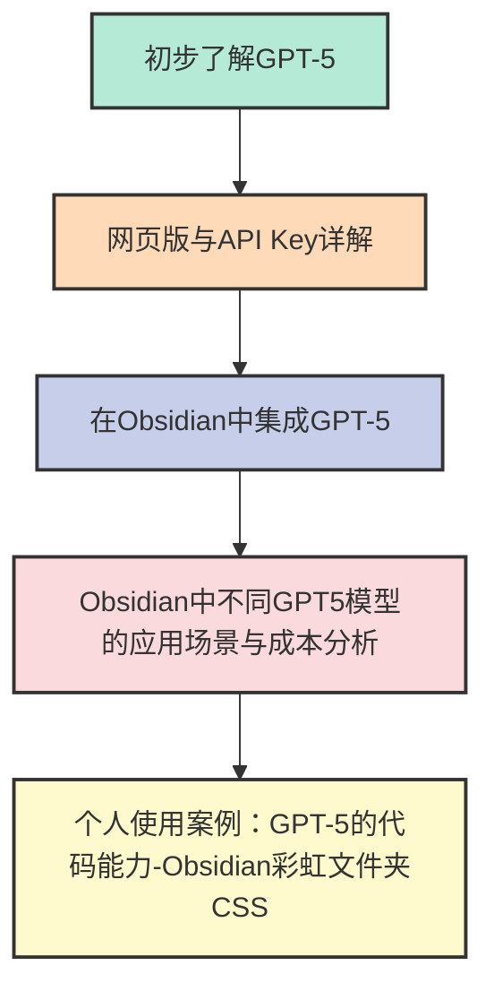

## 🚀 GPT-5 核心亮点与优势

根据 OpenAI 的发布会及官方资料，GPT-5 相比前代实现了跨越式提升，主要体现在以下几个方面：

*   **智能与推理的飞跃**：GPT-5 在逻辑推理、代码生成和多步骤任务规划上的能力得到**根本性增强**。它能更准确地理解复杂指令，并执行需要深度思考的代理（Agentic）任务。
*   **“幻觉”现象大幅减少**：模型的事实准确性显著提高，在回答中编造事实（即AI幻觉）的频率相比 GPT-4o 降低了40%以上，使其在专业领域的应用更加可靠。
*   **超长的上下文窗口**：全系列模型均支持高达 **400,000 tokens** 的上下文窗口，能够轻松处理整本书籍、代码库或长篇报告的分析与问答。
*   **更强的多模态能力**：不仅能理解文本和图像，在即将开放的功能中，GPT-5 将原生支持视频和音频的输入与理解，能够进行视频内容分析、语音对话等。
*   **极致的性能与成本分层**：首次推出 `mini` 和 `nano` 版本的 API，为开发者提供了从追求极致性能到追求极致性价比的完整选择光谱，极大地降低了AI应用的开发和运营成本。
*   **开发者体验优化**：引入了**缓存输入（Cached Input）**计费项和**预测性输出（Predicted outputs）**等新特性，帮助开发者在降低成本的同时，提升应用的响应速度和用户体验。

---

## 网页版 (产品) vs. API Key (服务)

*   **网页版 (chat.openai.com)**：这是一个面向最终用户的**产品**。按月支付**订阅费**（Free/Plus/Pro），购买的是一个功能打包的“AI助手”使用权。这里的模型名称（如GPT-5 Plus）是产品套餐的一部分。
*   **API Key**：这是一个面向开发者的**服务**。您按照实际消耗的计算资源（Tokens）来**按量付费**，用它来构建自己的应用程序（**比如集成到Obsidian中**）。这里的模型名称（如 `gpt-5-mini`）是精确的API代号。

> [!WARNING] 关键点
> **在网页版的订阅等级，与API Key的性能和计费完全无关！** 在Obsidian里使用哪个模型，只取决于您在插件里选择了哪个API模型代号，以及API账户是否有余额。

---

## 📊 表格一：网页版 ChatGPT 产品

作为一名普通用户，在不同订阅等级下使用 `chat.openai.com` 的具体情况。

| 特性 | **Free (免费版)** | **Plus (增强版)** | **Pro (专业版)** |
| :--- | :--- | :--- | :--- |
| **价格** | $0 / 月 | ~$20 / 月 | ~$200 / 月 |
| **核心定位** | 体验基础AI对话 | 高级AI功能与优先访问 | 极致性能与最高权限 |
| **可使用模型**| **GPT-5 (标准版)** + **GPT-5 mini** | **GPT-5 (增强版)** + **GPT-5 Thinking** | **GPT-5 Pro (顶级版)** |
| **推理能力** | 标准 | 高 | 最高 |
| **速度/权限** | 有限，高峰期可能降级或排队 | 优先访问，速度更快 | 最高优先级，速度最快 |
| **支持输入** | 文本, 图像 | 文本, 图像, 文件, (未来支持音视频) | 文本, 图像, 文件, (未来支持音视频) |
| **知识截止** | 2024年5月 | 2024年10月 | 2024年10月 |
| **上下文窗口**| 较短 | 更长 | 超长 |
| **使用限制** | 有每日使用次数和消息频率限制 | 使用额度远高于免费版 | 几乎无限制的最高额度 |
| **高级工具** | ❌ 不支持 | ✅ DALL-E 3, 高级数据分析, 联网等 | ✅ Plus所有功能，且能力更强 |

---

## 📈 表格二：GPT-5 API Key 详解

这张表格是为开发者准备的（当然也是Obsidian使用者），详细列出了每个API模型的性能、价格和技术参数。**这也是我们在Obsidian插件里需要关心的部分**。

| 特性 | **GPT-5** | **GPT-5 mini** | **GPT-5 nano** | **GPT-5 Chat** |
| :--- | :--- | :--- | :--- | :--- |
| **核心定位** | **旗舰模型**，适用于最复杂的编码和代理任务。 | **高性价比模型**，为定义明确的任务提供更快、更经济的选择。 | **速度最快、成本最低**的版本，专为需要即-时响应和超低延迟的应用设计。 | **对话优化模型**，目前在ChatGPT中使用的下一代高智能旗舰模型。 |
| **推理能力** | **最高 (4/4)** | **高 (3/4)** | **一般 (2/4)** | **高 (3/4)** |
| **速度** | 中等 (3/5) | 很快 (4/5) | **非常快 (5/5)** | 中等 (3/5) |
| **价格 (每1M Tokens)** | **输入**: $1.25 **输出**: $10.00 | **输入**: $0.25 **输出**: $2.00 | **输入**: $0.05 **输出**: $0.40 | **输入**: $1.25 **输出**: $10.00 |
| **支持输入** | 文本, 图像 | 文本, 图像 | 文本, 图像 | 文本, 图像 |
| **支持输出** | 文本 | 文本 | 文本 | 文本 |
| **知识截止日期**| 2024年10月1日 | 2024年5月31日 | 2024年5月31日 | 2024年9月30日 |
| **最大上下文窗口**| 400,000 tokens | 400,000 tokens | 400,000 tokens | 400,000 tokens |
| **最大输出** | 128,000 tokens | 128,000 tokens | 128,000 tokens | 128,000 tokens |
| **主要优势** | 编码和代理任务性能最强，支持预测性输出。 | 性能和成本之间的最佳平衡点，性价比极高。 | 延迟最低，成本最便宜，适合大规模、高频率的简单任务。 | 专为高级、自然的对话设计，提供更流畅的交互体验。 |
| **主要劣势** | 价格最昂贵，速度相对较慢。 | 不支持预测性输出和蒸馏。 | 推理能力较弱，不支持预测性输出和蒸馏。 | 不支持函数调用、结构化输出和微调等高级功能。 |
| **支持的工具** | 网页搜索, 文件搜索, 代码解释器, MCP | 文件搜索, 代码解释器, MCP | 文件搜索, 代码解释器, MCP | 不支持 |
| **支持的特性** | 流式传输, 函数调用, 结构化输出, 微调, 蒸馏, 预测性输出 | 流式传输, 函数调用, 结构化输出, 微调 | 流式传输, 函数调用, 结构化输出, 微调 | 流式传输, 预测性输出 |

---

## 🛠️ 如何在 Obsidian 中接入 GPT-5

将 GPT-5 的强大能力接入您的 Obsidian 知识库非常简单，只需通过支持API的插件即可。

### 实操步骤

| 步骤 | 操作建议 |
| :--- | :--- |
| **1. 获取 API Key** | 登录您的 OpenAI 账户，在 `platform.openai.com` 的 API Keys 页面生成一个新的 API 密钥并复制。**注意**：您可能需要在此页面绑定支付方式并充值，才能使用API。 |
| **2. 安装插件** | 在 Obsidian 的 `社区插件市场` 中搜索并安装一个通用AI插件。推荐使用 **Text Generator** 或 **Obsidian Copilot**。 |
| **3. 配置插件** | 进入插件的设置页面：   • 将您复制的 **API Key** 粘贴到指定位置。   • 在模型选择（Model）下拉菜单中，选择您想使用的模型代号，例如 `gpt-5-mini` (推荐初次使用) 或 `gpt-5`。   • 保存设置并重启Obsidian（如果需要）。|
| **4. 开始使用** | 现在您可以在笔记中通过快捷键或命令面板调用插件功能，与您的笔记内容进行对话、生成摘要、或进行智能问答了！ |

> [!TIP] 成本提示
> 通过 API 在 Obsidian 中使用 GPT-5 是**按量付费**的，会消耗您 OpenAI API 账户中的余额，与您的网页版订阅无关。对于大多数笔记整理和问答任务，`gpt-5-mini` 是最具性价比的选择。

---

### API 调用成本实例

为了更直观地理解不同API模型的成本差异，我们以一个实际任务为例：**生成一篇约500字的知识笔记**。

假设完成这个任务需要 **输入50 tokens** 和 **输出280 tokens**。下表将详细计算并对比各模型完成此任务的费用，并给出具体的使用建议。

| 模型版本 | 生成笔记成本 (美元) | 生成笔记成本 (人民币) | 用20元人民币能生成多少篇 | **使用场景建议** |
| :--- | :--- | :--- | :--- | :--- |
| **GPT-5** | `~$0.00286` | `~¥0.021` (约 2.1 分) | 约 **950** 篇 | **核心、高价值任务**。需要顶级创造力、深度逻辑推理和复杂代码生成时使用。例如：撰写论文核心章节、分析复杂财报、构建精密的软件模块。 |
| **GPT-5 mini** | `~$0.00057` | `~¥0.0042` (约 0.4 分) | 约 **4,700** 篇 | **绝大多数日常任务的默认首选**。例如：整理笔记、内容摘要、起草邮件、辅助编程、智能问答等。在质量和成本之间取得了最佳平衡。 |
| **GPT-5 nano** | `~$0.00011` | `~¥0.0008` (约 0.08 分) | 约 **25,000** 篇 | **高并发、低延迟、成本敏感**的简单任务。例如：为笔记批量打标签、情感分析、关键词提取、文本分类、格式转换等。 |
| **GPT-5 Chat** | `~$0.00286` | `~¥0.021` (约 2.1 分) | 约 **950** 篇 | 专为**构建流畅、自然的对话式应用**而优化。例如：智能客服、角色扮演、聊天机器人、虚拟伴侣等需要高度上下文感知和人性化交互的场景。 |

> [!NOTE] 成本说明
> - 以上人民币价格按 1 美元 ≈ 7.3 人民币的汇率估算，实际费用以OpenAI账单为准。
> - 此计算基于单个、短篇笔记的生成。在处理更长的文档或进行多轮对话时，Token消耗量和总成本会相应增加。

---
### GPT-5 在 Obsidian 中的独特优势与场景应用

> [!SUCCESS]- GPT5在Obsidian中的应用场景优势
> 将 GPT-5 接入 Obsidian，不仅仅是增加了一个“AI写作助手”，更是为整个知识库安装了一个强大的“智能处理引擎”。GPT-5的优势根源于其几个“不可替代”的核心能力，这些能力在知识管理场景中被无限放大：
>
> 1.  **更高的可靠性与忠诚度**：GPT-5 大幅降低了“幻觉率”，在执行格式化、结构化输出（如生成会议纪要、元数据）时，它能像一个严谨的助理一样精确遵循指令，极大减少了二次修改的成本。当它作为“第二大脑”的核心时，这种忠于你所提供材料的特性，保证了输出的可信度。
>
> 2.  **从“识别”到“理解”的质变**：其顶级的多模态推理能力，让Obsidian不再局限于处理文本。你可以直接将白板照片、手绘草图、流程图扔给它，GPT-5能理解其中的逻辑关系并转化为结构化笔记，真正打通了视觉灵感与文本知识之间的壁垒。
>
> 3.  **极致的成本效益与战略灵活性**：`nano`、`mini`、`GPT-5` 构成的模型家族，允许你在同一个技术生态内，为不同的知识处理任务选择最合适的工具。你可以用`nano`以几乎忽略不计的成本批量整理上千篇笔记，再用`mini`进行日常的问答与写作，最后用旗舰`GPT-5`攻克最复杂的分析与创造任务。这种无缝切换的战略灵活性是其他AI目前无法比拟的。
>
> 4.  **强大的“代理”与推理能力**：在处理复杂工作流（如知识库问答、论文研究）时，GPT-5能更可靠地综合、推理多篇笔记中的冲突或不完整信息，从而生成更高层次的原创“洞见”，而不仅仅是信息的复述。

---

#### **场景化优势对比分析表**

| 场景                                 | 大致流程                                                                            | 推荐模型                                              |    输入量（示例）→ tokens |      输出量（示例）→ tokens |                                                       费用计算（USD；逐项） |                                      合计(CNY) | 20元可完成次数 |
| ---------------------------------- | ------------------------------------------------------------------------------- | ------------------------------------------------- | -----------------: | -------------------: | -----------------------------------------------------------------: | -------------------------------------------: | -------: |
| **撰写知识笔记**（500字 Markdown 中文）       | 1. 在 Obsidian 新建笔记 2. 填写标题与指令 3. 发送 prompt 给模型 4. 接收并保存 500 字 Markdown | gpt-5-mini $0.25/百万tokens 输入 $2/百万tokens 输出 | 输入：50字 ≈ 55 tokens | 输出：500字 ≈ 550 tokens | 输入费 = $0.25 × 0.000055 = $0.00001375；输出费 = $2 × 0.00055 = $0.00110 | **￥0.007997** |     2501 |
| **批量修改元数据**（20 条笔记 × 每条 200 字）     | 1. 插件读取 20 条笔记内容 2. 调用模型生成 tags/summary 3. 写回 frontmatter 4. 保存修改      | gpt-5-mini $0.25/百万tokens 输入 $2/百万tokens 输出 |     输入：4000 tokens |       输出：2000 tokens |         输入费 = $0.25 × 0.004 = $0.00100；输出费 = $2 × 0.002 = $0.00400 |  **￥0.03590** |      557 |
| **知识库智能问答**（带上下文检索）                | 1. 用户提问 2. 插件用 embeddings 检索 chunk 3. 拼成 prompt 调用模型 4. 返回答案并附引用       | gpt-5-mini $0.25/百万tokens 输入 $2/百万tokens 输出 |     输入：1000 tokens |        输出：500 tokens |        输入费 = $0.25 × 0.001 = $0.00025；输出费 = $2 × 0.0005 = $0.00100 | **￥0.008975** |     2228 |
| **图片/白板 → 结构化笔记**（白板 + 生成 400 字笔记） | 1. 插入白板图片到 Obsidian 2. 调用 Image→Note 命令 3. 模型解析图片并生成笔记 4. 保存要点与标签      | gpt-5 $1.25/百万tokens 输入 $10/百万tokens 输出     |      输入：300 tokens |        输出：500 tokens |     输入费 = $1.25 × 0.0003 = $0.000375；输出费 = $10 × 0.0005 = $0.00500 | **￥0.038593** |      518 |
