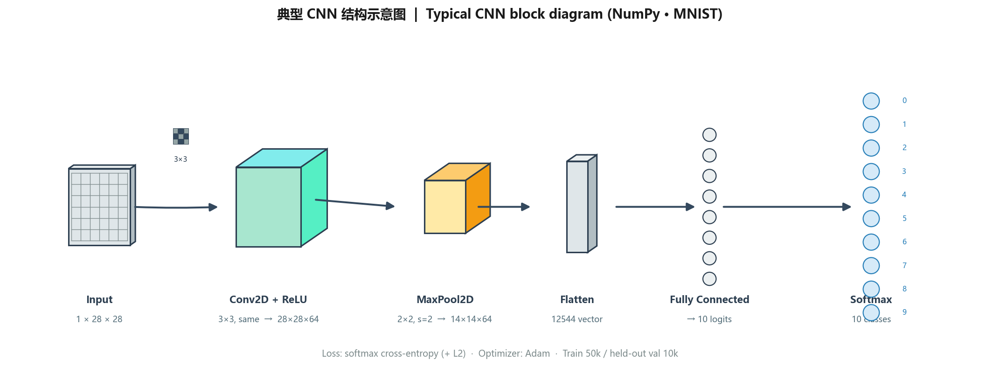
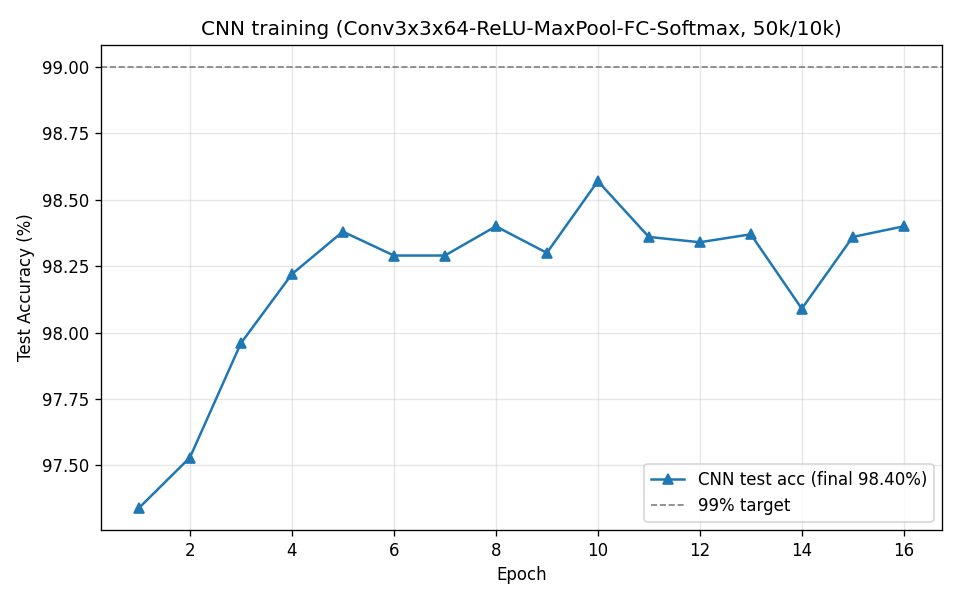
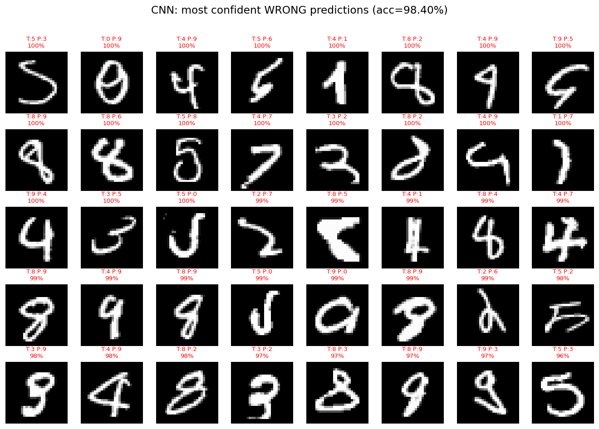
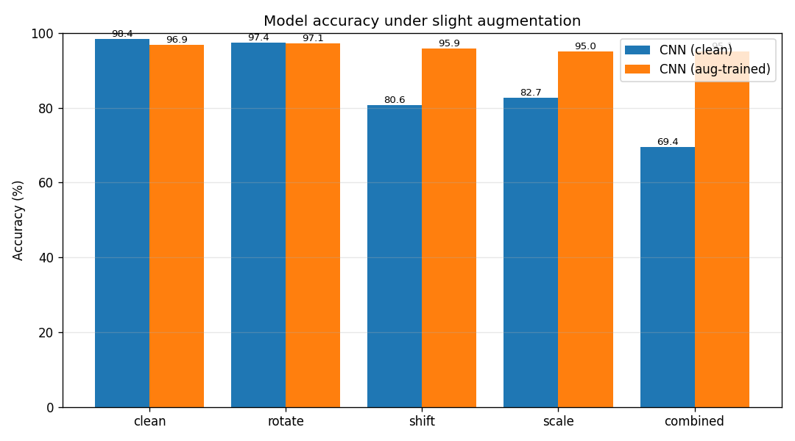
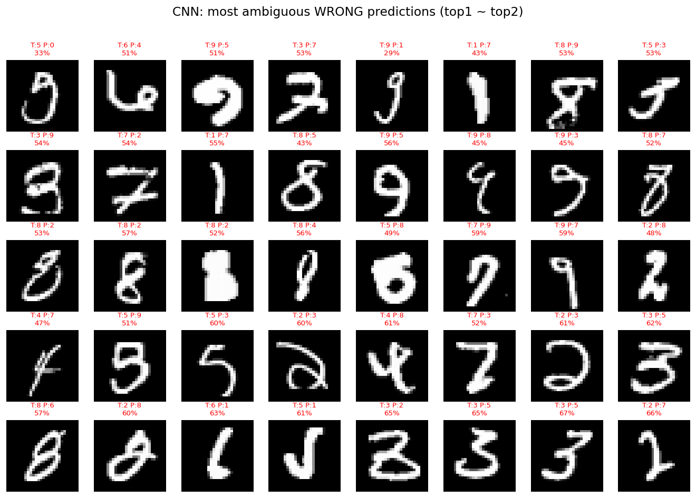

# CNN 手写数字识别与实验 · 2026-06-08

> [!info] 与 MLP 笔记的分工
> **MLP** 的推导、超参实验、错误分析与增强鲁棒性（全连接视角）已写在：[[2026-06-08 MLP 手写数字识别与优化]]。  
> **本文只记录 CNN**：结构、训练结果、与优化 MLP 的对比、旋转/平移/缩放鲁棒性及结论。

> [!summary] 一页总览
> 纯 NumPy 单块结构 `Conv3×3×64 → ReLU → MaxPool2×2 → FC → Softmax`，同一划分（前 5 万训练 / 后 1 万测试）**98.40%**，优于优化 MLP **97.86%**。**训练时几何增强**后，在 shift/scale/combined 扰动上约 **95%**，显著强于 MLP。代码：`C:/work/code/others/neuralnetworks/cnn`；配图：`attachments/`。

---

## 1. 工程与数据

- 数据集：仓库根目录 `neuralnetworks/data/mnist.npz`（与 `mlp/` 共用）。
- 在 `cnn/` 下运行脚本，数据路径 `../data/mnist.npz`。
- 展示图：`cnn/images/`；可重生成产物：`cnn/out/`（与仓库 `.gitignore` 一致）。

---

## 2. 网络结构

$$\text{Input}(1\times28\times28)\to\text{Conv2D}(3\times3,64)\to\text{ReLU}\to\text{MaxPool}(2\times2)\to\text{Flatten}\to\text{FC}\to\text{Softmax}$$

- 卷积：im2col / col2im；same padding；He 初始化。
- 优化：Adam `lr=1e-3`、L2 `1e-4`、Dropout `0.1`、学习率每 epoch ×0.97；约 16 epoch（以 `train_eval.py` 为准）。
- 结构图由仓库内 `draw_network_structure.py` 生成，重跑：`python draw_network_structure.py`（在 `cnn/` 目录）。

---

## 3. 训练结果（前 50000 训练 / 后 10000 测试）

| 模型 | 测试准确率 | 错误数 |
|---|---|---|
| 优化 MLP（对照，见姊妹篇） | 97.86% | 214 / 10000 |
| **CNN (clean)** | **98.40%** | **160 / 10000** |

> [!tip] 关于 99%
> 单 Conv→Pool→FC 块在该划分上约 **98.4% 封顶**；要稳过 99% 通常需更深卷积栈或更强训练策略（见 `cnn/README.md`）。

---

## 4. 旋转 / 平移 / 缩放鲁棒性

运行 `augment_eval.py`：**CNN (clean)** 仅原图训练；**CNN (aug-trained)** 训练时 batch 内随机旋转/平移/缩放。下表含 **MLP (optimized)** 作为对照（数据来自 `mlp/augment_test.py`）。

| 增强 | CNN (clean) | CNN (aug-trained) | MLP (optimized) |
|---|---|---|---|
| clean | **98.40%** | 96.86% | 97.86% |
| rotate | 97.36% | 97.14% | 96.94% |
| shift | 80.62% | **95.92%** | 70.17% |
| scale | 82.74% | **94.96%** | 72.46% |
| combined | 69.44% | **95.13%** | 57.54% |

> [!success] 结论
> 卷积 + 池化带来平移不变性；**训练时增强**后在扰动集上约 **95%**，能稳定识别旋转/偏移/缩放后的数字。干净集略降（96.86%）是典型的精度–鲁棒性权衡。

---

## 5. 补充：犹豫型错误样本

---

## 6. TODO

- [ ] 第二卷积块或其它结构，冲 MNIST **99%+**
- [ ] 参数量 / 推理耗时对比表
- [ ] 更丰富的增强（如弹性形变）

## 参考

- 姊妹篇（MLP）：[[2026-06-08 MLP 手写数字识别与优化]]
- `cnn/README.md`、`mlp/README.md`
- 技能：`.cursor/skills/nn-project-builder/SKILL.md`
