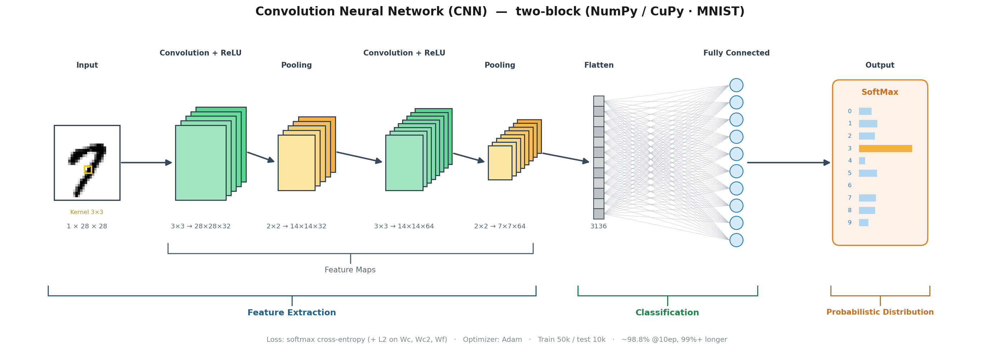
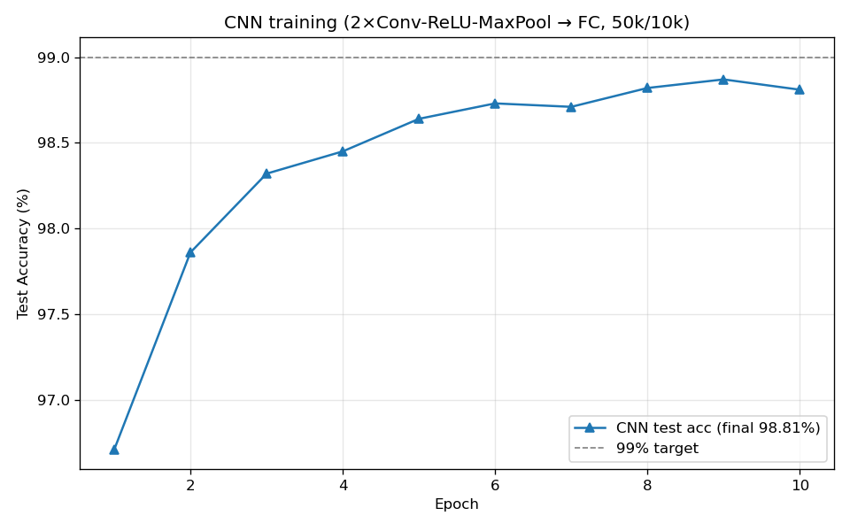
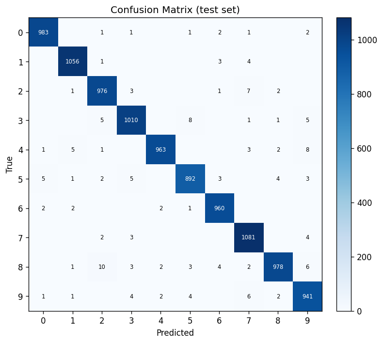
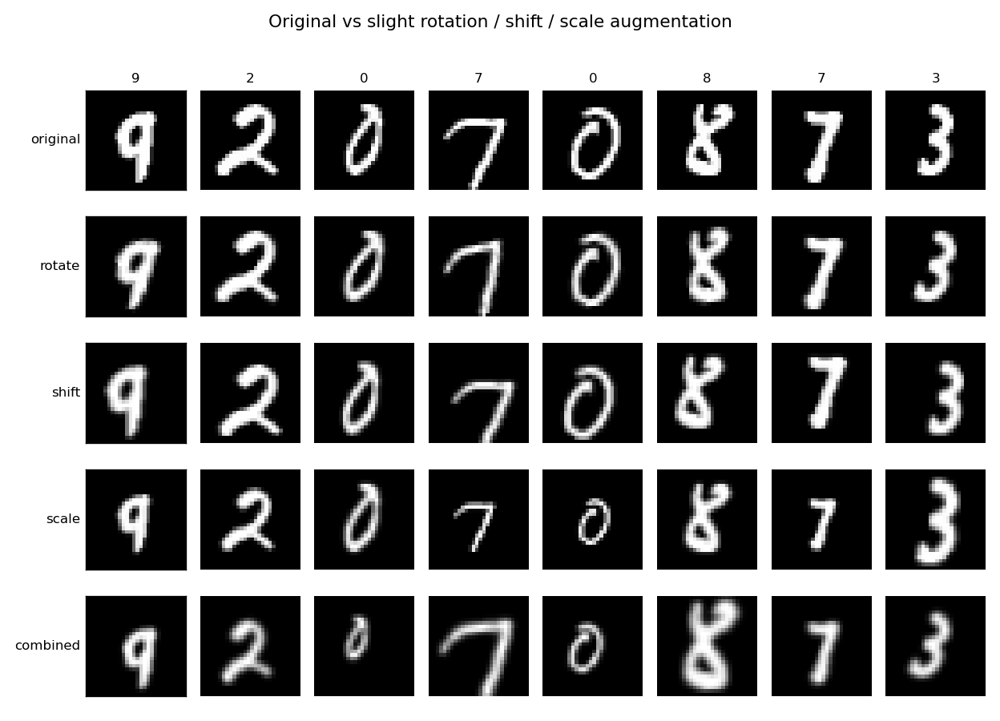
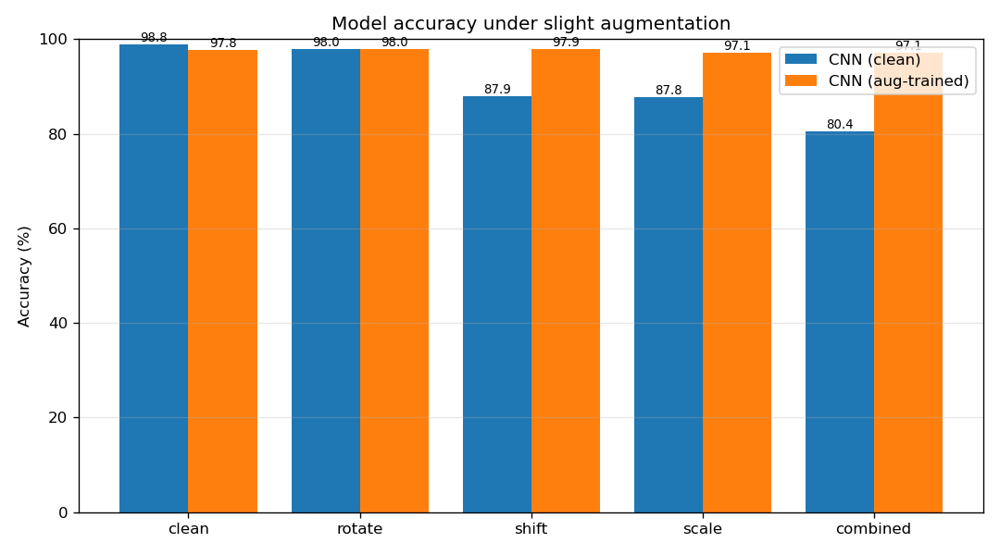

# CNN 手写数字识别与实验 · 2026-06-08（同步更新 2026-06-10）

> [!info] 与 MLP 笔记的分工
> **MLP** 的推导、超参实验、错误分析与增强鲁棒性（全连接视角）已写在：[[MLP手写数字识别与优化]]。  
> **本文记录 CNN**：**双卷积块**结构、默认训练配置、测试集结果、与 MLP 对照及鲁棒性实验说明；并记录仓库已支持的 **CPU（NumPy）/ GPU（CuPy）** 双后端与复现命令。

> [!summary] 一页总览
> 实现：**同一套 `cnn.py`** 可选 **`device="cpu"`（NumPy）** 或 **`device="cuda"`（CuPy）**；`load_data` 仍为 NumPy，训练时 batch 在 CUDA 下自动拷到 GPU；`predict` / `predict_proba` 仍返回 NumPy 便于下游脚本。  
> 结构：双块 **`Conv(3×3,F=32)→ReLU→MaxPool → Conv(3×3,F₂=64)→ReLU→MaxPool`**（28→14→7）→ **Flatten 3136** → FC → Softmax。同一划分（前 5 万训练 / 后 1 万测试）。  
> **默认 `train_eval.py`（10 epoch、`batch_size=512`、Dropout 0.05）**：测试集约 **98.81%**（119 / 10000 错），优于优化 MLP **97.86%**。在 GPU 上 **`sweep_epochs.py`（40 epoch）** 已测得最佳约 **99.04%**（约第 27 epoch 首次 ≥99%）。  
> **代码**：`C:/work/code/others/neuralnetworks/cnn` · **本页配图**：`images/cnn_*.png`（由仓库 `cnn/images/` 同步）。

---

## 1. 工程与数据

- 数据集：仓库根目录 `neuralnetworks/data/mnist.npz`（与 `mlp/` 共用）。
- 在 `cnn/` 下运行脚本，数据路径 `../data/mnist.npz`。
- 展示图：仓库内 `cnn/images/`；可重生成产物 `cnn/out/`。Obsidian 侧配图在 **`images/`** 目录（`cnn_*.png` 与仓库同步）。

### 1.1 脚本与 GPU（与仓库 README 对齐）

| 脚本 | 作用 |
|------|------|
| `train_eval.py` | 训练 + 评估 + 错误分析 |
| `compare_blocks.py` | 单块 vs 双块（同划分、同超参，只切 `two_blocks`） |
| `sweep_epochs.py` | 加长 epoch 冲 99%（默认 40 epoch，可用 `CNN_EPOCHS` 覆盖） |
| `augment_eval.py` | 旋转 / 平移 / 缩放鲁棒性（clean vs aug-trained） |
| `draw_network_structure.py` | 生成结构示意图 |

- **环境变量 `CNN_DEVICE`**：`cpu`（默认）或 `cuda`。在 `cnn/` 下例如：`CNN_DEVICE=cuda python train_eval.py`（Linux/macOS）；Windows PowerShell：`$env:CNN_DEVICE="cuda"; python train_eval.py`。
- **CuPy**：需安装与系统 CUDA 匹配的 wheel（如 `pip install cupy-cuda12x`），见 [CuPy 安装文档](https://docs.cupy.dev/en/stable/install.html)。仓库另有 `cnn/requirements-cuda.txt` 说明可选依赖。
- **`python cnn.py` 自检（无参数）**：若检测到 CuPy+CUDA 可用则**只跑 GPU** 一小段自检，否则**只跑 CPU**（双块 + 单块）。**`--cuda`** 强制只跑 GPU（失败非 0 退出）；**`--cpu`** 强制只跑 CPU；**`--cuda --cpu`** 先 CPU 再 GPU。

---

## 2. 网络结构

$$\text{Input}(1\times28\times28)\to\text{Block1: Conv3×3}(F{=}32)\to\text{ReLU}\to\text{MaxPool}\to\text{Block2: Conv3×3}(F_2{=}64)\to\text{ReLU}\to\text{MaxPool}\to\text{Flatten}(7{\times}7{\times}64)\to\text{FC}\to\text{Softmax}$$

- 卷积：**im2col / col2im**（在 `CNN` 类上为 `_im2col` / `_col2im`，用 `self.xp`）；same padding；He 初始化；第二块输入通道 = **F**。
- 优化：Adam `lr=1e-3`、L2 `1e-4`、Dropout **`0.05`**、学习率每 epoch ×0.97；默认 **10 epoch**、`batch_size=512`（以 `train_eval.py` 为准）。

---

## 3. 训练结果（前 50000 训练 / 后 10000 测试）

| 模型 | 测试准确率 | 错误数 |
|---|---|---|
| 优化 MLP（对照，见姊妹篇） | 97.86% | 214 / 10000 |
| **CNN (clean，双块默认配置)** | **98.81%** | **119 / 10000** |

> 上表与仓库 `cnn/README.md` §6 一致（默认 10 epoch）。另：单独加长到 **18 epoch** 的一次实验曾得到约 **98.92%**，仍略低于 99%；**40 epoch sweep** 在 GPU 上可达约 **99.04%** 最佳（详见仓库 §6.2 与 `sweep_epochs.py` / `out/epochs_report.txt`）。

> [!tip] 关于 99%
> 单卷积块在该划分上约 **98.3% 平台**；双块 + 足够 epoch 已实测 **≥99%**（见仓库 `sweep_epochs.py` 与 `out/cnn_best.npz`）。完整公式与反向推导仍以仓库 **`cnn/README.md`** 与 **`cnn/cnn.py`** 为准。

---

## 4. 旋转 / 平移 / 缩放鲁棒性

运行 `augment_eval.py`（可与 `CNN_DEVICE=cuda` 配合）：**CNN (clean)** 优先加载 `out/cnn_clean.npz`；**CNN (aug-trained)** 与 clean **结构相同**（双块），训练时 batch 内随机旋转/平移/缩放。**MLP (optimized)** 列仍为 `mlp/augment_test.py` 对照数据。

下列数字与仓库 **`cnn/README.md` §8**（本机 CUDA 实测、10 epoch）一致；若你本地重训权重，请以 `out/cnn_augment_report.txt` 为准刷新。

| 增强 | CNN (clean) | CNN (aug-trained) | MLP (optimized) |
|---|---|---|---|
| clean | **98.81%** | 97.78% | 97.86% |
| rotate | 97.98% | **97.98%** | 96.94% |
| shift | 87.93% | **97.86%** | 70.17% |
| scale | 87.80% | **97.10%** | 72.46% |
| combined | 80.44% | **97.14%** | 57.54% |

> [!success] 结论（定性）
> 卷积 + 池化带来一定平移/尺度鲁棒性；**训练时增强**可显著提升旋转/平移/缩放下的表现，通常以略降 clean 分为代价。定量以仓库 `augment_eval.py` 输出与上表为准。

---

## 5. 补充：单块 vs 双块、GPU 耗时（摘要）

仓库 **`compare_blocks.py`**（CUDA 上同超参 10 epoch）：**单块**约 **98.32%**，**双块**约 **98.81%**；双块 `fc_in` 更小故全连接参数更少，但第二块卷积使前向 FLOPs 更高，4090 D 上推理 10k 张约 **~50 ms vs ~150 ms**（量级见 `out/block_comparison_report.txt`）。细节表与曲线见仓库 README §6.1。

---

## 6. 犹豫型错误样本

---

## 7. TODO

- [x] 第二卷积块（28→14→7）已落地于 `cnn/cnn.py`
- [x] **99%+**：`sweep_epochs.py` 已测得约 **99.04%**（40 epoch，GPU）；若需更稳可再调增强 / 学习率调度
- [x] **`augment_eval.py`** 与 README §8 表格已填实（以本机 CUDA 运行为准）
- [ ] 参数量 / 推理耗时：已在仓库 `block_comparison_report` 记录；Obsidian 侧可选做一页对照表
- [ ] 更丰富的增强（如弹性形变）

## 参考

- 姊妹篇（MLP）：[[MLP手写数字识别与优化]]
- 仓库文档：`cnn/README.md`、`mlp/README.md`
- 技能：`.cursor/skills/nn-project-builder/SKILL.md`
- CuPy：[安装说明](https://docs.cupy.dev/en/stable/install.html)
