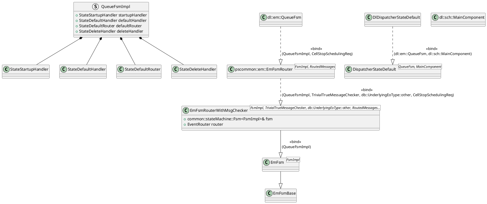
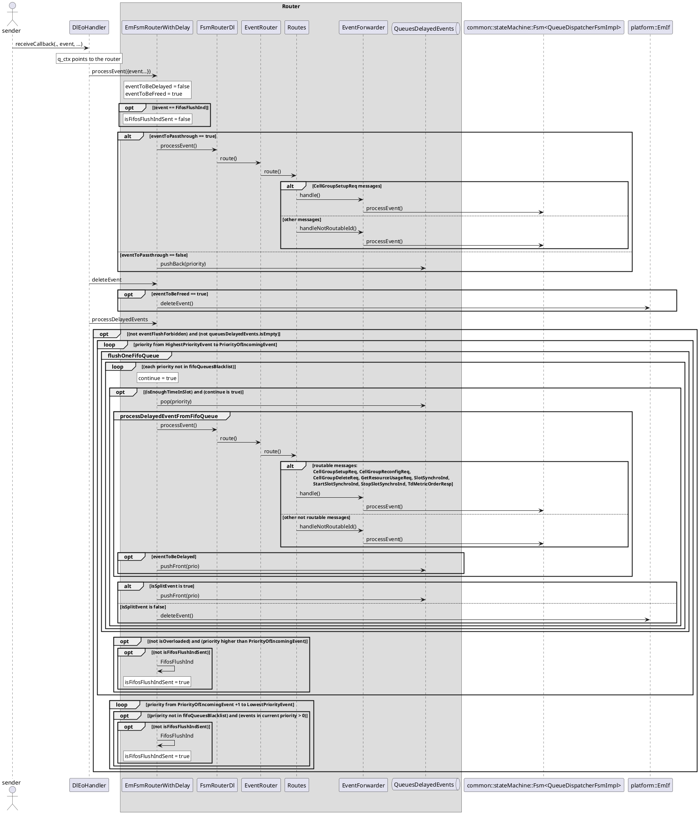
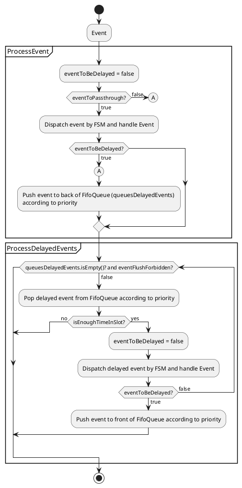
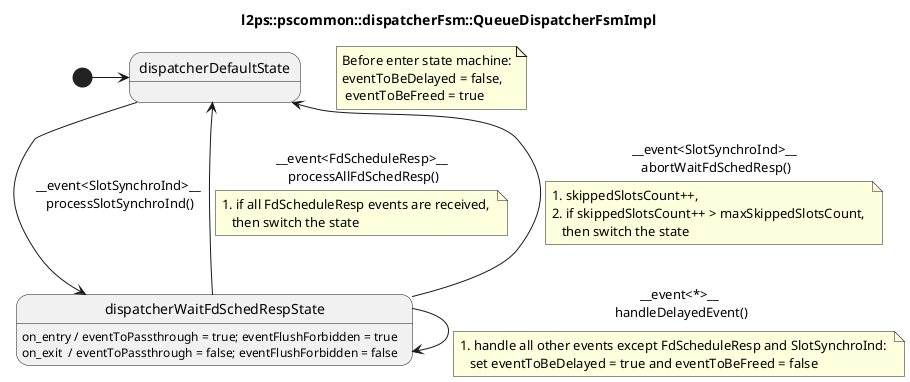

# L2PS DL FIFO Overview

## class diagram

```plantuml
@startuml L2PS DL FSM Classes

class StateStartupHandler
class StateDefaultHandler
class StateDefaultRouter
class StateDeleteHandler
struct QueueFsmImpl 
{
    +StateStartupHandler startupHandler
    +StateDefaultHandler defaultHandler
    +StateDefaultRouter defaultRouter
    +StateDeleteHandler deleteHandler
}

QueueFsmImpl *-- StateStartupHandler
QueueFsmImpl *-- StateDefaultHandler
QueueFsmImpl *-- StateDefaultRouter
QueueFsmImpl *-- StateDeleteHandler

class EmFsmBase
class EmFsm<FsmImpl>
class EmFsmRouterWithMsgChecker<FsmImpl, TrivialTrueMessageChecker, db::UnderlyingEoType::other, RoutedMessages...>
{   
    +common::stateMachine::Fsm<FsmImpl>& fsm
    +EventRouter router
}

class EmFsmRouter as "pscommon::em::EmFsmRouter<FsmImpl, RoutedMessages>"
class DispatcherStateDefault<QueueFsm, MainComponent>
class QueueFsm as "dl::em::QueueFsm"
class DispatcherStateDefault
class DlDispatcherStateDefault

class DlMainComponent as "dl::sch::MainComponent"

EmFsm --|> EmFsmBase
EmFsmRouterWithMsgChecker --|> EmFsm : <<bind>> \n (QueueFsmImpl)
EmFsmRouter ..|> EmFsmRouterWithMsgChecker : <<bind>> \n (QueueFsmImpl, TrivialTrueMessageChecker, db::UnderlyingEoType::other, CellStopSchedulingReq)
QueueFsm ..|> EmFsmRouter : <<bind>> \n (QueueFsmImpl, CellStopSchedulingReq)
DlDispatcherStateDefault ..|> DispatcherStateDefault : <<bind>> \n (dl::em::QueueFsm, dl::sch::MainComponent) 

@enduml
```
## Sequence diagram

```plantuml
@startuml L2PS DL FIFO Sequence Diagram

skinparam NoteBackgroundColor white
skinparam NoteBorderColor black
skinparam NoteFontColor black
actor sender
participant DlEoHandler
box "Router"
    participant EmFsmRouterWithDelay as fsmRouter
    participant FsmRouterDl as fsmRouterDl
    participant EventRouter as router
    participant Routes as routes
    participant EventForwarder as handler
    queue QueuesDelayedEvents as queues
end box
participant "common::stateMachine::Fsm<QueueDispatcherFsmImpl>" as fsm
participant "platform::EmIf" as platform

sender -> DlEoHandler : receiveCallback(., event, ...)
rnote over DlEoHandler
    q_ctx points to the router
end rnote

DlEoHandler -> fsmRouter : processEvent({event...})
rnote over fsmRouter
    eventToBeDelayed = false
    eventToBeFreed = true
end rnote

opt (event == FifosFlushInd)
    rnote over fsmRouter
        isFifosFlushIndSent = false
    end rnote   
end

alt eventToPassthrough == true
    fsmRouter -> fsmRouterDl : processEvent()
    fsmRouterDl -> router : route()
    router -> routes : route()
    alt CellGroupSetupReq messages
        routes -> handler : handle()
        handler -> fsm : processEvent()
    else other messages
        routes -> handler : handleNotRoutableId()
        handler -> fsm : processEvent()
    end
else eventToPassthrough == false
    fsmRouter -> queues : pushBack(priority)
end

DlEoHandler -> fsmRouter : deleteEvent
opt eventToBeFreed == true
    fsmRouter -> platform : deleteEvent()
end

DlEoHandler -> fsmRouter : processDelayedEvents
opt (not eventFlushForbidden) and (not queuesDelayedEvents.isEmpty)
    loop priority from HighestPriorityEvent to PriorityOfIncomingEvent
        group flushOneFifoQueue
            loop (each priority not in fifoQueuesBlacklist)
                rnote over fsmRouter
                    continue = true
                end rnote  

                opt (isEnoughTimeInSlot) and (continue is true)
                    fsmRouter -> queues : pop(priority)
                    group processDelayedEventFromFifoQueue
                        fsmRouter -> fsmRouterDl : processEvent()
                        fsmRouterDl -> router : route()
                        router -> routes : route()
                        alt routable messages:\n CellGroupSetupReq, CellGroupReconfigReq,\n CellGroupDeleteReq, GetResourceUsageReq, SlotSynchroInd,\n StartSlotSynchroInd, StopSlotSynchroInd, TdMetricOrderResp
                            routes -> handler : handle()
                            handler -> fsm : processEvent()
                        else other not routable messages
                            routes -> handler : handleNotRoutableId()
                            handler -> fsm : processEvent()
                        end                
                        opt eventToBeDelayed
                            fsmRouter -> queues: pushFront(prio)
                        end                    
                    end group
                    
                    Alt isSplitEvent is true                    
                        fsmRouter -> queues: pushFront(prio)                     
                    else isSplitEvent is false
                        fsmRouter -> platform : deleteEvent()
                    end
                end
            end
        end group

        opt (not isOverloaded) and (priority higher than PriorityOfIncomingEvent)
            opt (not isFifosFlushIndSent)
                fsmRouter -> fsmRouter: FifosFlushInd
                rnote over fsmRouter
                    isFifosFlushIndSent = true
                end rnote                   
            end
        end
    end

    loop priority from PriorityOfIncomingEvent +1 to LowestPriorityEvent
        opt (priority not in fifoQueuesBlacklist) and (events in current priority > 0)
            opt (not isFifosFlushIndSent) 
                fsmRouter -> fsmRouter: FifosFlushInd
                rnote over fsmRouter
                    isFifosFlushIndSent = true
                end rnote                   
            end        
        end 
    end
end
@enduml
```

## Flowchart

```plantuml
@startuml L2PS DL FIFO Flowchart
start
:Event;
partition ProcessEvent {
    :eventToBeDelayed = false;
    if (eventToPassthrough?) then (true)
        :Dispatch event by FSM and handle Event;
        if (eventToBeDelayed?) then (true)
            (A)
            :Push event to back of FifoQueue (queuesDelayedEvents) \naccording to priority;
        endif
    else (false)
        (A)
    endif
}

partition ProcessDelayedEvents {
    while (queuesDelayedEvents.isEmpty()? and eventFlushForbidden?) is (false)
        :Pop delayed event from FifoQueue according to priority;
        if (isEnoughTimeInSlot?) then (no)
            break
        else (yes)
            :eventToBeDelayed = false;
            :Dispatch delayed event by FSM and handle Event;
            if (eventToBeDelayed?) then (true)
                :Push event to front of FifoQueue according to priority;
                break
            else (false)
            endif        
        endif
    endwhile
}
stop
@enduml
```

## State diagram

```plantuml
@startuml L2PS DL FSM statechart

title l2ps::pscommon::dispatcherFsm::QueueDispatcherFsmImpl

state "dispatcherDefaultState" as default
state "dispatcherWaitFdSchedRespState" as waitFdResp
note "Before enter state machine:\neventToBeDelayed = false, \n eventToBeFreed = true" as N1

[*] -right-> default
default --> waitFdResp : __event<SlotSynchroInd>__\n processSlotSynchroInd()

waitFdResp : on_entry / eventToPassthrough = true; eventFlushForbidden = true
waitFdResp : on_exit  / eventToPassthrough = false; eventFlushForbidden = false


waitFdResp -> default : __event<FdScheduleResp>__\n processAllFdSchedResp()
note on link
    1. if all FdScheduleResp events are received, 
       then switch the state
end note

waitFdResp -> default : __event<SlotSynchroInd>__\n abortWaitFdSchedResp()
note on link
    1. skippedSlotsCount++,
    2. if skippedSlotsCount++ > maxSkippedSlotsCount, 
       then switch the state
end note

waitFdResp -> waitFdResp : __event<*>__\n handleDelayedEvent()
note on link
    1. handle all other events except FdScheduleResp and SlotSynchroInd: 
       set eventToBeDelayed = true and eventToBeFreed = false
end note
@enduml
```

