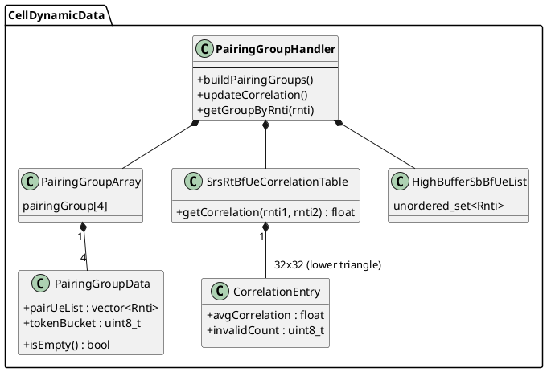

# Dual Boost Cell Dynamic Data

```plantuml

@startuml Dual Boost Cell Dynamic Data
!pragma graphviz svg
' scale 1920*1080

' skinparam linetype ortho
skinparam classAttributeIconSize 0
set namespaceSeparator ::

package "CellDynamicData" {
  class "**PairingGroupHandler**" as PairingGroupHandler {
    --
    +buildPairingGroups()
    +updateCorrelation()
    +getGroupByRnti(rnti)
  }

  class PairingGroupData {
    +pairUeList : vector<Rnti>
    +tokenBucket : uint8_t
    --
    +isEmpty() : bool
  }

  class PairingGroupArray {
    pairingGroup[4]
  }

  class SrsRtBfUeCorrelationTable {
    +getCorrelation(rnti1, rnti2) : float
  }

  class CorrelationEntry {
    +avgCorrelation : float
    +invalidCount : uint8_t
  }

  class HighBufferSbBfUeList {
    unordered_set<Rnti>
  }

  PairingGroupArray "1" *-- "4" PairingGroupData
  SrsRtBfUeCorrelationTable "1" *-- "32x32 (lower triangle)" CorrelationEntry
  PairingGroupHandler *-- PairingGroupArray
  PairingGroupHandler *-- SrsRtBfUeCorrelationTable
  PairingGroupHandler *-- HighBufferSbBfUeList
}
@enduml
```
