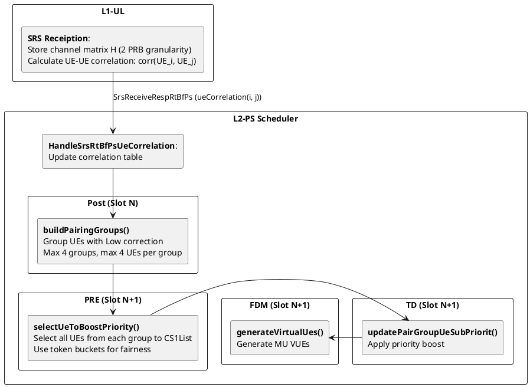

# Dual Boost Zero Forcing MU-MIMO Data Flow

```plantuml

@startuml Dual Boost Zero Forcing MU-MIMO Data Flow
!pragma graphviz svg
' scale 1920*1080

' skinparam linetype ortho

rectangle "**L1-UL**" as L1 {
  rectangle "**SRS Receiption**:\nStore channel matrix H (2 PRB granularity)\nCalculate UE-UE correlation: corr(UE_i, UE_j) " as SrsReception
}

rectangle "L2-PS Scheduler" as L2 {
  rectangle "**HandleSrsRtBfPsUeCorrelation**:\nUpdate correlation table" as SrsRespHandler

  rectangle "Post (Slot N)" as POST {
    rectangle "**buildPairingGroups()**\nGroup UEs with Low correction\nMax 4 groups, max 4 UEs per group" as buildPG
  }
  rectangle "PRE (Slot N+1)" as PRE {
    rectangle "**selectUeToBoostPriority()**\nSelect all UEs from each group to CS1List\nUse token buckets for fairness" as SelectUe
  }
  rectangle "TD (Slot N+1)" as TD {
    rectangle "**updatePairGroupUeSubPriorit()**\nApply priority boost" as UpdateSubPriority
  }
  rectangle "FDM (Slot N+1)" as FDM {
    rectangle "**generateVirtualUes()**\nGenerate MU VUEs" as GenVitualUe
  }

  SelectUe -[hidden]l- UpdateSubPriority
  UpdateSubPriority -[hidden]l- GenVitualUe
}
SrsReception -d-> SrsRespHandler : SrsReceiveRespRtBfPs (ueCorrelation(i, j))
SrsRespHandler -d-> buildPG
buildPG -d-> SelectUe
SelectUe -r-> UpdateSubPriority
UpdateSubPriority -r-> GenVitualUe

@enduml
```
