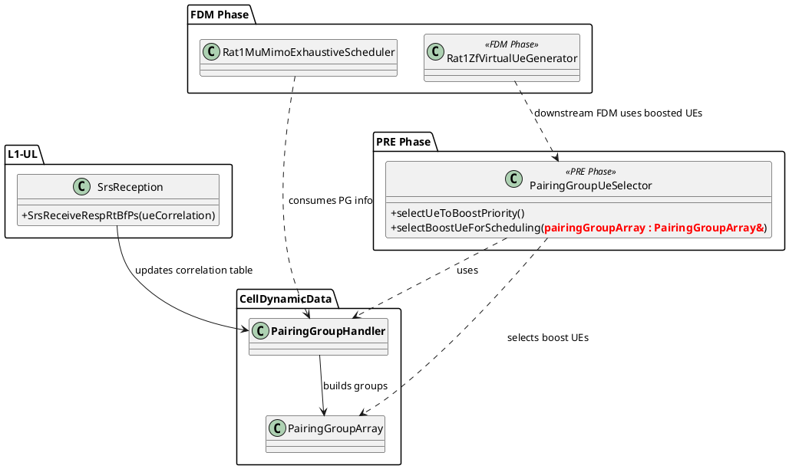

# Dual Boost Package Overview

```plantuml

@startuml Dual Boost Package Overview
!pragma graphviz svg
' scale 1920*1080

' skinparam linetype ortho
skinparam classAttributeIconSize 0
set namespaceSeparator ::

package "L1-UL" {
  class SrsReception {
    +SrsReceiveRespRtBfPs(ueCorrelation)
  }
}

package "CellDynamicData" {
  class "**PairingGroupHandler**" as PairingGroupHandler
  class PairingGroupArray
}

package "PRE Phase" {
  class PairingGroupUeSelector <<PRE Phase>> {
    +selectUeToBoostPriority()
    +selectBoostUeForScheduling(<color:red><b>pairingGroupArray : PairingGroupArray&</b></color>)
  }
}

package "FDM Phase" {
  class Rat1MuMimoExhaustiveScheduler
  class Rat1ZfVirtualUeGenerator <<FDM Phase>>
}

SrsReception -d-> PairingGroupHandler : updates correlation table
PairingGroupHandler -d-> PairingGroupArray : builds groups
PairingGroupUeSelector ..> PairingGroupHandler : uses
PairingGroupUeSelector ..> PairingGroupArray : selects boost UEs
Rat1MuMimoExhaustiveScheduler ..> PairingGroupHandler : consumes PG info
Rat1ZfVirtualUeGenerator ..> PairingGroupUeSelector : downstream FDM uses boosted UEs
@enduml
```
