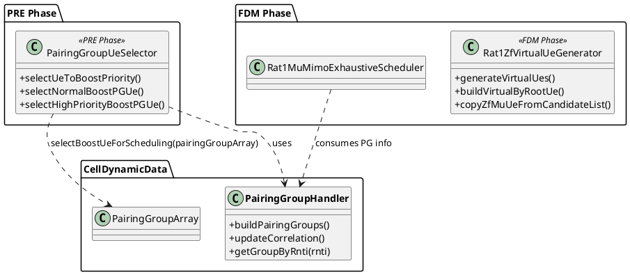

# Dual Boost Scheduling Integration

```plantuml

@startuml Dual Boost Scheduling Integration
!pragma graphviz svg
' scale 1920*1080

' skinparam linetype ortho
skinparam classAttributeIconSize 0
set namespaceSeparator ::

package "CellDynamicData" {
  class "**PairingGroupHandler**" as PairingGroupHandler {
    +buildPairingGroups()
    +updateCorrelation()
    +getGroupByRnti(rnti)
  }

  class PairingGroupArray
}

package "PRE Phase" {
  class PairingGroupUeSelector <<PRE Phase>> {
    +selectUeToBoostPriority()
    +selectNormalBoostPGUe()
    +selectHighPriorityBoostPGUe()
  }
}

package "FDM Phase" {
  class Rat1ZfVirtualUeGenerator <<FDM Phase>> {
    +generateVirtualUes()
    +buildVirtualByRootUe()
    +copyZfMuUeFromCandidateList()
  }

  class Rat1MuMimoExhaustiveScheduler
}

PairingGroupUeSelector ..> PairingGroupHandler : uses
PairingGroupUeSelector ..> PairingGroupArray : selectBoostUeForScheduling(pairingGroupArray)
Rat1MuMimoExhaustiveScheduler ..> PairingGroupHandler : consumes PG info
@enduml
```
