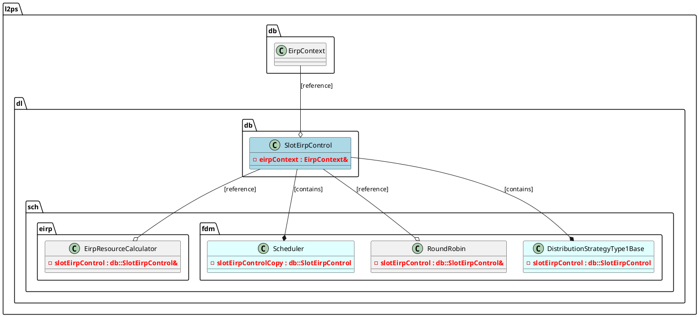

# EIRP Control Overview

```plantuml
@startuml EIRP Control Overview
!pragma graphviz svg
' scale 1920*1080

' skinparam linetype ortho
set namespaceSeparator ::

package l2ps {
  namespace db {
    class EirpContext {
    }
  }

  namespace dl {
    namespace db {
      class SlotEirpControl #LightBlue {
        - <color:red><b>eirpContext : EirpContext&</b></color>
      }
    }
    'end of db

    namespace sch {
      class eirp::EirpResourceCalculator {
        - <color:red><b>slotEirpControl : db::SlotEirpControl&</b></color>
      }

      namespace fdm {
        class Scheduler #LightCyan {
          - <color:red><b>slotEirpControlCopy : db::SlotEirpControl</b></color>
        }

        class RoundRobin {
          - <color:red><b>slotEirpControl : db::SlotEirpControl&</b></color>
        }

        class DistributionStrategyType1Base #LightCyan {
          - <color:red><b>slotEirpControl : db::SlotEirpControl</b></color>
        }
      }
      'end of fdm
    } 
    ' end sch

    ' Layout hint: keep external DB classes above scheduler users.
    db::SlotEirpControl -[hidden]down-> sch::fdm::Scheduler

    db::SlotEirpControl o-u- l2ps::db::EirpContext : [reference]
    sch::eirp::EirpResourceCalculator o-u- db::SlotEirpControl : [reference]
    sch::fdm::Scheduler *-u- db::SlotEirpControl : [contains]
    sch::fdm::DistributionStrategyType1Base *-u- db::SlotEirpControl : [contains]
    sch::fdm::RoundRobin o-u- db::SlotEirpControl : [reference]
  }
  'end of dl
}
@enduml
```
