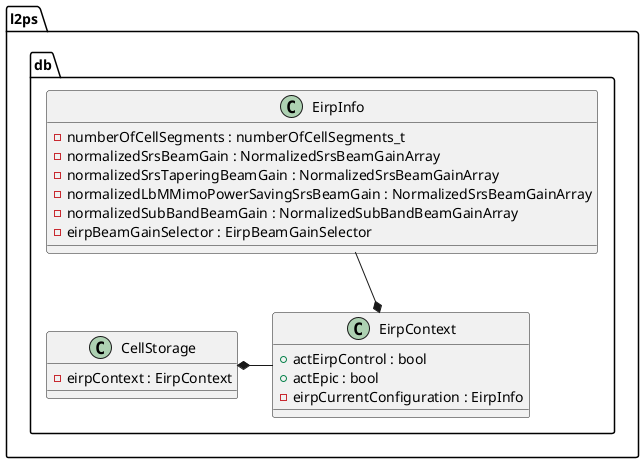

# L2PS DB EIRP

```plantuml
@startuml L2PS DB EirpControl Class diagram
!pragma graphviz svg
' scale 1920*1080

' skinparam linetype ortho
set namespaceSeparator ::

!$MAX_ALL_BEAMS = 2720
!$MAX_CELL_SEGMENT = 60

package l2ps {
  namespace db {
    class EirpInfo {
      - numberOfCellSegments : numberOfCellSegments_t
      - normalizedSrsBeamGain : NormalizedSrsBeamGainArray
      - normalizedSrsTaperingBeamGain : NormalizedSrsBeamGainArray
      - normalizedLbMMimoPowerSavingSrsBeamGain : NormalizedSrsBeamGainArray
      - normalizedSubBandBeamGain : NormalizedSubBandBeamGainArray
      - eirpBeamGainSelector : EirpBeamGainSelector

    }

    class EirpContext {
      + actEirpControl : bool
      + actEpic : bool
      - eirpCurrentConfiguration : EirpInfo
    }

    class CellStorage {
      - eirpContext : EirpContext
    }

    CellStorage *-r- EirpContext
    EirpContext *-u- EirpInfo
  }
}
@enduml

```
