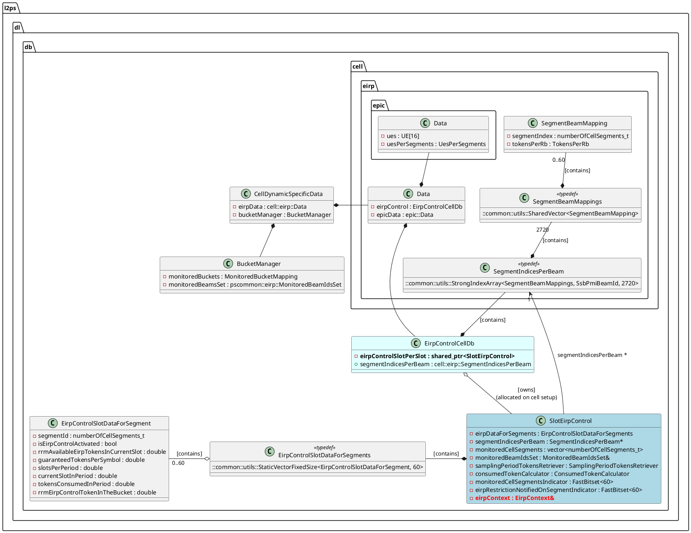

# L2PS DL DB EIRP

```plantuml
@startuml L2PS DL DB EirpControl Class 
!pragma graphviz svg
' scale 1920*1080

' skinparam linetype ortho
set namespaceSeparator ::

!$MAX_ALL_BEAMS = 2720
!$MAX_CELL_SEGMENT = 60

package l2ps {
  namespace dl {
    namespace db {
      class SlotEirpControl #LightBlue {
        - eirpDataForSegments : EirpControlSlotDataForSegments
        - segmentIndicesPerBeam : SegmentIndicesPerBeam*
        - monitoredCellSegments : vector<numberOfCellSegments_t>
        - monitoredBeamIdsSet : MonitoredBeamIdsSet&
        - samplingPeriodTokensRetriever : SamplingPeriodTokensRetriever
        - consumedTokenCalculator : ConsumedTokenCalculator
        - monitoredCellSegmentsIndicator : FastBitset<$MAX_CELL_SEGMENT>
        - eirpRestrictionNotifiedOnSegmentIndicator : FastBitset<$MAX_CELL_SEGMENT>
        - <color:red><b>eirpContext : EirpContext&</b></color>

        + getRrmNumberOfRemainingRbFromEirp(beamId) : numOfPrb_t
        + consumeTokensForPdschForFdm(beamId, numOfPrb)
        + isPrbReductionOccured()

        + isEnoughPrbForEntireDlBandwidth(cell, beamId) : bool
        + consumeTokensForPdsch()
        + consumeTokensForDlPdcchOnBeam()
        + consumeTokensForUlPdcchOnBeam()
        + consumeTokensForCsiRsPbch()
        + notifyPrbReductionOccurred(beamId)
        + updateSegmentIndicesForOneRtBeam(beamId)
        + setupSegmentInfoIndexation()
        + reconfigure()
      }
      hide SlotEirpControl methods

      class EirpControlSlotDataForSegments <<typedef>> {
        ::common::utils::StaticVectorFixedSize<EirpControlSlotDataForSegment, $MAX_CELL_SEGMENT>
      }

      class EirpControlSlotDataForSegment {
        - segmentId : numberOfCellSegments_t
        - isEirpControlActivated : bool
        - rrmAvailableEirpTokensInCurrentSlot : double
        - guaranteedTokensPerSymbol : double
        - slotsPerPeriod : double
        - currentSlotInPeriod : double
        - tokensConsumedInPeriod : double
        - rrmEirpControlTokenInTheBucket : double
      }

      namespace cell::eirp {
        class SegmentBeamMappings <<typedef>> {
          ::common::utils::SharedVector<SegmentBeamMapping>
        }

        class SegmentBeamMapping {
          - segmentIndex : numberOfCellSegments_t
          - tokensPerRb : TokensPerRb
        }

        class Data {
          - eirpControl : EirpControlCellDb
          - epicData : epic::Data
        }

        class epic::Data {
          - ues : UE[16]
          - uesPerSegments : UesPerSegments
        }

        class SegmentIndicesPerBeam <<typedef>> {
          ::common::utils::StrongIndexArray<SegmentBeamMappings, SsbPmiBeamId, $MAX_ALL_BEAMS>
        }

        Data *-u- epic::Data
      }

      class CellDynamicSpecificData {
        - eirpData : cell::eirp::Data
        - bucketManager : BucketManager
      }

      class EirpControlCellDb #LightCyan {
        - **eirpControlSlotPerSlot : shared_ptr<SlotEirpControl>**
        + segmentIndicesPerBeam : cell::eirp::SegmentIndicesPerBeam
      }

      class BucketManager {
        - monitoredBuckets : MonitoredBucketMapping
        - monitoredBeamsSet : pscommon::eirp::MonitoredBeamIdsSet
      }

      CellDynamicSpecificData *-d- BucketManager
      CellDynamicSpecificData *-l- cell::eirp::Data

      cell::eirp::Data *-r- EirpControlCellDb
      EirpControlCellDb o-d- SlotEirpControl : [owns]\n(allocated on cell setup)
      EirpControlCellDb *-u- SegmentIndicesPerBeam : [contains]

      SlotEirpControl *-l- EirpControlSlotDataForSegments : [contains]
      SlotEirpControl -u-> "1" SegmentIndicesPerBeam : segmentIndicesPerBeam *
      EirpControlSlotDataForSegments o-l- "0..$MAX_CELL_SEGMENT" EirpControlSlotDataForSegment : [contains]
      SegmentIndicesPerBeam *-u- "$MAX_ALL_BEAMS" SegmentBeamMappings : [contains]
      SegmentBeamMappings *-u- "0..$MAX_CELL_SEGMENT" SegmentBeamMapping : [contains]
    }
    'end of db
  }
  'end of dl
}
@enduml
```
