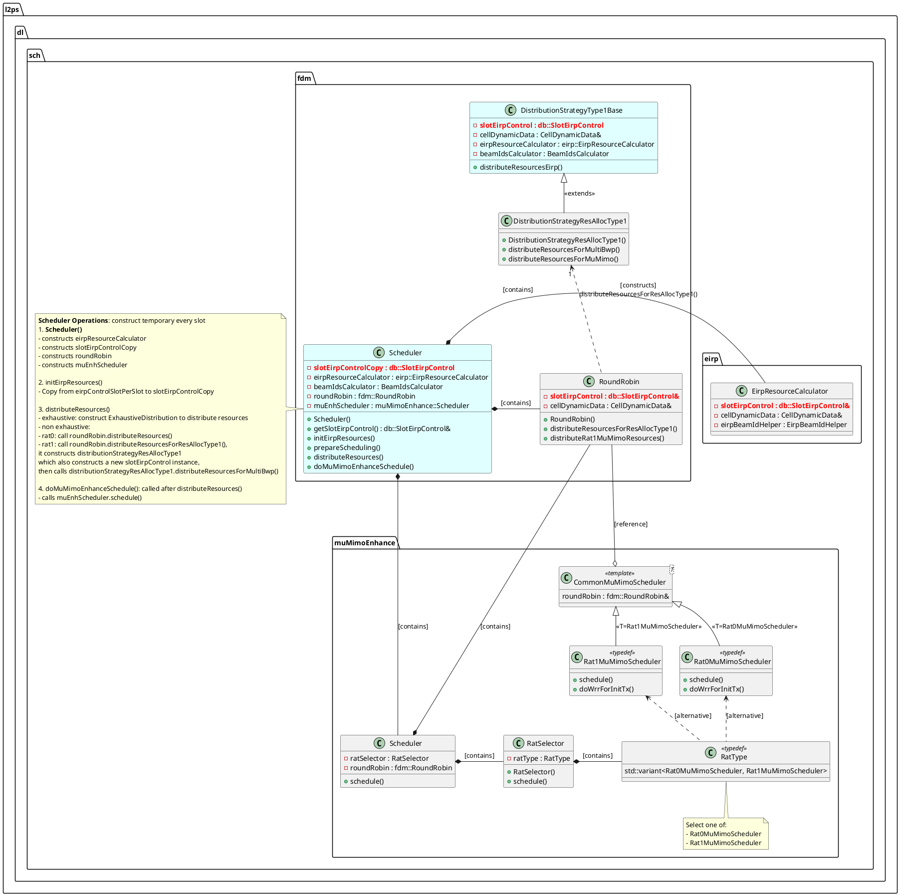

# L2PS DL Scheduler EIRP

```plantuml
@startuml L2PS DL SCH EirpControl Class
!pragma graphviz svg
' scale 1920*1080

' skinparam linetype ortho
set namespaceSeparator ::

package l2ps {
  namespace dl {
    namespace sch {
      class eirp::EirpResourceCalculator {
        - <color:red><b>slotEirpControl : db::SlotEirpControl&</b></color>
        - cellDynamicData : CellDynamicData&
        - eirpBeamIdHelper : EirpBeamIdHelper
      }

      namespace fdm {
        class Scheduler #LightCyan {
          - <color:red><b>slotEirpControlCopy : db::SlotEirpControl</b></color>
          - eirpResourceCalculator : eirp::EirpResourceCalculator
          - beamIdsCalculator : BeamIdsCalculator
          - roundRobin : fdm::RoundRobin
          - muEnhScheduler : muMimoEnhance::Scheduler

          + Scheduler()
          + getSlotEirpControl() : db::SlotEirpControl&
          + initEirpResources()
          + prepareScheduling()
          + distributeResources()
          + doMuMimoEnhanceSchedule()
        }

        class RoundRobin {
          - <color:red><b>slotEirpControl : db::SlotEirpControl&</b></color>
          - cellDynamicData : CellDynamicData&

          + RoundRobin()
          + distributeResourcesForResAllocType1()
          + distributeRat1MuMimoResources()
        }

        class DistributionStrategyResAllocType1 {
          + DistributionStrategyResAllocType1()
          + distributeResourcesForMultiBwp()
          + distributeResourcesForMuMimo()
        }

        class DistributionStrategyType1Base #LightCyan {
          - <color:red><b>slotEirpControl : db::SlotEirpControl</b></color>
          - cellDynamicData : CellDynamicData&
          - eirpResourceCalculator : eirp::EirpResourceCalculator
          - beamIdsCalculator : BeamIdsCalculator

          + distributeResourcesEirp()
        }

        Scheduler *-r- RoundRobin : [contains]
        RoundRobin .u.> "1" DistributionStrategyResAllocType1 : [constructs]\ndistributeResourcesForResAllocType1()
        DistributionStrategyResAllocType1 -u-|> DistributionStrategyType1Base : <<extends>>
      }
      'end of fdm

      Scheduler *-l- eirp::EirpResourceCalculator : [contains]

      ' Notes '
      note left of Scheduler
        **Scheduler Operations**: construct temporary every slot
        1. **Scheduler()**
        - constructs eirpResourceCalculator
        - constructs slotEirpControlCopy
        - constructs roundRobin
        - constructs muEnhScheduler

        2. initEirpResources()
        - Copy from eirpControlSlotPerSlot to slotEirpControlCopy

        3. distributeResources()
        - exhaustive: construct ExhaustiveDistribution to distribute resources
        - non exhaustive:
        - rat0: call roundRobin.distributeResources()
        - rat1: call roundRobin.distributeResourcesForResAllocType1(),
        it constructs distributionStrategyResAllocType1
        which also constructs a new slotEirpControl instance,
        then calls distributionStrategyResAllocType1.distributeResourcesForMultiBwp()

        4. doMuMimoEnhanceSchedule(): called after distributeResources()
        - calls muEnhScheduler.schedule()
      end note

      namespace muMimoEnhance {
        class Scheduler {
          - ratSelector : RatSelector
          - roundRobin : fdm::RoundRobin

          + schedule()
        }

        class RatSelector {
          - ratType : RatType

          + RatSelector()
          + schedule()
        }

        class RatType <<typedef>> {
          std::variant<Rat0MuMimoScheduler, Rat1MuMimoScheduler>
        }
        note bottom of RatType
          Select one of:
          - Rat0MuMimoScheduler
          - Rat1MuMimoScheduler
        end note

        class Rat0MuMimoScheduler <<typedef>> {
          + schedule()
          + doWrrForInitTx()
        }

        class Rat1MuMimoScheduler <<typedef>> {
          + schedule()
          + doWrrForInitTx()
        }

        class CommonMuMimoScheduler<T> <<template>> {
          roundRobin : fdm::RoundRobin&
        }

        Scheduler *-r- RatSelector : [contains]
        RatSelector *-r- RatType : [contains]
        RatType .u.> Rat0MuMimoScheduler : [alternative]
        RatType .u.> Rat1MuMimoScheduler : [alternative]
        Rat0MuMimoScheduler -u-|> CommonMuMimoScheduler : <<T=Rat0MuMimoScheduler>>
        Rat1MuMimoScheduler -u-|> CommonMuMimoScheduler : <<T=Rat1MuMimoScheduler>>
      }
      'end of muMimoEnhance

      fdm::Scheduler *-d- muMimoEnhance::Scheduler : [contains]
      muMimoEnhance::CommonMuMimoScheduler o-u- fdm::RoundRobin : [reference]
      muMimoEnhance::Scheduler *-u- fdm::RoundRobin : [contains]
    } 
    ' end sch
  }
  'end of dl
}
@enduml
```
