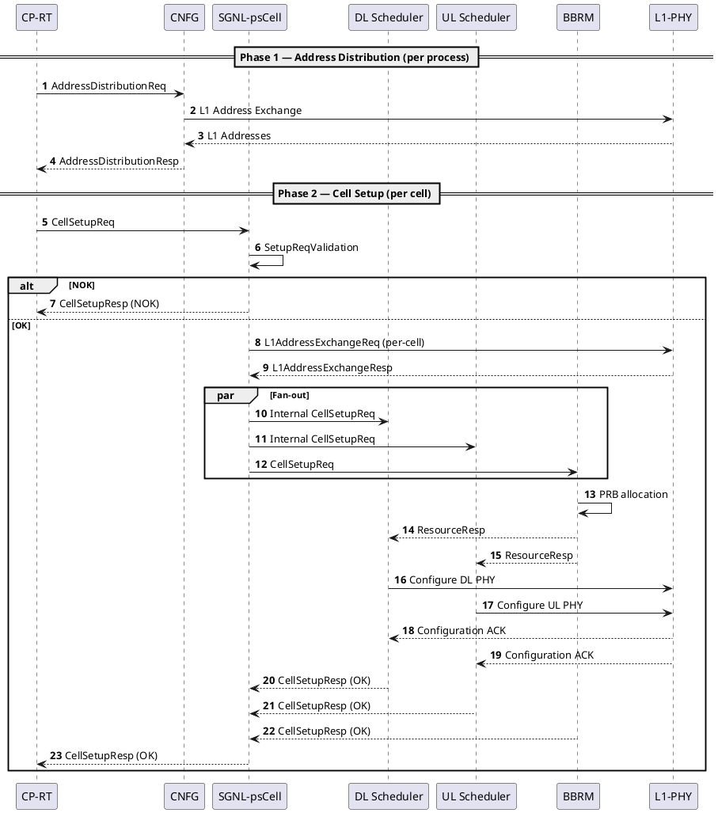

# L2PS Cell Setup Sequence

```plantuml

@startuml L2PS Cell Setup Sequence
autonumber
participant "CP-RT" as CPRT
participant "CNFG" as CNFG
participant "SGNL-psCell" as SGNL
participant "DL Scheduler" as DL
participant "UL Scheduler" as UL
participant "BBRM" as BBRM
participant "L1-PHY" as L1

== Phase 1 — Address Distribution (per process) ==
CPRT -> CNFG : AddressDistributionReq
CNFG -> L1 : L1 Address Exchange
L1 --> CNFG : L1 Addresses
CNFG --> CPRT : AddressDistributionResp

== Phase 2 — Cell Setup (per cell) ==
CPRT -> SGNL : CellSetupReq
SGNL -> SGNL : SetupReqValidation
alt NOK
  SGNL --> CPRT : CellSetupResp (NOK)
else OK
  SGNL -> L1 : L1AddressExchangeReq (per-cell)
  L1 --> SGNL : L1AddressExchangeResp
  par Fan-out
    SGNL -> DL : Internal CellSetupReq
    SGNL -> UL : Internal CellSetupReq
    SGNL -> BBRM : CellSetupReq
  end
  BBRM -> BBRM : PRB allocation
  BBRM --> DL : ResourceResp
  BBRM --> UL : ResourceResp
  DL -> L1 : Configure DL PHY
  UL -> L1 : Configure UL PHY
  L1 --> DL : Configuration ACK
  L1 --> UL : Configuration ACK
  DL --> SGNL : CellSetupResp (OK)
  UL --> SGNL : CellSetupResp (OK)
  BBRM --> SGNL : CellSetupResp (OK)
  SGNL --> CPRT : CellSetupResp (OK)
end
@enduml
```
