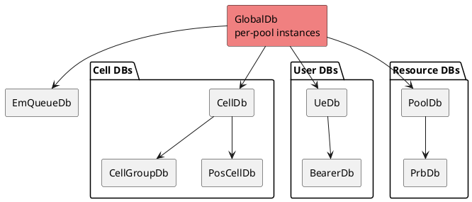

# L2PS Database Architecture

```plantuml

@startuml L2PS Database Architecture
!pragma graphviz svg
' scale 1920*1080

' skinparam linetype ortho
set namespaceSeparator ::
skinparam componentStyle rectangle

top to bottom direction

component "GlobalDb\nper-pool instances" as GLOBALDB #LightCoral

package "Cell DBs" {
  component "CellDb" as CELLDB
  component "CellGroupDb" as CELLGRPDB
  component "PosCellDb" as POSCELLDB
}

package "User DBs" {
  component "UeDb" as UEDB
  component "BearerDb" as BEARERDB
}

package "Resource DBs" {
  component "PoolDb" as POOLDB
  component "PrbDb" as PRBDB
}

component "EmQueueDb" as EMQDB

GLOBALDB -d-> CELLDB
GLOBALDB -d-> UEDB
GLOBALDB -d-> POOLDB
GLOBALDB -d-> EMQDB
CELLDB -d-> CELLGRPDB
CELLDB -d-> POSCELLDB
UEDB -d-> BEARERDB
POOLDB -d-> PRBDB
@enduml
```
