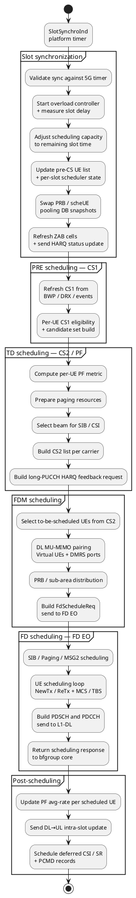

# L2PS DL Slot Scheduling Flow

```plantuml

@startuml L2PS DL Slot Scheduling Flow
!pragma graphviz svg
' scale 1920*1080

start
:SlotSynchroInd\nplatform timer;
partition "Slot synchronization" {
  :Validate sync against 5G timer;
  :Start overload controller\n+ measure slot delay;
  :Adjust scheduling capacity\nto remaining slot time;
  :Update pre-CS UE list\n+ per-slot scheduler state;
  :Swap PRB / scheUE\npooling DB snapshots;
  :Refresh ZAB cells\n+ send HARQ status update;
}
partition "PRE scheduling — CS1" {
  :Refresh CS1 from\nBWP / DRX / events;
  :Per-UE CS1 eligibility\n+ candidate set build;
}
partition "TD scheduling — CS2 / PF" {
  :Compute per-UE PF metric;
  :Prepare paging resources;
  :Select beam for SIB / CSI;
  :Build CS2 list per carrier;
  :Build long-PUCCH HARQ feedback request;
}
partition "FDM scheduling" {
  :Select to-be-scheduled UEs from CS2;
  :DL MU-MIMO pairing\nVirtual UEs + DMRS ports;
  :PRB / sub-area distribution;
  :Build FdScheduleReq\nsend to FD EO;
}
partition "FD scheduling — FD EO" {
  :SIB / Paging / MSG2 scheduling;
  :UE scheduling loop\nNewTx / ReTx + MCS / TBS;
  :Build PDSCH and PDCCH\nsend to L1-DL;
  :Return scheduling response\nto bfgroup core;
}
partition "Post-scheduling" {
  :Update PF avg-rate per scheduled UE;
  :Send DL→UL intra-slot update;
  :Schedule deferred CSI / SR\n+ PCMD records;
}
stop
@enduml
```
