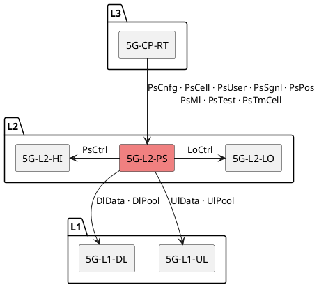

# L2PS External Peers

```plantuml

@startuml L2PS External Peers
!pragma graphviz svg
' scale 1920*1080

' skinparam linetype ortho
set namespaceSeparator ::
skinparam componentStyle rectangle

top to bottom direction

package "L3" {
  component "5G-CP-RT" as CPRT
}

package "L2" {
  component "5G-L2-HI" as L2HI
  component "5G-L2-PS" as L2PS #LightCoral
  component "5G-L2-LO" as L2LO
}

package "L1" {
  component "5G-L1-DL" as L1DL
  component "5G-L1-UL" as L1UL
}

CPRT -d-> L2PS : PsCnfg · PsCell · PsUser · PsSgnl · PsPos\nPsMl · PsTest · PsTmCell
L2PS -l-> L2HI : PsCtrl
L2PS -r-> L2LO : LoCtrl
L2PS -d-> L1DL : DlData · DlPool
L2PS -d-> L1UL : UlData · UlPool
@enduml
```
