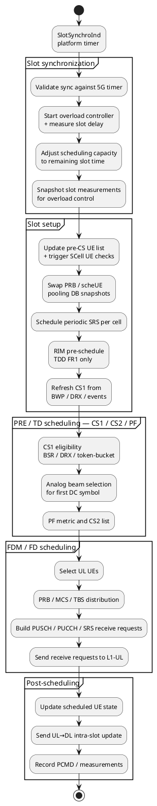

# L2PS UL Slot Scheduling Flow

```plantuml

@startuml L2PS UL Slot Scheduling Flow
!pragma graphviz svg
' scale 1920*1080

start
:SlotSynchroInd\nplatform timer;
partition "Slot synchronization" {
  :Validate sync against 5G timer;
  :Start overload controller\n+ measure slot delay;
  :Adjust scheduling capacity\nto remaining slot time;
  :Snapshot slot measurements\nfor overload control;
}
partition "Slot setup" {
  :Update pre-CS UE list\n+ trigger SCell UE checks;
  :Swap PRB / scheUE\npooling DB snapshots;
  :Schedule periodic SRS per cell;
  :RIM pre-schedule\nTDD FR1 only;
  :Refresh CS1 from\nBWP / DRX / events;
}
partition "PRE / TD scheduling — CS1 / CS2 / PF" {
  :CS1 eligibility\nBSR / DRX / token-bucket;
  :Analog beam selection\nfor first DC symbol;
  :PF metric and CS2 list;
}
partition "FDM / FD scheduling" {
  :Select UL UEs;
  :PRB / MCS / TBS distribution;
  :Build PUSCH / PUCCH / SRS receive requests;
  :Send receive requests to L1-UL;
}
partition "Post-scheduling" {
  :Update scheduled UE state;
  :Send UL→DL intra-slot update;
  :Record PCMD / measurements;
}
stop
@enduml
```
