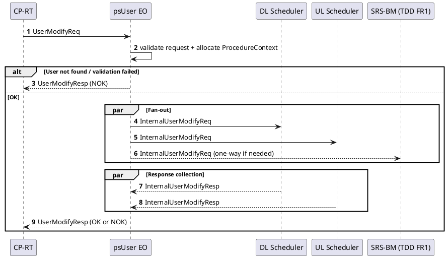

# L2PS User Modify Sequence

```plantuml

@startuml L2PS User Modify Sequence
autonumber
participant "CP-RT" as CPRT
participant "psUser EO" as PSUSER
participant "DL Scheduler" as DL
participant "UL Scheduler" as UL
participant "SRS-BM (TDD FR1)" as SRSBM

CPRT -> PSUSER : UserModifyReq
PSUSER -> PSUSER : validate request + allocate ProcedureContext
alt User not found / validation failed
  PSUSER --> CPRT : UserModifyResp (NOK)
else OK
  par Fan-out
    PSUSER -> DL : InternalUserModifyReq
    PSUSER -> UL : InternalUserModifyReq
    PSUSER --> SRSBM : InternalUserModifyReq (one-way if needed)
  end
  par Response collection
    DL --> PSUSER : InternalUserModifyResp
    UL --> PSUSER : InternalUserModifyResp
  end
  PSUSER --> CPRT : UserModifyResp (OK or NOK)
end
@enduml
```
