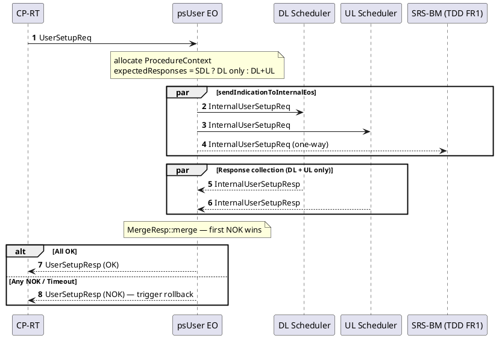

# L2PS User Setup Sequence

```plantuml

@startuml L2PS User Setup Sequence
autonumber
participant "CP-RT" as CPRT
participant "psUser EO" as PSUSER
participant "DL Scheduler" as DL
participant "UL Scheduler" as UL
participant "SRS-BM (TDD FR1)" as SRSBM

CPRT -> PSUSER : UserSetupReq
note over PSUSER
  allocate ProcedureContext
  expectedResponses = SDL ? DL only : DL+UL
end note
par sendIndicationToInternalEos
  PSUSER -> DL : InternalUserSetupReq
  PSUSER -> UL : InternalUserSetupReq
  PSUSER --> SRSBM : InternalUserSetupReq (one-way)
end
par Response collection (DL + UL only)
  DL --> PSUSER : InternalUserSetupResp
  UL --> PSUSER : InternalUserSetupResp
end
note over PSUSER : MergeResp::merge — first NOK wins
alt All OK
  PSUSER --> CPRT : UserSetupResp (OK)
else Any NOK / Timeout
  PSUSER --> CPRT : UserSetupResp (NOK) — trigger rollback
end
@enduml
```
