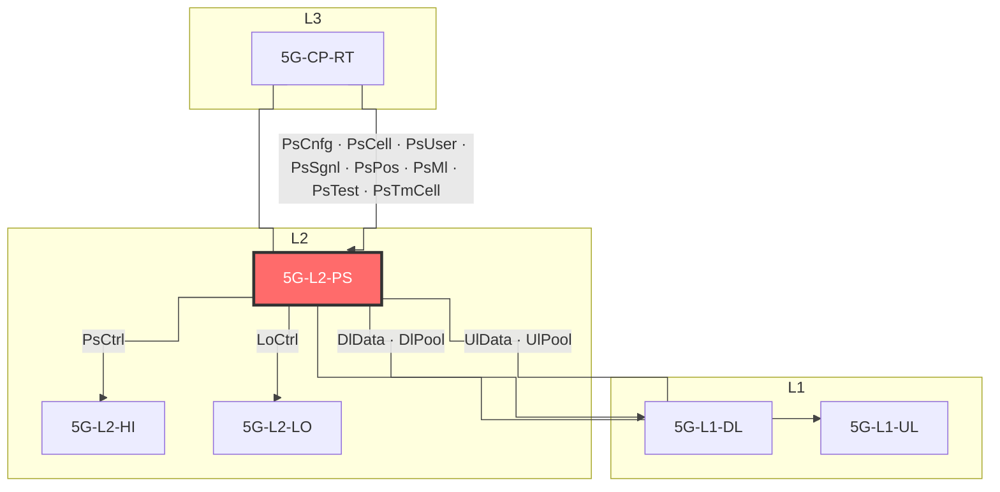
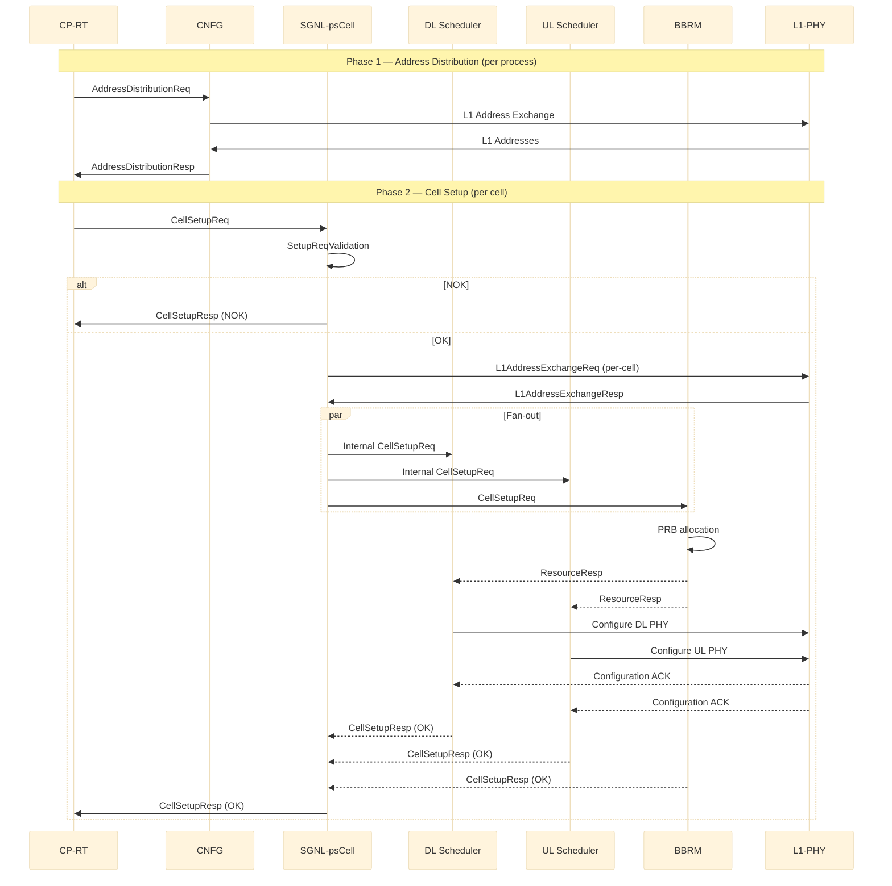
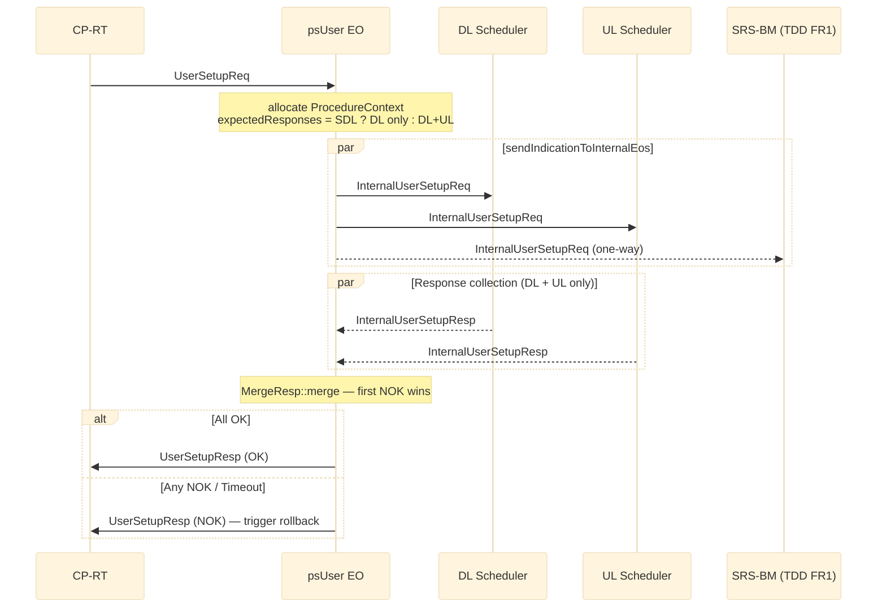
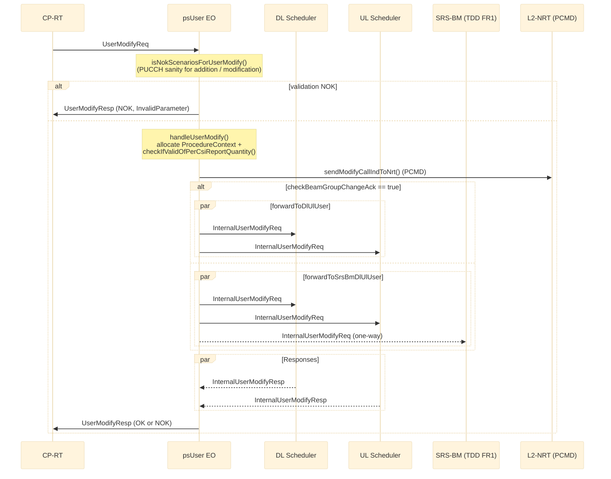
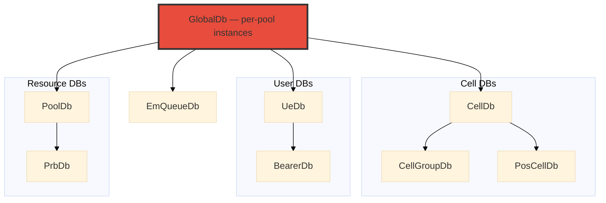

# L2-PS (Layer 2 Packet Scheduler) — Architecture

**Scope.** This document covers **L2-PS only** (not `L2-PS-LEGACY`) and **FR1 only** (TDD and FDD). FR2 paths are intentionally excluded.

**Audience.** Engineers and AI agents implementing new L2-PS features or fixing defects. This is a code-anchored knowledge base, not a tutorial.

**Authority.** Numbers, EO names, allocation triggers and flows are taken from the source under `/workspace/uplane/L2-PS/src/`. In any conflict with the AsciiDoc set under `uplane/L2-PS/doc/Chap04*.adoc`, the code wins.

---

## Table of Contents

1. [Executive Summary](#1-executive-summary)
2. [System Context](#2-system-context)
3. [Hardware & Deployment (board → process → cell group)](#3-hardware--deployment-board--process--cell-group)
4. [Execution Objects (EOs)](#4-execution-objects-eos)
5. [Flows](#5-flows)
6. [Database Architecture](#6-database-architecture)
7. [Real-Time & Performance (TDD FR1 reference)](#7-real-time--performance-tdd-fr1-reference)
8. [Source Tree](#8-source-tree)
9. [Build / UT / SCT](#9-build--ut--sct)
10. [Glossary](#10-glossary)

---

## 1. Executive Summary

**L2-PS** is the real-time MAC scheduler of the Nokia 5G NR gNB user plane. It owns per-slot DL and UL scheduling for **FR1** cells (TDD and FDD). It is always co-deployed with **L2-LO** in the same Linux container; together they form one L2-RT real-time pipeline. Non-real-time peers (**L2-HI**, **CP-RT**, **L1**) live outside the container.

| Theme | Detail |
|-------|--------|
| Time class | Per-slot deadline; FR1 TDD 30 kHz → 0.5 ms slot |
| Execution model | Event Machine (EM); explicit core pinning; one EO ↔ one or more EQs |
| Process model | One L2-PS Linux process = one EM instance = one L2-RT instance; hosts up to `itf::MAX_NUM_L2POOLS_PER_L2RT = 2` L2-RT pools |
| Cores per L2-PS instance | 4 – 12 PS cores (deployment-flavor dependent); see [§3](#3-hardware--deployment-board--process--cell-group) |
| Language | C++17 |

---

## 2. System Context

### 2.1 5G User Plane components

| Component | Function | RT class |
|-----------|----------|----------|
| 5G-L1-DL / 5G-L1-UL | Physical layer (encode/decode, RF) | Hard RT |
| **5G-L2-PS** | MAC scheduler (this document) — includes **BBRM** | Hard RT |
| 5G-L2-LO | RLC · HARQ · MAC PDU mux/demux; L1 data-plane proxy | Hard RT |
| 5G-L2-HI (DU) | PDCP, SDAP, GTP-U, F1-U / F1-C bridging | Non-RT |
| 5G-L2-HI (CU) | PDCP, S1, NG, Xn, F1 termination | Non-RT |
| 5G-CP-RT | DU control plane (SysCom: cell / user setup, ML use cases) | Mixed |
| 5G-CP-NRT | DU non-real-time control plane (CU-side) | Non-RT |
| 5G-L2-SRB | C-plane SRB processing (part of C-Plane) | Non-RT |
| LOM / O&M | FM / PM / L2 Log Du / PCMD aggregation | Non-RT |

### 2.2 External peers and interfaces

Scope: only the **main components** L2-PS exchanges messages with at run-time. Per-DU peer L2-PS, L2-NRT (LomStub / pmagent / cpuTimeCollector / L2Log streaming) and the platform timer (`SlotSynchroService`) are intentionally omitted — they are wired but secondary to architecture understanding.

**Diagram convention.** Solid arrow points **from client to server** (tail = client, head = server). Components are grouped by 3GPP layer (`L1`, `L2`, `L3`).

> **Code-anchored peer mapping.** Although every `Ps*` protocol is *declared* under `itf/l2/ps/...`, the actual peer is determined by who sends/receives the message in code. We checked each protocol's senders and handlers under `cplane/CP-RT/`, `cplane/CP-NRT/`, `uplane/L2-PS/`, `uplane/L2-LO/`, `uplane/L2-HI/`. Result: **all `Ps*` protocols are CP-RT ↔ L2-PS except `PsCtrl` which is L2-PS → L2-HI** (L2-HI receives `UlRadioLinkStatusInd` in `L2-HI/src/rlc/tx/flowcontrol/PsCtrlUlRadioLinkStatusIndReceiver.cpp`; L2-PS sends it in `L2-PS/src/ul/sch/bfgroup/SplitModeDetectionAlgorithm.cpp` to `l2hiSicad`).



---

#### 2.2.1 L2-PS interface inventory (main peers, from `protocol.pt`, `pscommon/events/`, and code search)

| # | Interface (`protocol`) | Peer | Direction (relative to L2-PS) | Definition file | Representative messages | Code anchor (sender / receiver) |
|---|------------------------|------|-------------------------------|------------------|-------------------------|---------------------------------|
| 1 | **`PsCnfg`** | CP-RT | **server** (in: Req, out: Resp) | `itf/l2/ps/cnfg/protocol.pt` | `AddressDistributionReq/Resp`, `L2PsCapabilityReq/Resp`, `PoolConfigurationReq/Resp` | sender: `cplane/CP-RT/.../pool_mgmt/pool_create/`; receiver: `uplane/L2-PS/src/cnfg/psCnfg/` |
| 2 | **`PsCtrl`** | **L2-HI (DU)** | **client** (out only — `Ind`) | `itf/l2/ps/ctrl/protocol.pt` | `UlRadioLinkStatusInd` | sender: `uplane/L2-PS/src/ul/sch/bfgroup/SplitModeDetectionAlgorithm.cpp` (sends to `l2hiSicad`); receiver: `uplane/L2-HI/src/rlc/tx/flowcontrol/PsCtrlUlRadioLinkStatusIndReceiver.cpp` |
| 3 | **`PsCell`** | CP-RT | **server** (in: Req/Ind, out: Resp/Ind) | `itf/l2/ps/cell/protocol.pt` | `CellSetupReq/Resp`, `CellGroup{Setup,Reconfig,Delete}Req/Resp`, `CellReconfigurationReq/Resp`, `CellStopSchedulingReq/Resp`, `CellDeleteReq/Resp`, `MibScheduleReq/Resp`, `SibScheduleReq/Resp`, `BeamConfigUpdateReq/Resp`, `OverloadProtectionReq/Resp`, `LoadReportingReq/Resp`, `Pws{Add,Replace,Del,Report}{Req,Resp,Ind}`, `NrRel{P,S}Cell{Setup,Update,Delete}Req/Resp`, `Dss*`, `IgnbCaCell*`, `Dl/UlLoadInd`, `AntStatusBitmapInd`, `PowerSavingConfigurationReq/Resp`, `TestMeasurementReq/Resp`, `Ul/DlTestMeasurementInd`, … (~60 msgs) | sender: `cplane/CP-RT/.../cell_mgmt/`; receiver: `uplane/L2-PS/src/sgnl/psCell/` |
| 4 | **`PsUser`** | CP-RT | **server** (in: Req/Ind, out: Resp/Ind) | `itf/l2/ps/user/protocol.pt` | `UserSetupReq/Resp`, `UserModifyReq/Resp`, `UserDeleteReq/Resp`, `UserStopReq/Resp`, `UserSuspendSchedulingReq/Resp`, `Bearer{Setup,Delete,Stop}Req/Resp`, `DrbModifyReq/Resp`, `BulkUser{Req,Resp}`, `RrcReconfCompletedReq`, `RRCConnectionReconfCompletedReq/Resp`, `RandomAccessInd`, `RadioLinkStatusInd`, `BufferMonitoringInd`, `BeamGroupChangeInd`, `UserChangeInd`, `UeBwpSwitchInd`, `PowerControlUpdateInd`, `RrcDeliveryCompletedInd`, `TaExceededInd`, `ReleaseCfraPreambleInd`, `ReserveCfraPreambleReq/Resp`, `RanBundledMeasReportInd`, `SCellReleaseConditionMetInd`, `UserRanMeasurementReq/Resp`, … | sender: `cplane/CP-RT/.../ue_mgmt/ue_procedures/`; receiver: `uplane/L2-PS/src/sgnl/psUser/` |
| 5 | **`PsSgnl`** | CP-RT | **server** | `itf/l2/ps/sgnl/protocol.pt` | `PcchDataSendReq` (paging) | sender: `cplane/CP-RT/.../cell_mgmt/l2_ps_sgnl/InternalCellPagingTask.cpp`; receiver: `uplane/L2-PS/src/dl/sch/paging/PagingHandler.cpp` |
| 6 | **`PsPos`** | CP-RT | **server** (positioning) | `itf/l2/ps/pos/protocol.pt` | `PosCellSetup/DeleteReq/Resp`, `MeasSetup/AbortReq/Resp`, `BundledMeasReport` | sender: `cplane/CP-RT/.../sct stub cprt/sequence/psPos/`; receiver: `uplane/L2-PS/src/posMeas/` |
| 7 | **`PsMl`** | CP-RT | **server** (ML use cases) | `itf/l2/ps/ml/protocol.pt` | `Activate/DeactivateUseCaseReq/Resp` | sender: `cplane/CP-RT/.../ml_mgmt/uc_activate/CellMlActivateTask.cpp`; receiver: `uplane/L2-PS/src/sgnl/psMl/` |
| 8 | **`PsTest`** | CP-RT (debug / artificial-load) | **server** | `itf/l2/ps/test/protocol.pt` | `CpuArtificialLoadReq/Resp/Ind`, `CpuArtificialLoadRegTimer`, `StoreTestCpuLoadEqIdReq/Resp`, `CellInfoNon555Resp`, `CellInfoKeepAliveMacRouteReq`, `StopRadioTimeInd` | external: CP-RT debug entry; internal: `uplane/L2-PS/src/artificialCpuLoad/startup/SendStoreReqSender.cpp` ↔ `uplane/L2-PS/src/sgnl/psTest/services/ArtificialLoadHandler.cpp` |
| 9 | **`PsTmCell`** | CP-RT (Test Mode / conformance) | **server** | `itf/l2/ps/tm/cell/protocol.pt` | `Start/StopConformanceTestReq/Resp`, `MeasurementReportInd`, `BeamPatternChangeReq/Resp` | sender: `cplane/CP-RT/.../cell_mgmt/startConformanceTest/PsTmStartConformanceTestReqBuilder*.cpp`; receiver: `uplane/L2-PS/src/sgnlTm/psTm/psTmSch/` |
| 10 | **`LoCtrl`** | L2-LO | **client** | `itf/l2/lo/ctrl/protocol.pt` | `PduMuxReq` (DL MAC-PDU mux), `DlBufferStatusInd`, `CcchDataInd`, `LoCtrlAddressReq/Resp`, `SlotTriggerReq`, `UlMacPduReceiveInd`, `LoCtrlStart/StopFlowControlReq`, `LoCtrlStart/StopSlotSynchroReq`, `LoCtrlUciUpdateReq`, `LoCtrlDeleteTempUeReq`, `RadioLinkResumeInd`, `FastAntennaSnapInd`, `Fr1/Fr2HarqStatusUpdateReq`, `Ul{BufferSplit,CaActivation}StatusReq`, `DlUuStatusUpdateReq` | sender: e.g. `uplane/L2-PS/src/dl/sch/fd/LoCtrlPduMuxReq.cpp`; receiver: L2-LO RLC / HARQ / MAC components |
| 11 | **`L1::DlData`** | L1-DL | **client** (down) / **handler** (up: scheduling responses) | `pscommon/events/l1/DlData/*.hpp` | Down: `PdcchSendReq`, `PdschSendReq`, `PdschPayloadTbSendReq`, `CsiRsSendReq`, `SsBlockSendReq`, `RimRsSendReq`, `SlotTypeReq`, `PatternConfigReq`, `UePairingReq`, `FastAntennaSnapshotRequest`, `AddressReq`. Up: `PdschSendRespPs`, `FastAntennaSnapshotResp`, `AddressResp`, `DiagnosticInd` | sender: `uplane/L2-PS/src/dl/sch/fd/PdschSendReqSender.cpp` etc.; receiver: L1-DL |
| 12 | **`L1::DlPool`** | L1-DL (DL BB pool resource) | **client** | L1 pool brokers (`BbResourceReconfReq`) | `BbResourceReconfReq/Resp`, `AddressReq/Resp` | sender/receiver: `uplane/L2-PS/src/bbrm/` |
| 13 | **`L1::UlData`** | L1-UL | **client** (down: receive cmds) / **handler** (up: rx-resp) | `pscommon/events/l1/UlData/*.hpp` | Down: `PrachReceiveReq`, `PucchReceiveReq`, `PuschReceiveReq`, `PuschReceiveReqL1ru`, `RimReceiveReq`, `SrsReceiveReq`, `SrsBeamCalcUlReceiveReq`, `SrsPosReceiveReq`, `FastAntennaSnapshotRequest`, `AddressReq`. Up (L1 → L2-PS rx-resp): `PrachReceiveInd`, `PucchReceiveRespPs`, `PucchReceiveRespHarqD`, `PuschReceiveRespPs`, `PuschReceiveRespHarqD`, `PuschReceiveRespHarqU`, `PuschReceiveRespLo`, `RimReceiveRespPs`, `SrsReceiveRespPs`, `SrsReceiveRespBmPs`, `SrsReceiveRespBwvPs`, `SrsReceiveRespRtBfPs`, `SrsBeamCalcUlReceiveRespPs`, `SrsPosReceiveRespPs`, `FastAntennaSnapshotResp`, `AddressResp`, `DiagnosticInd` | sender: `uplane/L2-PS/src/ul/sch/srs/.../SrsBeamCalcUlReceiveReqSender.cpp` etc.; rx-resp handlers: `uplane/L2-PS/src/ul/em/QueueStateDefault.hpp` |
| 14 | **`L1::UlPool`** | L1-UL (UL BB pool resource) | **client** | L1 pool brokers (`BbResourceReconfReq`) | `BbResourceReconfReq/Resp`, `AddressReq/Resp` | sender/receiver: `uplane/L2-PS/src/bbrm/` |

#### 2.2.2 L2-PS roles at a glance

| Role of L2-PS | Interface(s) | Peer |
|---------------|--------------|------|
| **Server** (handles Req from peer, sends Resp/Ind back) | `PsCnfg`, `PsCell`, `PsUser`, `PsSgnl`, `PsPos`, `PsMl`, `PsTest`, `PsTmCell` | CP-RT |
| **Client → L2-HI** | `PsCtrl` (`UlRadioLinkStatusInd`) | L2-HI (DU) |
| **Client → L2-LO** | `LoCtrl` | L2-LO |
| **Client → L1** | `DlData`, `DlPool` / `UlData`, `UlPool` | L1-DL / L1-UL |

---

## 3. Hardware & Deployment (board → process → cell group)

A single section that goes from the largest scope (the board/box) down to the smallest (an NR cell group bound to one scheduler index).

### 3.1 Board / hardware platform

| Platform | L2 device | Cores | Boards |
|----------|-----------|-------|--------|
| **Snowfish / Loki** | Intel Snowfish, x86 Atom Tremont | 20 / 24 cores | ABIO (24c), ABIN (20c), ASOE, ASOF |
| **Marlin / Thor** | Marvell CN106XXS, ARM Neoverse Perseus | 24 cores | ABIP, ABIQ, ASOG, ASOH |
| **Nemo / Odin** | Marvell Nemo, ARM | 42 cores | ABIR, ASOK |
| **Cloud vDU** | Server-class x86 | variable | RINLINE2 / GPU101 |

Cores come from the isolated CPU set (IsolCpus); non-isolated cores 0–3 run Linux SMP / OAM / control. Cell capacity per L2RT container is governed by an external **Cell Slot Model (CSM)** combining HW platform, board, deployment configuration and feature activations — L2-PS itself does not own the CSM.

### 3.2 L2RT Linux container

A board hosts one (full-board) or two (half-board) L2RT containers.

```text
+------------------------- L2RT Linux container (LXC) -----------------------+
|   L2-LO process                                  L2-PS process             |
|   (RLC, HARQ, MAC PDU)                           (this document)           |
+----------------------------------------------------------------------------+
```

- One container cannot mix LTE/5G.
- FDD and TDD cells use **separate** containers (separate `CellTechno`).
- PS and LO inside the container consume the same cell-slot positions.

### 3.3 L2-PS process (= L2-RT instance from L2-PS's view)

One L2-PS Linux process = one Event Machine instance. The process owns **only** the isolated RT cores (IsolCpus). NRT EOs created by the same Linux process execute on non-isolated cores shared with Linux SMP — they sit *outside* the isolated cpuset and are not RT-cores.

| Scope | Cores | What runs there |
|-------|-------|-----------------|
| **Isolated (L2-PS RT instance)** | Signalling core | `L2PsSgnl` (aggregated psCell / psUser / psSgnl / psML / psPos / psTest / l2Log) + `L2PsCnfg` |
| **Isolated (L2-PS RT instance)** | PS subpool cores | DL / UL / FD per-cell-group schedulers, BBRM, SrsBm, PosSch, PatternConfigSender |
| **Non-isolated (shared with Linux)** | NRT core(s) | `l2PcmdNrt`, `L2PsNrtTtiStreaming`, long-NRT executors (off the slot-deadline path; co-located with Linux SMP / OAM / control) |

A process hosts up to `itf::MAX_NUM_L2POOLS_PER_L2RT = 2` **L2-RT pools** on the isolated cores.

### 3.4 L2-RT pool

Pooling scope for poolable resources (PRB, throughput, SchedUEs, SubCells). Inside one process the pools share the signalling and NRT cores but each pool has its own SGNL+BBRM stack and its own per-cell-group EO set.

### 3.5 L2 subpool

A subpool is a sub-division of an L2 pool: a set of PS cores that schedule a set of cells. The subpool is the unit of cell-to-core assignment.

**FR1 TDD subpool types**

| Subpool | PS cores | Scheduling model | Max cells (HP) | Max cells (perf) | Max cells (conn) | Notes |
|---------|----------|------------------|----------------|------------------|------------------|-------|
| 1-core | 1 | Mix | — | — | 1 | Max 50 MHz BW or 8 DL/8 UL UE/TTI |
| 2-core | 2 | Direct / Partial mix / Cross mix | — | 1 | 2 (avoid from 27R1) | Scheduling timing alignment |
| 3-core | 3 | Direct (2 DL + 1 UL) | 1 | — | — | Future |
| 4-core | 4 | Cross mix | — | — | 3 | 28R1 CB015845 |

**FDD subpool types**

| Subpool | PS cores | Scheduling model | Max cells (HP) | Max cells (perf) | Max cells (conn) | Notes |
|---------|----------|------------------|----------------|------------------|------------------|-------|
| 1-core | 1 | Mix | — | 1 | — | Reduced peak with simultaneous DL+UL |
| 2-core | 2 | Direct | 1 | 2 (w/o conn) | 4 (w/o perf) | Scheduling timing alignment |

**Scheduling models** — *Mix:* same core does DL+UL for a cell. *Direct:* each core handles one direction. *Cross mix:* cells cross-allocated between cores for load balancing. *Partial mix:* hybrid of Direct and Mix.

### 3.6 NR cell group (per scheduler index)

One NR cell group is bound to one scheduler index `Yy` inside the pool. The total number of cell groups in a pool is `S = numOfSchedulers = numOfL2SubPools × numOfSchedulersPerL2SubPool`. Each cell group instantiates its own DL / UL / (FD / SRS-BM / PosSch) EOs in [§4.5](#45-per-cell-group-per-scheduler-index-eos).

### 3.7 NR cell types (L2-RT view)

| L2RT type | Duplex | Typical `nrCellType` | Description |
|-----------|--------|----------------------|-------------|
| GA2 | FDD | 1DL 2UL – 2DL 2UL | Small FDD |
| GA4 | FDD | 2DL 4UL – 4DL 4UL | Medium FDD |
| GA8 | FDD | 4DL 8UL – 8DL 8UL | Large FDD (BF) |
| GA16 | FDD | 8DL 8UL – 16DL 8UL | FDD BF eCPRI 7-2e |
| GC2 | TDD | 2DL 2UL | Small TDD |
| GC4 | TDD | 4DL 4UL / 4DL 2UL | Medium TDD |
| GC4S | TDD | 0DL 4UL | Positioning cell (`NRPOSCELL`) |
| GC8 | TDD | 8DL 4UL – 8DL 8UL | Large TDD |
| GC16 | TDD | 16DL 4UL – 16DL 8UL | Largest TDD |

### 3.8 Internal tier vocabulary

To talk about scope inside L2-PS we use three internal tiers — these are *not* 3GPP layers:

| Tier | Modules | Scope |
|------|---------|-------|
| **Cross-pool** | CNFG | All pools in the process |
| **Per-pool** | SGNL, BBRM | One L2 pool |
| **Per-cell-group** | DL, UL, FD, SRS-BM, PosSch, PatternConfig | One NR cell / cell group |

---

## 4. Execution Objects (EOs)

Single source of truth for "what runs where". Each L2-PS process creates a set of **EOs** (Execution Objects), each owning one or more **EQs** (Event Queues). EOs are statically pinned to cores; EQs are dispatched by the per-core EM scheduler. Every functional module of L2-PS lives inside one of these EOs.

### 4.1 EM framework & EQ naming

L2-PS is built on the **Event Machine (EM)** framework. EOs communicate only via EQs — deterministic, lock-free on the hot path.

Pool-scoped EOs carry a pool prefix from `cnfg/psCnfg/l3/AddressDistribution_Constants.hpp`:

```text
L2RtPool<P>_<EO base name>      where <P> ∈ {0, 1}
```

EQ names follow the convention from `uplane/L2-PS/doc/Chap041_Overview.adoc`:

```text
L2Ps FFF DD II
```

| Token | Meaning |
|-------|---------|
| `L2Ps` | Constant prefix |
| `FFF`  | 3-letter function code: `Sch`, `Cfg`, `Cel`, `Usr`, `Msg`, `Brm`, `Pih`, `Nra`, `Nrt`, `Fds`, `Pcf`, `Sgn`, `Tst`, `Log`, `Srs`, `Srt`, `Xpi`, `Cax`, `PosSch`, `Mln`, … |
| `DD`   | Direction: `Dl` / `Ul` / `Xx` (n/a) |
| `II`   | 2-digit numeric index (scheduler index, core id, …) — written as **`Yy`** in this document to avoid visual collision with letter I / digit 1 |

**Queue priorities** (non-uniform — DL is more time-critical than UL; configuration is lowest):

| Priority | Used for |
|----------|----------|
| `EQ_PRIO_4` (highest) | DL Scheduler, RadioTime |
| `EQ_PRIO_3` | UL Scheduler (HARQ timing) |
| `EQ_PRIO_2` | Message routing |
| `EQ_PRIO_0` (lowest) | SGNL, CNFG, BBRM (control / base) |

Queue groups (Chap041): `GR_DLSCH`, `GR_ULSCH`, etc., group related EQs for joint enable/disable.

**EO creation lifecycle** (from `init/Startup.cpp`):

1. `Startup::globalEmInit` → `createEosEqsAndGroups()` creates the **container-level** EOs (see [§4.3](#43-container-level-eos)).
2. `Startup::localEmInit` per core → `mlockCore()` + `mlockConst()` + `startEo(coreId)` + `em_queue_enable_all()`.
3. On `AddressDistributionReq` from CP-RT, CNFG drives `AddressDistributionEoAllocator::allocate*` to create the **per-pool** EOs (see [§4.4](#44-per-l2-rt-pool-eos)), and `allocateEoGroup()` to fan out the **per-cell-group** EOs (see [§4.5](#45-per-cell-group-per-scheduler-index-eos)).

### 4.2 EO catalog — at a glance

| Scope | EO base name | Default count | Sub-modules inside |
|-------|--------------|--------------:|---------------------|
| **Container-level** | `L2PsCnfg` | 1 | `cnfg/` |
|                     | `L2PsSgnlTm` | 1 | `sgnlTm/` |
|                     | `l2PcmdNrt` | 1 | `pscommon/l2PcmdNrt/` |
|                     | `L2PsNrtTtiStreaming` | 1 | `debuglog/ttiTraceStreaming/nrt/` |
|                     | `Eo` (artificial CPU load) | 0–1 | `artificialCpuLoad/` |
| **Per L2-RT pool**  | `L2RtPool<P>_L2PsPoolInitHelperYy` | = non-sig cores in pool | `pscommon/db/` |
|                     | `L2RtPool<P>_L2PsSgnlCreator` | 1 | `sgnl/psSgnl/` |
|                     | `L2RtPool<P>_L2PsSgnl` | 1 | `sgnl/` (psSgnl + psCell + psUser + psML + psPeer + psPos + psTest + l2Log) |
|                     | `L2RtPool<P>_L2PsFdYySch` | `F` (`FdDlCoresProvider`) | `fd/em/` + `fd/sch/` |
| **Per cell-group**  | `L2RtPool<P>_L2PsDlYySch` | `S` | `dl/em/` + `dl/sch/` |
|                     | `L2RtPool<P>_L2PsUlYySch` | `S` | `ul/em/` + `ul/sch/` |
|                     | `L2RtPool<P>_L2PsBbrm` | 1/pool | `bbrm/` |
|                     | `L2RtPool<P>_L2PsPatternConfigYy` | `S` | `patternConfigSender/` |
|                     | `L2RtPool<P>_L2PsSrsBmYy` | `S` (TDD FR1) | `srsBm/` |
|                     | `L2RtPool<P>_L2PsPosSchYy` | `S` (TDD FR1) | `posMeas/` |
|                     | `L2RtPool<P>_L2PsCoreYyLongNrtEvent` | 1 per distinct host core | `uplane/common/longNrtEvents/em/` |

`S` = `numOfSchedulers = numOfL2SubPools × numOfSchedulersPerL2SubPool`, max 18.

### 4.3 Container-level EOs

Created from `Startup::createEosEqsAndGroups()` and `Startup::startEo()`; **not** prefixed with `L2RtPool<P>_`.

| EO base name | EQ name(s) | Sub-modules / responsibilities | Code |
|--------------|------------|--------------------------------|------|
| `L2PsCnfg` | `L2PsCfgXxXx` | **CNFG** — cross-pool config entry. Receives `AddressDistributionReq` / `L2PsCapabilityReq` from CP-RT, drives L1 / L2-LO address exchange (`AddressDistributionResp`), allocates per-pool and per-cell-group EOs via `AddressDistributionEoAllocator`, forwards L2Log-DU streaming setup | `cnfg/em/Eo.cpp` + `cnfg/psCnfg/l3/AddressDistribution*.cpp` |
| `L2PsSgnlTm` | `L2PsCfgXxXxTm`, `L2PsCelXxXxTm` | Test-Mode signalling | `sgnlTm/Eo.cpp` |
| `l2PcmdNrt` | `L2PsNraXxXx` | NRT PCMD counter / per-UE record upload via LomProxy; runs on the NRT core (non-isolated, shared with Linux) | `pscommon/l2PcmdNrt/em/Eo.cpp` |
| `L2PsNrtTtiStreaming` | (dedicated TTI streaming EQ) | NRT TTI-trace streaming | `debuglog/ttiTraceStreaming/nrt/Eo.cpp` |
| `Eo` (artificial CPU load) | (test only, 0–1 instance) | Test CPU-load generator | `artificialCpuLoad/EoHandlerCpuLoad.cpp` |

Marlin / Nemo / RCP-ODP also call `l2ps::ttiTrace::em::TtiTrace::createTtiTraceQueue()` — creates an EQ only, not an EO.

### 4.4 Per L2-RT pool EOs

Allocated on `AddressDistributionReq` (`AddressDistribution::allocatePoolInitHelperEo()` + `storeAddressAndAllocateEos()`). One set per active pool (max 2 per process — `itf::MAX_NUM_L2POOLS_PER_L2RT = 2`).

| EO base name | EQ name(s) | Sub-modules / responsibilities | Code |
|--------------|------------|--------------------------------|------|
| `L2RtPool<P>_L2PsPoolInitHelperYy` | `L2PsPihXxXx` | Bootstrap each non-signalling core of the pool: initialise `GlobalDb` / `EmQueueDb` / `WritableDb` references on that core. **Count** = non-signalling cores in the pool (≤ 18) | `pscommon/db/Eo.cpp` |
| `L2RtPool<P>_L2PsSgnlCreator` | `L2PsSgnXxXx` (creator stage) | Bootstrap EO that initialises DB refs on the signalling core, then calls `SgnlEoHandler::allocateEo` to spawn `L2PsSgnl` | `sgnl/psSgnl/Eo.cpp` |
| `L2RtPool<P>_L2PsSgnl` | `L2PsCelXxXx`, `L2PsCfgXxXx`, `L2PsUsrXxXx`, `L2PsLogXxXx`, `L2PsSgnXxXx`, `L2PsTstXxXx` (+ `L2PsMlnXxXx` if `psML` enabled) | **SGNL** — pool-level signalling. Single EO on the signalling core hosting the sub-services below. Terminates CP-RT messages and fans out cell / cell-group / user configuration | `sgnl/Eo.cpp` |
| `L2RtPool<P>_L2PsFdYySch` | `L2PsFdsDDYy` | **FD scheduler** — DL frequency-domain scheduling: MCS/TBS, PRB allocation, PDSCH/PDCCH L1 message building, SIB/Paging/MSG2. **Count `F`** from `FdDlCoresProvider::getListOfCoreFdDl()`: site-mode `F = S`; TDD FR1 with `rdEnableDlFdSchOnULCores = 1` → `F = 2·S`. When `dlFdParallelSchedulerEnabled = false`, shares a core with DL SCH and communicates via `dl/sch/intracore/FdSchMsgBufferizer.cpp` | `fd/em/` + `fd/sch/` |

**Sub-services inside `L2PsSgnl`** (all share one EM thread on the signalling core; together they contribute all the EQs listed above):

| Sub-service | Purpose | Source |
|-------------|---------|--------|
| `psSgnl` | Paging, PCCH routing | `sgnl/psSgnl/` |
| `psCell` | Cell lifecycle (Setup / Reconfig / Delete / GroupSetup); per-cell L1 address exchange; cell FSM `QueueStateStartup → QueueStateDefault → QueueStateDelete`; ~120 validators | `sgnl/psCell/` + `sgnl/psCell/reqValidation/` |
| `psUser` | User / UE / bearer management; `ProcedureContext` / `ProcedureContextDb` tracking in-flight UE procedures with `expectBothDlAndUlResponses` / `expectOnlyDlResponse` / `expectOnlyUlResponse` from `ExpectedResponses.hpp`; `MergeResp::merge` (first NOK wins, rollback on NOK/timeout) | `sgnl/psUser/` |
| `psML` | ML use-case activation / deactivation (only if enabled) | `sgnl/psML/` |
| `psPeer` | Peer control messaging | `sgnl/psPeer/` |
| `psPos` | Positioning-cell operations | `sgnl/psPos/` |
| `psTest` | Test / debug | `sgnl/psTest/` |
| `l2Log` | L2-Log-DU streaming | `sgnl/l2Log/` |

> **`L2PsSgnl` is the pool-level signalling EO** — every CP-RT message into the pool lands here first and gets fanned out from there.

> **`L2PsFdYySch` is pool-scoped** even though there is one per FD core, because `FdDlCoresProvider` allocates them at the pool level (not bound to a single cell group).

### 4.5 Per cell-group (per scheduler-index) EOs

Allocated by `AddressDistributionEoAllocator::allocateEoGroup()` once per `GroupConfigDatas` entry produced by `pscommon/deployment/ConfigProvider`. All TDD-vs-FDD differences live here.

| EO base name | EQ name(s) | Trigger | Sub-modules / responsibilities | Code |
|--------------|------------|---------|--------------------------------|------|
| `L2RtPool<P>_L2PsDlYySch` | `L2PsSchDlYy`, `L2PsMsgDlYy`, `L2PsUsrDlYy`, `L2PsCelDlYy` (+ `L2PsXpiDlYy`, `L2PsCaxDlYy`) | Always | **DL scheduler** — PRE/TD/FDM scheduling: eligibility (CS1), PF metric + CS2, PDCCH/PDSCH FDM, DL MU-MIMO, HARQ, DRX, BWP, link adaptation. Entry: `dl/sch/MainComponent.cpp` | `dl/em/` + `dl/sch/` |
| `L2RtPool<P>_L2PsUlYySch` | `L2PsSchUlYy`, `L2PsMsgUlYy`, `L2PsUsrUlYy`, `L2PsCelUlYy` (+ `L2PsXpiUlYy`, `L2PsCaxUlYy`) | Always | **UL scheduler** — PRE/TD/FDM/FD scheduling: RACH/Msg3, PUSCH/PUCCH, CoMP, token-bucket, UL DRX, UL pre-scheduling, UL MU-MIMO. Entry: `ul/sch/MainComponent.cpp` | `ul/em/` + `ul/sch/` |
| `L2RtPool<P>_L2PsBbrm` | `L2PsBrmXxXx` | `groupConfig.bbrm != invalidCoreId`; assigned only to scheduler-index 0 in subpool 0 — i.e. **1 instance per pool** | **BBRM** — pool-wide baseband resource manager. Cell setup/delete coordination (`CellSetupManager`), Sherpa milestone trigger (`CommonTriggerManager` / `BeginOfBbPoolingPeriod`), cross-pool PRB allocation (`PoolingMapperManager`, `InterSubPoolsPrbManager`), subcell allocation (`SubCellsAllocator`), throughput pooling (`ThroughputHandler`), multi-pool ZAB privilege rotation (`MultiPoolZabPrivilegeCtrl`), `ResourceRespSender`. **Not on the user-setup path** | `bbrm/Eo.cpp` + `bbrm/fsm/` + `bbrm/*Pooling*` |
| `L2RtPool<P>_L2PsPatternConfigYy` | `L2PsPcfXxYy` | `groupConfig.patternCfg != invalidCoreId` (always true on FR1) | Concatenates per-TTI pattern config from DL+UL and forwards to L1 | `patternConfigSender/em/` + `patternConfigSender/sender/` |
| `L2RtPool<P>_L2PsSrsBmYy` | `L2PsSrsXxYy` + `L2PsSrtXxYy` | TDD FR1 only — `SrsBmCoreIdProvider::getSrsBmCoreId()` returns `invalidCoreId` for FDD and when `actSrsBmCalcInL1 == true` | **SRS Beam Management** — consumes L1 SRS measurements (`SrsReceiveRespBmPs`), runs beam selection, emits `SrsBeamSelectionInd` to DL and `UlSrsBeamSelectionInd` to UL; handlers: `handleUserSetupReq` / `handleUserModifyReq` / `handleUserDeleteInd` / `handleSrsReceiveRespBmPs` / `handleBeamConfigUpdateReq` / `handleSlotSynchroInd` | `srsBm/em/` + `srsBm/management/` + `srsBm/ul/` + `srsBm/dl/` |
| `L2RtPool<P>_L2PsPosSchYy` | `L2PsPosSchXxYy` | TDD FR1 only — `getPosSchCoreId(!isTddFr1)` returns `invalidCoreId` for FDD. In *positioning-dedicated-pool* mode (`positioningDedicatedPoolDeployment()`) the entire pool is just `PoolInitHelper + SgnlCreator + Sgnl + PosSch` | Positioning scheduler — UL TDoA / positioning measurements | `posMeas/em/` + `posMeas/sch/` + `posMeas/db/` |
| `L2RtPool<P>_L2PsCoreYyLongNrtEvent` | `L2PsNrtXxYy` (`Yy` = core id) | One per distinct core hosting any DL / UL / BBRM EO (deduplicated via `Eo::isCoreInitialized()`) | Long NRT-event executor on that core (off the slot-deadline path) | `uplane/common/longNrtEvents/em/` (via `pscommon::em::LongNrtEventEoHandler`) |

**Index `Yy` ranges** (semantics depend on the EO family):

- `Sch` / `Msg` / `Usr` / `Cel` / `PatternConfig`: `Yy` = scheduler index in the pool, `Yy ∈ {01 … S}`; max `S = 18`.
- `L2PsSrsBmYy`: `Yy ∈ {1 … 10}` (from `eoSrsBmNames` in `AddressDistribution_Constants.hpp`).
- `L2PsPosSchYy`: `Yy ∈ {1 … 18}` (`maxAllowedCellsForPositioningDeployment`).
- `L2PsCoreYyLongNrtEvent` ↔ EQ `L2PsNrtXxYy`: `Yy ∈ {0 … 31}` — **absolute core id**, not a scheduler index.

### 4.6 Per-scenario EO summary (FR1)

`R_per_sched` = per-cell-group RT EO count *per scheduler index* (DL + UL + PatternConfig ± SrsBm ± PosSch):

| Scenario | Deployment function (`ConfigProvider.cpp`) | Cores / subpool | `SrsBmYy` | `PosSchYy` | `R_per_sched` |
|----------|--------------------------------------------|-----------------|:---------:|:----------:|:-------------:|
| **TDD FR1** (single-core/subpool) | `initAndGetDeploymentConfigForOneCoreL2sp(isTddFr1=true)` | 1 | Yes¹ | Yes | **5** |
| **TDD FR1** (dual / triple-core/subpool) | `initAndGetDeploymentConfigForMixedCellEOsInDualCorePerL2spTDD` (`numCoresPerL2sp ∈ {2,3} ∧ numSched/sp ≤ 3`) | 2 or 3 | Yes¹ | Yes | **5** |
| **FDD FR1** (single-core/subpool) | `initAndGetDeploymentConfigForOneCoreL2sp(isTddFr1=false)` | 1 | No | No | **3** |
| **FDD FR1** (dual-core/subpool, `actTwoCoresL2DeploymentFddFr1 = true`) | `initAndGetDeploymentConfigForDualCorePerL2spFDD` | 2 | No | No | **3** |

¹ Only when `actSrsBmCalcInL1 == false`.

- `R_per_sched = 3` → DL + UL + PatternConfig.
- `R_per_sched = 5` → also adds SrsBm + PosSch.
- `L2PsBbrm` is per pool (1 instance), not per scheduler.

### 4.7 Worked examples (one active L2-RT pool)

| Scenario | Cell groups (`S`) | Pool cores | `K_init` (non-sig) | `F` (FD EOs) | `C_distinct` | `N_per_pool` | `N_container` |
|----------|------------------:|-----------:|-------------------:|-------------:|-------------:|-------------:|--------------:|
| TDD FR1 (dual-core/subpool, 3 subpools = 6 cores) | 3 | 6 | 5 | 3 | 6 | 32 | 36 |
| FDD FR1 (single-core/subpool, 6 subpools = 6 cores) | 6 | 6 | 5 | 6 | 6 | 38 | 42 |

`N_per_pool = 2 (SgnlCreator + Sgnl) + K_init + F + 1 (Bbrm) + C_distinct + R_per_sched · S`. Container-level `+4` adds `L2PsCnfg + L2PsSgnlTm + l2PcmdNrt + L2PsNrtTtiStreaming`. Both pools active → add another `N_per_pool` block.

Real values depend on `maxNumberOfNrCellGroup`, `numOfL2SubPools`, `numOfCores`, `flavorId`, board type, and RAD parameters (`rdEoDeploymentParallelization`, `rdEnableDlFdSchOnULCores`, `rdActLongNrtEventHandling`, …).

### 4.8 PSCOMMON — shared infrastructure (not an EO)

`pscommon/` is the shared C++ library used by every EO above. It is **not** an EO itself but defines the primitives the EOs are built from. Notable subtrees:

| Group | Subdirs |
|-------|---------|
| Core | `em/`, `db/`, `events/`, `logging/` |
| FSM utilities | `fsm/`, `dispatcherFsm/`, `stateMachine/` |
| Timing | `synchro/`, `timer/`, `sfnSlot/`, `timeDomain/` |
| Protocol features | `drx/`, `cfra/`, `measurementGap/`, `suMimo/` |
| Link adaptation | `link_adaptation/`, `sch/`, `qualityControl/` |
| Config / deployment | `radParams/`, `deployment/` (`ConfigProvider*`, `FdDlCoresProvider`, `SrsBmCoreIdProvider`) — the scenario → EO-deployment matrix |
| Overload control | `synchro/overload/` (`OverloadController`, `SlotProcessingRatioAdapter`, `OverloadControlCalculator`, …) — see [§7.2](#72-per-slot-deadline--adaptive-rt-budget) |
| Measurements / counters | `measurements/`, `performance/`, `counters/` |
| System integration | `platform/`, `ccsIf/`, `pcmdAPI/`, `messageHandler/`, `longNrtEvents/`, `l2PcmdNrt/` |
| Special features | `freeze/`, `dssxp/`, `interbandca/`, `eirp/` |
| Utilities | `memoryResources/`, `historyBuffers/`, `frequencycontrol/`, `randomizer/` |

---

## 5. Flows

This chapter describes the runtime flows that need context for feature development or debugging. The slot-level scheduling flows show only the top 2-3 levels of call structure; deeper detail is in the dedicated documents referenced inline.

### 5.1 Cell setup

Two-phase bring-up — address distribution via CNFG (cross-pool, once per process), then cell setup through SGNL-psCell → schedulers → BBRM → L1 (per cell).



psCell steps: `fillResponseInfo()` → `performRadParamAssertionCheck()` → `isRequestPayloadValid()` (delegates to `SetupReqValidation` and the ~120 checkers under `reqValidation/`) → on OK `allocatePowerMeasurementCellIndex()` → `startL1AddressExchange()` / `L1AddressExchangeResp` → `storeAddresses()` → `sendSetupReqToInternalEos()` → `isResponseReceivedFromAllExecObjs()` → `CellSetupResp`.

### 5.2 User setup

`UserSetupReq` goes from CP-RT to SGNL (psUser), which fans out to DL + UL with a one-way notification to SRS-BM (if present). Only DL and UL contribute aggregated responses. BBRM is **not** on the user path.



Key files: `sgnl/psUser/handler/HandleUserSetupReq.hpp`, `PsUserProcedure.hpp` (template), `ExpectedResponses.hpp`, `ProcedureContext*.hpp`.

### 5.3 User modify

Same shape as user setup but with extra pre-validation (PUCCH, 32-port CSI-RS) and a different SRS-BM rule. See `sgnl/psUser/handler/HandleUserModifyReq.hpp` and the `UserModifyReq`-specialised `PsUserProcedure::handle()` in `PsUserProcedure.hpp`.



The user-stop, user-delete and bearer-setup procedures use the same `PsUserProcedure` template with their own per-class specialisations of `handle()`.

### 5.4 DL slot-level scheduling

Triggered by `SlotSynchroInd` produced by the **platform `SlotSynchroService`** (`uplane/common/platform/SlotSynchroService.hpp`) — an RP1/RT-timer periodic event anchored to the radio-frame start. **It is not pushed by L1**; L1 only provides the radio-frame start time at startup via `StartSlotSynchroParams`.

The DL pipeline spans two EOs — `L2PsDlYySch` (PRE / TD / FDM) and `L2PsFdYySch` (FD / L1 messages). When they share a core (`dlFdParallelSchedulerEnabled = false`), they communicate via `FdSchMsgBufferingService::send(FdScheduleReq)`.

```mermaid
%%{init: {'flowchart': {'curve': 'linear'}}}%%
flowchart TB
    A([SlotSynchroInd<br/>platform timer])
    A --> P1
    subgraph P1["<b>Slot synchronization</b>"]
        direction LR
        P1a[Validate sync<br/>against 5G timer]
        P1b[Start slot in overload controller<br/>+ measure slot delay]
        P1c[Adjust scheduling capacity<br/>to remaining slot time]
        P1d[Update pre-CS UE list<br/>+ per-slot scheduler state]
        P1e[Swap PRB / scheUE<br/>pooling DB snapshots]
        P1f[Refresh ZAB cells<br/>+ send HARQ status update]
    end
    P1 --> P2
    subgraph P2["<b>PRE scheduling — CS1</b>"]
        direction LR
        P2a[Refresh CS1 from<br/>BWP / DRX / events]
        P2b[Per-UE CS1 eligibility<br/>+ candidate set build]
    end
    P2 --> P3
    subgraph P3["<b>TD scheduling — CS2 / PF</b>"]
        direction LR
        P3a[Compute per-UE<br/>PF metric]
        P3b[Prepare paging<br/>resources]
        P3c[Select beam<br/>for SIB / CSI]
        P3d[Build CS2 list<br/>per carrier]
        P3e[Build long-PUCCH<br/>HARQ feedback request]
    end
    P3 --> P4
    subgraph P4["<b>FDM scheduling</b>"]
        direction LR
        P4a[Select to-be-scheduled<br/>UEs from CS2]
        P4b[DL MU-MIMO pairing<br/>Virtual UEs + DMRS ports]
        P4c[PRB / sub-area<br/>distribution]
        P4d[Build FdScheduleReq<br/>send to FD EO]
    end
    P4 --> P5
    subgraph P5["<b>FD scheduling — FD EO</b>"]
        direction LR
        P5a[SIB / Paging / MSG2<br/>scheduling]
        P5b[UE scheduling loop<br/>NewTx / ReTx + MCS / TBS]
        P5c[Build PDSCH and PDCCH<br/>send to L1-DL]
        P5d[Return scheduling response<br/>to bfgroup core]
    end
    P5 --> P6
    subgraph P6["<b>Post-scheduling</b>"]
        direction LR
        P6a[Update PF avg-rate<br/>per scheduled UE]
        P6b[Send DL→UL<br/>intra-slot update]
        P6c[Schedule deferred CSI / SR<br/>+ PCMD records]
    end
    style A fill:#3498db,stroke:#333,stroke-width:2px,color:#fff
```



| Phase | Code entry |
|-------|-----------|
| **Slot synchronization** | `dl/sch/SlotSynchroIndHandler.cpp::handle` → `handleSlotSynchroIndCommon` (`overloadControllerStartSlot`, `tickSlotFacade.computeSlotDelayAndTickSlotEnd`, `setSlotDelay`, `adjustSchedulingToRemainingSlot`, `scheduler.updatePreCsUes`, `scheduler.updateOnNewSlot`) → `runSlotHandler` (`swapPoolingDatabases`, `ZabCellUpdater::update`, `HarqStatusUpdateReqSender::send`, `slotHandler.run`) |
| **PRE scheduling — CS1** | `SlotHandler::schedule` → `scheduler.updateCs1ListWithEvents` → `bfgroup::Scheduler::schedule` → `preScheduler.schedule` (`dl/sch/pre/Scheduler.cpp`) — uses `Cs1ListCandidateConstraint::isUeEligibleForCs1Common` |
| **TD scheduling — CS2 / PF** | `bfgroup::Scheduler::schedule` → `tdScheduler.schedule` (`dl/sch/td/Scheduler.cpp`) → `pfMetric.computePfMetric` + `pagingHandler.preparePagingResource` + `selectBeamForSibOrCsiAndPrepareTdSchedForabf` + `scheduleCarriers` → `Cs2ListBuilder` + `dl/sch/td/PucchScheduler.cpp::sendDlHarqFeedback` |
| **FDM scheduling** | `dl/sch/td/CarrierScheduler.cpp::scheduleCells` → `scheduleFdm` / `scheduleFdmForMuMimoInSubcell` → PRB distribution, MU-MIMO pairing → `FdSchedulerProxy::schedule` → `FdSchMsgBufferingService::send(FdScheduleReq)` (`dl/sch/intracore/FdSchMsgBufferizer.cpp`) |
| **FD scheduling — FD EO** | `fd::MainComponent::processFdScheduleReq` (`uplane/L2-PS/src/fd/sch/MainComponent.cpp:294`) → `preScheduling` → `fillFdScheduleRespMessage` → `Xpdsch` + `Xpdcch` builders → `PdschSendReq` / `PdcchSendReq` to L1; `FdScheduleResp` returned to bfgroup core |
| **Post-scheduling** | `SlotHandler::postRun` → `bfgroup::Scheduler::postSchedule` (`postFdSchedule`, `preScheduler.postSchedule`, `tdScheduler.postSchedule`) → `SlotHandler::sendDlToUlIntraSchedUpdate` → `IntraSchedUpdateSender::sendDlToUlIntraSchedUpdate` ; `bfgroup::Scheduler::postRun` (`csiSrScheduler.scheduleInAdvance`, `SchedulerCellAccessor::sendPcmdRecords`, `ssbInterferenceMitigationForNonBF.postUpdate`) |

> Full call stack: `/home/ptr476/work/doc/ai/storage/L2PS_FR1_DL_Scheduling_Flow.md`.

### 5.5 UL slot-level scheduling

Same dispatch model, **no separate FD-EO** — PRE / TD / FDM / FD all run inline on the UL EO (`L2PsUlYySch`). PUSCH decoding results come back from L1 asynchronously (rx-resp messages) and feed link adaptation / HARQ. RACH / Msg3 is a slot-type-conditional branch (taken when the slot type is `SLOT_TYPE_PRACH` / `SLOT_TYPE_RACH_FORMAT_1`); for FDD, regular data scheduling also runs in the same slot.

```mermaid
%%{init: {'flowchart': {'curve': 'linear'}}}%%
flowchart TB
    A([SlotSynchroInd<br/>platform timer])
    A --> Q1
    subgraph Q1["<b>Slot synchronization</b>"]
        direction LR
        Q1a[Validate sync<br/>against 5G timer]
        Q1b[Start slot in overload controller<br/>+ measure slot delay]
        Q1c[Adjust scheduling capacity<br/>to remaining slot time]
        Q1d[Snapshot slot measurements<br/>for overload control]
    end
    Q1 --> Q2
    subgraph Q2["<b>Slot setup</b>"]
        direction LR
        Q2a[Update pre-CS UE list<br/>+ trigger SCell UE checks]
        Q2b[Swap PRB / scheUE<br/>pooling DB snapshots]
        Q2c[Schedule periodic SRS<br/>per cell]
        Q2d[RIM pre-schedule<br/>TDD FR1 only]
        Q2e[Refresh CS1 from<br/>BWP / DRX / events]
    end
    Q2 --> Q3
    subgraph Q3["<b>PRE / TD scheduling — CS1 / CS2 / PF</b>"]
        direction LR
        Q3a[CS1 eligibility<br/>BSR / DRX / token-bucket]
        Q3b[Analog beam selection<br/>for first DC symbol]
        Q3c[Compute per-UE<br/>PF metric]
        Q3d[Build CS2 list<br/>per carrier]
    end
    Q3 --> Q4
    subgraph Q4["<b>FDM scheduling + UL MU-MIMO</b>"]
        direction LR
        Q4a[Select to-be-scheduled<br/>UEs from CS2]
        Q4b[Create Virtual UEs<br/>WRR / Exhaustive]
        Q4c[Manage MU UE lists<br/>+ pairing eligibility]
        Q4d[Distribute PRBs and layers<br/>per UE group]
        Q4e[Allocate DMRS ports<br/>per Virtual UE]
    end
    Q4 --> Q5
    subgraph Q5["<b>Resource allocation + Grant generation</b>"]
        direction LR
        Q5a[Frequency allocation<br/>+ MCS / TBS]
        Q5b[Power control<br/>+ HARQ process assignment]
        Q5c[Build PUSCH grant<br/>+ UL DCI 0_1 / 0_2]
        Q5d[Send to L1-UL / L1-DL<br/>PUSCH receive + PDCCH send]
    end
    Q5 --> Q6
    subgraph Q6["<b>RACH / Msg3 — alternative path for PRACH slot</b>"]
        direction LR
        Q6a[Schedule PRACH slot<br/>preamble + RACH window]
        Q6b[Handle preamble<br/>build RAR / MSG2]
        Q6c[Build Msg3 grant<br/>for contention resolution]
    end
    Q6 --> Q7
    subgraph Q7["<b>Post-scheduling</b>"]
        direction LR
        Q7a[Update PF avg-rate<br/>+ link adaptation]
        Q7b[Send UL→DL<br/>intra-slot update]
        Q7c[Send slot type to subcells<br/>+ beam selection result]
        Q7d[Sync UL slot type to SRS-BM<br/>TDD FR1 only]
    end
    style A fill:#3498db,stroke:#333,stroke-width:2px,color:#fff
```



| Phase | Code entry |
|-------|-----------|
| **Slot synchronization** | `ul/sch/mainComponent/SlotSynchroIndHandler.cpp::handle` → `handleSynchronization` → `handleSlotSynchroIndForOneOnAirSlot` → `updateSlotMeasurements` (`overloadControllerStartSlot`, `tickSlotFacade.computeSlotDelayAndTickSlotEnd`, `setSlotDelay`, `adjustSchedulingToRemainingSlot`) |
| **Slot setup** | `slotHandler` → `processSlotForCell` → `scheduler.updatePreCsUes`, `triggerUeCheckingForSCellActDeact`, `refreshOnAirXhfnsInDb`, `updateCounters`; then `updateSlotResources` (`swapPoolingDatabases`, `schedulePsrsSeperate`, `rim.preSchedule` for TDD FR1, `updateCellUtilizationCounter`); `updateScheduler` calls `scheduler.updateCs1ListWithEvents` |
| **PRE / TD scheduling — CS1 / CS2 / PF** | `selectSlotType` → `scheduleData` → `bfgroup::Scheduler::schedule` (`ul/sch/bfgroup/Scheduler.cpp`) → `preScheduler.schedule` (CS1, analog beam) → `tdScheduler.schedule` (`ul/sch/td/Scheduler.cpp`) → `pfMetric.computePfMetric` → `scheduleCarriersAndAddScheduledUes` → `scheduleCarriers` (CarrierScheduler — CS2 build) |
| **FDM scheduling + UL MU-MIMO** | `ul/sch/td/CarrierScheduler.cpp::scheduleFdm` / `scheduleFdmForMuMimoInSubcell` → `ul/sch/fdm/Scheduler.cpp` + `ul/sch/overlapFdmMuMimo/` (`VirtualUeWithRetxListBuilder`, `VirtualUeBuilder`, `MuUeListsManager`, `NumOfLayersLimiter`, `MuVirtualUeDMRSPortAllocator`, `UeGroupPrbDistribution`) |
| **Resource allocation + Grant generation** | `ul/sch/fdm/Scheduler.cpp` → `Xpusch` (PUSCH builder) + `Xpdcch` (shared PDCCH builder for UL DCI 0_1 / 0_2) → `PuschReceiveReq` to L1-UL, `PdcchSendReq` to L1-DL |
| **RACH / Msg3 — alternative path** | Slot-type branch in `selectSlotType`: `SLOT_TYPE_PRACH` / `SLOT_TYPE_RACH_FORMAT_1` → `handlePrachSlotTypes` → `scheduler.schedulePrach` (`ul/sch/bfgroup/Scheduler.cpp:656`) → `ul/sch/pre/rach/RaProcedure.cpp` (`handleMsg1`, `scheduleMsg3`); for FDD also runs `scheduleData` |
| **Post-scheduling** | `scheduleData` → `scheduler.postSchedule` (`ul/sch/bfgroup/Scheduler.cpp:451`) → `preScheduler.postSchedule` + `tdScheduler.postSchedule` (PF avg + link adaptation) + `harqSchedulerStorage.reset`; `processSlotForCell` then calls `scheduler.sendUlToDlIntraSchedUpdate` (`ul/sch/intraSchedCom/IntraSchedUpdateSender.cpp`); `slotHandlerPostProcessing` runs `sendSlotTypeReqToAllSubcells`, `scheduler.sendBeamSelectionResultInd`, `scheduler.activatePdcchPatternConfiguration`; `UlToSrsSlotTypeSyncSender` is fired for TDD FR1 |

> Full UL MU-MIMO reference: `/home/ptr476/work/doc/ai/storage/L2PS_FR1_TDD_UL_MU_MIMO.md`.

### 5.6 Inter-EO communication

Per-slot information is exchanged through dedicated update messages.

| From → To    | Message                  | Carries                                                                                                                                                                                                       | Code |
|--------------|--------------------------|---------------------------------------------------------------------------------------------------------------------------------------------------------------------------------------------------------------|------|
| DL → UL      | `DlToUlIntraSchedUpdate` | RA UEs, MSG2 / MSG4 scheduled, scheduled DL beam, PUCCH PRB reservation, DRX state, SCell UL-CA UEs, beam-change notifications                                                                                | `dl/sch/intraSchedCom/IntraSchedUpdateSender.cpp` (sender); `dl/sch/bfgroup/Scheduler.cpp::sendDlToUlIntraSchedUpdate` |
| UL → DL      | `UlToDlIntraSchedUpdate` | UL-derived per-slot state needed by DL — PUCCH receive-resp summary (HARQ ACK/NACK, CSI), scheduled UL UEs, light-PS UL allocation hints, etc.                                                                | `ul/sch/intraSchedCom/IntraSchedUpdateSender.cpp::sendUlToDlIntraSchedUpdate` |
| DL → UL      | `DlHarqFeedbackReq`      | Long-PUCCH HARQ feedback request per UE — which UE, on which PUCCH slot, how many ACK/NACK bits to expect                                                                                                     | `dl/sch/dlHarqFeedback/DlHarqFeedbackSender.cpp` |
| SRS-BM → DL  | `SrsBeamSelectionInd`    | DL beam selection per UE — best beam, paired beams, gain ratios (best/weak, tapering/non-tapering), DOA, PDSCH/CSI-RS best-beam power-offset indices, DL-SRS-enh Kronecker eigen-beam weights                  | sender `srsBm/dl/BeamSelection.cpp`; handler `dl/sch/bfgroup/msgHandler/SrsBeamSelectionIndHandler.cpp`; message `itf/l2/ps/internal/SrsBeamSelectionInd.mt` |
| SRS-BM → UL  | `UlSrsBeamSelectionInd`  | UL beam selection per UE (analogous to the DL variant; used by the UL scheduler for UL beamforming weights)                                                                                                   | `srsBm/ul/UlSrsBeamSelectionIndSender.cpp` |
| UL → SRS-BM  | `UlToSrsSlotTypeSync`    | Effective UL slot type for the SRS-BM EO so that beam-management processing stays aligned with the actual UL pattern (TDD FR1 only)                                                                            | `ul/sch/mainComponent/UlToSrsSlotTypeSyncSender.cpp` |

---

## 6. Database Architecture



Typical access (shared-memory style across cores; writes localised to owner EOs):

```cpp
auto& cell = CellDb::db().getCell(nrCellIdentity);
auto& ue   = UeDb::db().getUe(ueId);
GlobalDb::db().cellTechnology;          // current pool
GlobalDb::dbRef(poolIndex);             // specific pool
```

Selected `GlobalDb` fields used to specialise behaviour on the hot path: `scheUePoolingAllowed`, `subcellDeactivationDlAllowed`, `spatialStreamPoolingAllowed`, `cellTechnology`, `frequencyRange` (always FR1 here), `psUserSicadForL2RtPool`.

---

## 7. Real-Time & Performance (TDD FR1 reference)

### 7.1 FR1 TDD 30 kHz timing

| Item | Value |
|------|-------|
| Slot duration | 0.5 ms |
| Slots per frame | 20 (10 ms frame) |
| Typical TDD patterns | `DDDSU`, `DDDDDDSUUU` |
| `K0` (DCI → PDSCH) | typically 0 (same slot) |
| `K1` (PDSCH → PUCCH HARQ) | 4 – 8 slots |
| L1 processing lead time | ~2 slots |

### 7.2 Per-slot deadline — adaptive RT budget

L2-PS uses no hard hand-coded deadline. Each RT core dynamically splits its slot between **slot-level scheduling (RT)** and **other message handling (NRT)**:

- `slotProcessingRatio` adapts per slot in the range **50 % … 90 %** (`SlotProcessingRatioAdapter.hpp` — `minimumSlotProcessingRatio = 50`, `maximumSlotProcessingRatio = 90`, target `0.9`, step `5 %`). Initial value ≈ 90 %; if the previous slot exceeded its scheduling budget the ratio steps down (toward 50 %), otherwise it steps back up.
- Inside the scheduling slice the DL/UL share is set per slot from the TDD `(k2, k1)` flags (default 70/30; `OverloadController.hpp` line 42).
- RT deadline is enforced on the hot path by `OverloadController::updateSchedulingCapacity()` (per-slot budget), `isTimeAvailableForFdScheduling()` / `calculateNumOfFdUes()` (clamp FD-scheduled UEs by time-till-slot-boundary), `setSlotDelay()` (feed slot-overrun back into the next slot's budget), and `getRemainingSchedulingBudgetThresholdUs` (~45 µs safety margin).

Net effect: NRT message handling is guaranteed ≥10 % of every slot under low load and up to 50 % under heavy load; scheduling can never starve NRT and never overruns the slot.

All of the above lives in `pscommon/synchro/overload/` (`OverloadController.*`, `SlotProcessingRatioAdapter.*`, `OverloadControlCalculator.*`).

### 7.3 Real-time techniques

- **Memory locking** — `mlockCore()` + `mlockConst()` at startup pin static/critical regions.
- **Lock-free EM queues** — message passing between EOs is the only RT synchronisation primitive on the hot path.
- **Preallocation** — no heap on hot paths; static arrays / pools.
- **Core pinning** — every RT EO is statically pinned to an IsolCpus core.
- **Per-pool DB sharding** — `GlobalDb::dbRef(poolIndex)` avoids cross-pool reads on the hot path.
- **PRB pooling** — `slotSynchAndApplyPrbLimitDl.swapNumAllocCellPrbDb()` and `ZabCellUpdater::update()` swap PRB DBs at slot start to keep readers lock-free.
- **Same-core FD bufferising** — `FdSchMsgBufferizer` removes EQ overhead when DL SCH and FD EOs share a core.
- **Adaptive slot budgeting** — see [§7.2](#72-per-slot-deadline--adaptive-rt-budget).

---

## 8. Source Tree

Canonical `uplane/L2-PS/src/` layout. Logical tiers ([§3.8](#38-internal-tier-vocabulary)) and EO ownership ([§4](#4-execution-objects-eos)) describe the runtime structure.

```text
uplane/L2-PS/src/
├── main/                    # Application entry point (main.cpp, mlock)
├── init/                    # System initialisation (Startup, MlrtController)
├── cnfg/                    # Cross-pool configuration
│   ├── psCnfg/
│   │   ├── l1/              # L1 address management
│   │   └── l3/              # CP-RT pool config; EO allocation (AddressDistribution*)
│   └── em/                  # EM integration (Eo.cpp)
├── sgnl/                    # Per-pool signalling
│   ├── common/  db/  psSgnl/ psCell/ psUser/ psML/ psPeer/ psPos/ psTest/
├── bbrm/                    # Per-pool baseband resource manager
├── dl/                      # DL scheduler (em/ + sch/{MainComponent, bfgroup, pre, td, fdm, fd, la, harq, drx, …})
├── ul/                      # UL scheduler (em/ + sch/{MainComponent, mainComponent, pre, td, fdm, overlapFdmMuMimo, srs, tokenBucket, …})
├── fd/                      # FD scheduler (em/ + sch/)
├── srsBm/                   # SRS Beam Management (TDD FR1 only)
├── posMeas/                 # Positioning measurements / scheduler
├── patternConfigSender/     # Per-TTI pattern config → L1
├── sgnlTm/                  # Test Mode signalling
├── ttiTrace/                # TTI trace (queue only, no EO)
├── debuglog/                # Debug logging; NRT TTI-trace streaming
├── artificialCpuLoad/       # Optional CPU load EO
├── benchmark/               # Performance benchmarks
├── pscommon/                # Shared infrastructure (~50 subdirs; see §4.8)
├── utils/                   # Utility functions
├── sct/                     # System Component Test scaffolding
├── ut/                      # Unit tests (Google Test / GMock)
└── doc/                     # Source-tree doc artifacts (.pu, .adoc)
```

---

## 9. Build / UT / SCT

Use the **i_faster** workflow for all routine build, unit-test and FUSE-SCT operations.

- Skill reference: `/workspace/.cursor/skills/i-faster/SKILL.md`.
- Inside that skill see also the L2-PS-specific cheat sheets (build, UT, fuse SCT, TC SCT).

This document intentionally does not duplicate the build commands; treat the skill as the source of truth.

---

## 10. Glossary

| Term | Definition |
|------|------------|
| **L2-PS** | Layer 2 Packet Scheduler (this system) |
| **L2-LO** | Layer 2 Low — RLC, HARQ, MAC PDU mux/demux |
| **L2-HI** | Layer 2 High — PDCP, SDAP, RRC-related L2 |
| **L2RT container** | LXC container hosting one L2-PS process and one L2-LO process |
| **L2-RT pool** | Pooling scope for poolable resources; up to 2 per L2-PS process |
| **L2 subpool** | Subdivision of an L2 pool; unit for cell-to-core assignment |
| **CP-RT** | DU control plane — umbrella label for all upper control traffic to L2-PS |
| **EO** | Execution Object — independent service with its own EM-scheduled queue(s) |
| **EQ** | Event Queue — message queue serviced by an EO |
| **`Yy`** | Placeholder for the 2-digit numeric index in EO/EQ names (Chap041 spells it `II`) |
| **TTI** | Transmission Time Interval (one slot) |
| **PRB** | Physical Resource Block |
| **MCS** | Modulation and Coding Scheme |
| **TBS** | Transport Block Size |
| **HARQ** | Hybrid Automatic Repeat Request |
| **DRX** | Discontinuous Reception |
| **SRS** | Sounding Reference Signal |
| **CQI / PMI / RI** | Channel Quality Indicator / Precoding Matrix Indicator / Rank Indicator |
| **PUCCH / PUSCH / PDCCH / PDSCH** | Physical UL Control / UL Shared / DL Control / DL Shared channels |
| **BBRM** | Baseband Resource Manager (L2-PS module) |
| **CNFG** | Configuration module (cross-pool) |
| **SGNL** | Signalling module (per pool) |
| **FD / TD** | Frequency Domain / Time Domain scheduler |
| **NRT / RT** | Non-Real-Time / Real-Time |
| **CS1 / CS2** | Candidate Set 1 (eligibility) / Candidate Set 2 (PF-sorted scheduling list) |
| **PF** | Proportional Fair (TD scheduling metric) |
| **CSM** | Cell Slot Model (capacity model — L2-PS does not own it) |

## Related

- [[navigation-nokia-home]]
- [[navigation-architecture]]
- [[navigation-gnb]]
