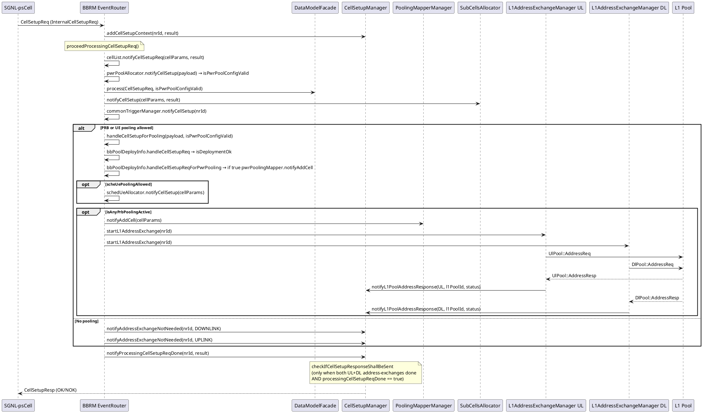

# L2PS BBRM Cell Bring-Up Flow

```plantuml
@startuml L2PS BBRM Cell Bring-Up Flow
participant "SGNL-psCell" as SGNL
participant "BBRM EventRouter" as BBRM
participant "DataModelFacade" as DataM
participant "CellSetupManager" as CSM
participant "PoolingMapperManager" as Pooling
participant "SubCellsAllocator" as SubCell
participant "L1AddressExchangeManager UL" as L1AddrUl
participant "L1AddressExchangeManager DL" as L1AddrDl
participant "L1 Pool" as L1

    SGNL->BBRM: CellSetupReq (InternalCellSetupReq)
    BBRM->CSM: addCellSetupContext(nrId, result)
    note over BBRM: proceedProcessingCellSetupReq()
    BBRM->BBRM: cellList.notifyCellSetupReq(cellParams, result)
    BBRM->BBRM: pwrPoolAllocator.notifyCellSetup(payload) → isPwrPoolConfigValid
    BBRM->DataM: process(CellSetupReq, isPwrPoolConfigValid)
    BBRM->SubCell: notifyCellSetup(cellParams, result)
    BBRM->BBRM: commonTriggerManager.notifyCellSetup(nrId)

    alt PRB or UE pooling allowed
        BBRM->BBRM: handleCellSetupForPooling(payload, isPwrPoolConfigValid)
        BBRM->BBRM: bbPoolDeployInfo.handleCellSetupReq → isDeploymentOk
        BBRM->BBRM: bbPoolDeployInfo.handleCellSetupReqForPwrPooling → if true pwrPoolingMapper.notifyAddCell
        opt scheUePoolingAllowed
            BBRM->BBRM: schedUeAllocator.notifyCellSetup(cellParams)
        end
        opt isAnyPrbPoolingActive
            BBRM->Pooling: notifyAddCell(cellParams)
            BBRM->L1AddrUl: startL1AddressExchange(nrId)
            BBRM->L1AddrDl: startL1AddressExchange(nrId)
            L1AddrUl->L1: UlPool::AddressReq
            L1AddrDl->L1: DlPool::AddressReq
            L1-->L1AddrUl: UlPool::AddressResp
            L1AddrUl->CSM: notifyL1PoolAddressResponse(UL, l1PoolId, status)
            L1-->L1AddrDl: DlPool::AddressResp
            L1AddrDl->CSM: notifyL1PoolAddressResponse(DL, l1PoolId, status)
        end
    else No pooling
        BBRM->CSM: notifyAddressExchangeNotNeeded(nrId, DOWNLINK)
        BBRM->CSM: notifyAddressExchangeNotNeeded(nrId, UPLINK)
    end

    BBRM->CSM: notifyProcessingCellSetupReqDone(nrId, result)
    note over CSM: checkIfCellSetupResponseShallBeSent\n(only when both UL+DL address-exchanges done\nAND processingCellSetupReqDone == true)
    CSM-->SGNL: CellSetupResp (OK/NOK)
@enduml
```
