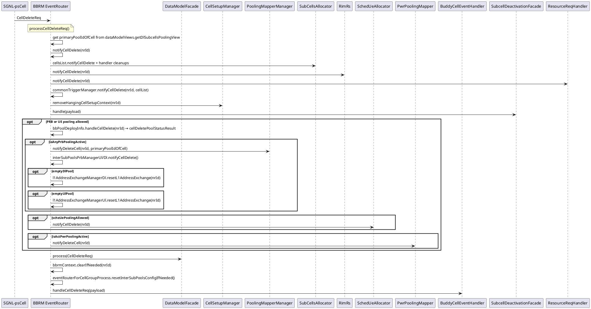

# L2PS BBRM Cell Delete Flow

```plantuml
@startuml L2PS BBRM Cell Delete Flow
participant "SGNL-psCell" as SGNL
participant "BBRM EventRouter" as BBRM
participant "DataModelFacade" as DataM
participant "CellSetupManager" as CSM
participant "PoolingMapperManager" as Pooling
participant "SubCellsAllocator" as SubCell
participant "RimRs" as RimRs
participant "SchedUeAllocator" as SchedUe
participant "PwrPoolingMapper" as PwrPool
participant "BuddyCellEventHandler" as Buddy
participant "SubcellDeactivationFacade" as SubDeact
participant "ResourceReqHandler" as ResReq

    SGNL->BBRM: CellDeleteReq
    note over BBRM: processCellDeleteReq()
    BBRM->BBRM: get primaryPoolIdOfCell from dataModelViews.getDlSubcellsPoolingView
    BBRM->BBRM: notifyCellDelete(nrId)
    BBRM->SubCell: cellsList.notifyCellDelete + handler cleanups
    BBRM->RimRs: notifyCellDelete(nrId)
    BBRM->ResReq: notifyCellDelete(nrId)
    BBRM->BBRM: commonTriggerManager.notifyCellDelete(nrId, cellList)
    BBRM->CSM: removeHangingCellSetupContext(nrId)
    BBRM->SubDeact: handle(payload)
    opt PRB or UE pooling allowed
        BBRM->BBRM: bbPoolDeployInfo.handleCellDelete(nrId) → cellDeletePoolStatusResult
        opt isAnyPrbPoolingActive
            BBRM->Pooling: notifyDeleteCell(nrId, primaryPoolIdOfCell)
            BBRM->BBRM: interSubPoolsPrbManagerUl/Dl.notifyCellDelete()
            opt emptyDlPool
                BBRM->BBRM: l1AddressExchangeManagerDl.resetL1AddressExchange(nrId)
            end
            opt emptyUlPool
                BBRM->BBRM: l1AddressExchangeManagerUl.resetL1AddressExchange(nrId)
            end
        end
        opt scheUePoolingAllowed
            BBRM->SchedUe: notifyCellDelete(nrId)
        end
        opt isActPwrPoolingActive
            BBRM->PwrPool: notifyDeleteCell(nrId)
        end
    end
    BBRM->DataM: process(CellDeleteReq)
    BBRM->BBRM: bbrmContext.clearIfNeeded(nrId)
    BBRM->BBRM: eventRouterForCellGroupProcess.resetInterSubPoolsConfigIfNeeded()
    BBRM->Buddy: handleCellDeleteReq(payload)
@enduml
```
