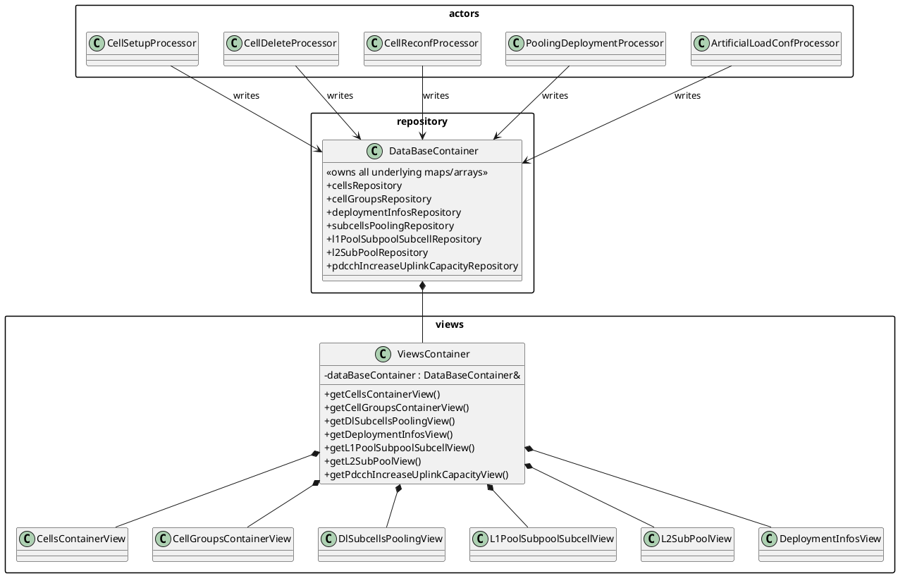

# L2PS BBRM DB Model

```plantuml
@startuml L2PS BBRM DB Model
!pragma graphviz svg
' scale 1920*1080

' skinparam linetype ortho
set namespaceSeparator ::
skinparam classAttributeIconSize 0
skinparam packageStyle rectangle

package repository {
  class DataBaseContainer {
    <<owns all underlying maps/arrays>>
    +cellsRepository
    +cellGroupsRepository
    +deploymentInfosRepository
    +subcellsPoolingRepository
    +l1PoolSubpoolSubcellRepository
    +l2SubPoolRepository
    +pdcchIncreaseUplinkCapacityRepository
  }
}

package views {
  class ViewsContainer {
    -dataBaseContainer : DataBaseContainer&
    +getCellsContainerView()
    +getCellGroupsContainerView()
    +getDlSubcellsPoolingView()
    +getDeploymentInfosView()
    +getL1PoolSubpoolSubcellView()
    +getL2SubPoolView()
    +getPdcchIncreaseUplinkCapacityView()
  }
  class CellsContainerView
  class CellGroupsContainerView
  class DlSubcellsPoolingView
  class L1PoolSubpoolSubcellView
  class L2SubPoolView
  class DeploymentInfosView
}

package actors {
  class CellSetupProcessor
  class CellDeleteProcessor
  class CellReconfProcessor
  class PoolingDeploymentProcessor
  class ArtificialLoadConfProcessor
}

DataBaseContainer *-d- ViewsContainer
ViewsContainer *-d- CellsContainerView
ViewsContainer *-d- CellGroupsContainerView
ViewsContainer *-d- DlSubcellsPoolingView
ViewsContainer *-d- L1PoolSubpoolSubcellView
ViewsContainer *-d- L2SubPoolView
ViewsContainer *-d- DeploymentInfosView
CellSetupProcessor -d-> DataBaseContainer : writes
CellDeleteProcessor -d-> DataBaseContainer : writes
CellReconfProcessor -d-> DataBaseContainer : writes
PoolingDeploymentProcessor -d-> DataBaseContainer : writes
ArtificialLoadConfProcessor -d-> DataBaseContainer : writes
@enduml
```
