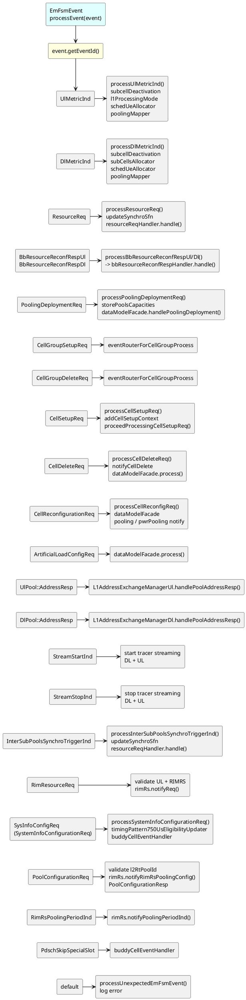

# L2PS BBRM Event ID Dispatch

Dispatch table matches `l2ps::bbrm::fsm::EventRouter::processEvent` in **`/workspace/uplane/L2-PS/src/bbrm/EventRouter.cpp`** (22 explicit `case` arms + `default`).

```plantuml
@startuml L2PS BBRM Event ID Dispatch
!pragma graphviz svg
' scale 1920*1080

' skinparam linetype ortho
skinparam componentStyle rectangle
skinparam nodesep 30
skinparam ranksep 45
top to bottom direction

rectangle "EmFsmEvent\nprocessEvent(event)" as Entry #LightCyan
rectangle "event.getEventId()" as Switch #LightYellow

rectangle "UlMetricInd" as E01
rectangle "processUlMetricInd()\nsubcellDeactivation\nl1ProcessingMode\nschedUeAllocator\npoolingMapper" as H01

rectangle "DlMetricInd" as E02
rectangle "processDlMetricInd()\nsubcellDeactivation\nsubCellsAllocator\nschedUeAllocator\npoolingMapper" as H02

rectangle "ResourceReq" as E03
rectangle "processResourceReq()\nupdateSynchroSfn\nresourceReqHandler.handle()" as H03

rectangle "BbResourceReconfRespUl\nBbResourceReconfRespDl" as E04
rectangle "processBbResourceReconfRespUl/Dl()\n-> bbResourceReconfRespHandler.handle()" as H04

rectangle "PoolingDeploymentReq" as E05
rectangle "processPoolingDeploymentReq()\nstorePoolsCapacities\ndataModelFacade.handlePoolingDeployment()" as H05

rectangle "CellGroupSetupReq" as E06
rectangle "eventRouterForCellGroupProcess" as H06

rectangle "CellGroupDeleteReq" as E07
rectangle "eventRouterForCellGroupProcess" as H07

rectangle "CellSetupReq" as E08
rectangle "processCellSetupReq()\naddCellSetupContext\nproceedProcessingCellSetupReq()" as H08

rectangle "CellDeleteReq" as E09
rectangle "processCellDeleteReq()\nnotifyCellDelete\ndataModelFacade.process()" as H09

rectangle "CellReconfigurationReq" as E10
rectangle "processCellReconfigReq()\ndataModelFacade\npooling / pwrPooling notify" as H10

rectangle "ArtificialLoadConfigReq" as E11
rectangle "dataModelFacade.process()" as H11

rectangle "UlPool::AddressResp" as E12
rectangle "L1AddressExchangeManagerUl.handlePoolAddressResp()" as H12

rectangle "DlPool::AddressResp" as E13
rectangle "L1AddressExchangeManagerDl.handlePoolAddressResp()" as H13

rectangle "StreamStartInd" as E14
rectangle "start tracer streaming\nDL + UL" as H14

rectangle "StreamStopInd" as E15
rectangle "stop tracer streaming\nDL + UL" as H15

rectangle "InterSubPoolsSynchroTriggerInd" as E16
rectangle "processInterSubPoolsSynchroTriggerInd()\nupdateSynchroSfn\nresourceReqHandler.handle()" as H16

rectangle "RimResourceReq" as E17
rectangle "validate UL + RIMRS\nrimRs.notifyReq()" as H17

rectangle "SysInfoConfigReq\n(SystemInfoConfigurationReq)" as E18
rectangle "processSystemInfoConfigurationReq()\ntimingPattern750UsEligibilityUpdater\nbuddyCellEventHandler" as H18

rectangle "PoolConfigurationReq" as E19
rectangle "validate l2RtPoolId\nrimRs.notifyRimRsPoolingConfig()\nPoolConfigurationResp" as H19

rectangle "RimRsPoolingPeriodInd" as E20
rectangle "rimRs.notifyPoolingPeriodInd()" as H20

rectangle "PdschSkipSpecialSlot" as E21
rectangle "buddyCellEventHandler" as H21

rectangle "default" as E22
rectangle "processUnexpectedEmFsmEvent()\nlog error" as H22

Entry -d-> Switch
Switch -d-> E01

E01 -r-> H01
E02 -r-> H02
E03 -r-> H03
E04 -r-> H04
E05 -r-> H05
E06 -r-> H06
E07 -r-> H07
E08 -r-> H08
E09 -r-> H09
E10 -r-> H10
E11 -r-> H11
E12 -r-> H12
E13 -r-> H13
E14 -r-> H14
E15 -r-> H15
E16 -r-> H16
E17 -r-> H17
E18 -r-> H18
E19 -r-> H19
E20 -r-> H20
E21 -r-> H21
E22 -r-> H22

E01 -[hidden]d-> E02
E02 -[hidden]d-> E03
E03 -[hidden]d-> E04
E04 -[hidden]d-> E05
E05 -[hidden]d-> E06
E06 -[hidden]d-> E07
E07 -[hidden]d-> E08
E08 -[hidden]d-> E09
E09 -[hidden]d-> E10
E10 -[hidden]d-> E11
E11 -[hidden]d-> E12
E12 -[hidden]d-> E13
E13 -[hidden]d-> E14
E14 -[hidden]d-> E15
E15 -[hidden]d-> E16
E16 -[hidden]d-> E17
E17 -[hidden]d-> E18
E18 -[hidden]d-> E19
E19 -[hidden]d-> E20
E20 -[hidden]d-> E21
E21 -[hidden]d-> E22

H01 -[hidden]d-> H02
H02 -[hidden]d-> H03
H03 -[hidden]d-> H04
H04 -[hidden]d-> H05
H05 -[hidden]d-> H06
H06 -[hidden]d-> H07
H07 -[hidden]d-> H08
H08 -[hidden]d-> H09
H09 -[hidden]d-> H10
H10 -[hidden]d-> H11
H11 -[hidden]d-> H12
H12 -[hidden]d-> H13
H13 -[hidden]d-> H14
H14 -[hidden]d-> H15
H15 -[hidden]d-> H16
H16 -[hidden]d-> H17
H17 -[hidden]d-> H18
H18 -[hidden]d-> H19
H19 -[hidden]d-> H20
H20 -[hidden]d-> H21
H21 -[hidden]d-> H22
@enduml
```
