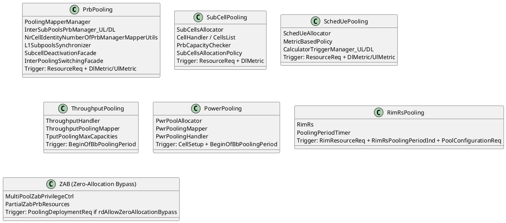

# L2PS BBRM Pooling Sub-Systems

```plantuml
@startuml L2PS BBRM Pooling Sub-Systems
!pragma graphviz svg
' scale 1920*1080

' skinparam linetype ortho
set namespaceSeparator ::
skinparam classAttributeIconSize 0
skinparam packageStyle rectangle

class PrbPooling {
  PoolingMapperManager
  InterSubPoolsPrbManager_UL/DL
  NrCellIdentityNumberOfPrbManagerMapperUtils
  L1SubpoolsSynchronizer
  SubcellDeactivationFacade
  InterPoolingSwitchingFacade
  Trigger: ResourceReq + DlMetric/UlMetric
}
class SubCellPooling {
  SubCellsAllocator
  CellHandler / CellsList
  PrbCapacityChecker
  SubCellsAllocationPolicy
  Trigger: ResourceReq + DlMetric
}
class SchedUePooling {
  SchedUeAllocator
  MetricBasedPolicy
  CalculatorTriggerManager_UL/DL
  Trigger: ResourceReq + DlMetric/UlMetric
}
class ThroughputPooling {
  ThroughputHandler
  ThroughputPoolingMapper
  TputPoolingMaxCapacities
  Trigger: BeginOfBbPoolingPeriod
}
class PowerPooling {
  PwrPoolAllocator
  PwrPoolingMapper
  PwrPoolingHandler
  Trigger: CellSetup + BeginOfBbPoolingPeriod
}
class RimRsPooling {
  RimRs
  PoolingPeriodTimer
  Trigger: RimResourceReq + RimRsPoolingPeriodInd + PoolConfigurationReq
}
class ZabPooling as "ZAB (Zero-Allocation Bypass)" {
  MultiPoolZabPrivilegeCtrl
  PartialZabPrbResources
  Trigger: PoolingDeploymentReq if rdAllowZeroAllocationBypass
}


@enduml
```
