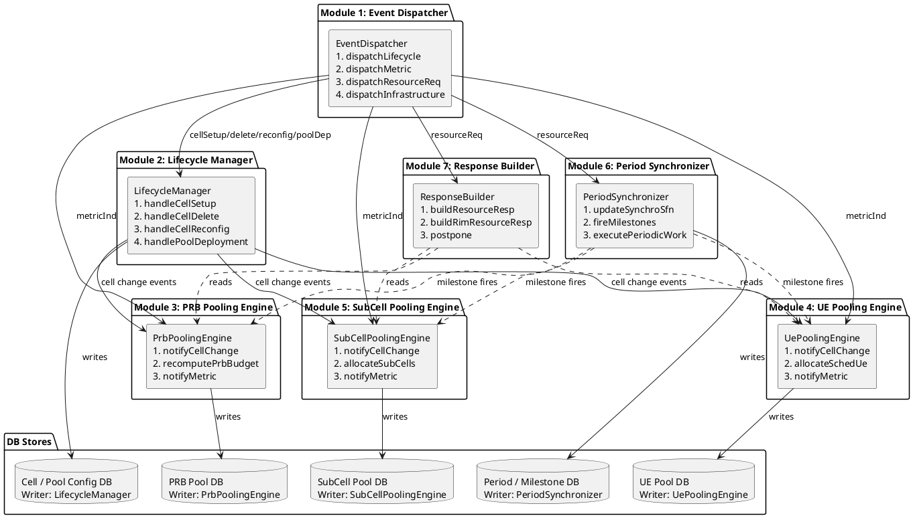

# L2PS BBRM Proposed Module Structure (modules)

```plantuml
@startuml L2PS BBRM Proposed Module Structure (modules)
!pragma graphviz svg
' scale 1920*1080

' skinparam linetype ortho
set namespaceSeparator ::
skinparam componentStyle rectangle

top to bottom direction

package "Module 1: Event Dispatcher" {
  component "EventDispatcher\n1. dispatchLifecycle\n2. dispatchMetric\n3. dispatchResourceReq\n4. dispatchInfrastructure" as DISP
}
package "Module 2: Lifecycle Manager" {
  component "LifecycleManager\n1. handleCellSetup\n2. handleCellDelete\n3. handleCellReconfig\n4. handlePoolDeployment" as LC
}
package "Module 3: PRB Pooling Engine" {
  component "PrbPoolingEngine\n1. notifyCellChange\n2. recomputePrbBudget\n3. notifyMetric" as PRB
}
package "Module 4: UE Pooling Engine" {
  component "UePoolingEngine\n1. notifyCellChange\n2. allocateSchedUe\n3. notifyMetric" as UE
}
package "Module 5: SubCell Pooling Engine" {
  component "SubCellPoolingEngine\n1. notifyCellChange\n2. allocateSubCells\n3. notifyMetric" as SC
}
package "Module 6: Period Synchronizer" {
  component "PeriodSynchronizer\n1. updateSynchroSfn\n2. fireMilestones\n3. executePeriodicWork" as SYNC
}
package "Module 7: Response Builder" {
  component "ResponseBuilder\n1. buildResourceResp\n2. buildRimResourceResp\n3. postpone" as RB
}

DISP -d-> LC : cellSetup/delete/reconfig/poolDep
DISP -d-> PRB : metricInd
DISP -d-> UE : metricInd
DISP -d-> SC : metricInd
DISP -d-> SYNC : resourceReq
DISP -d-> RB : resourceReq
LC -d-> PRB : cell change events
LC -d-> UE : cell change events
LC -d-> SC : cell change events
SYNC ..> PRB : milestone fires
SYNC ..> UE : milestone fires
SYNC ..> SC : milestone fires
RB ..> PRB : reads
RB ..> UE : reads
RB ..> SC : reads

package "DB Stores" {
  database "PRB Pool DB\nWriter: PrbPoolingEngine" as PRB_DB
  database "UE Pool DB\nWriter: UePoolingEngine" as UE_DB
  database "SubCell Pool DB\nWriter: SubCellPoolingEngine" as SUBCELL_DB
  database "Cell / Pool Config DB\nWriter: LifecycleManager" as CELL_DB
  database "Period / Milestone DB\nWriter: PeriodSynchronizer" as SYNC_DB
}

PRB -d-> PRB_DB : writes
UE -d-> UE_DB : writes
SC -d-> SUBCELL_DB : writes
LC -d-> CELL_DB : writes
SYNC -d-> SYNC_DB : writes
@enduml
```
