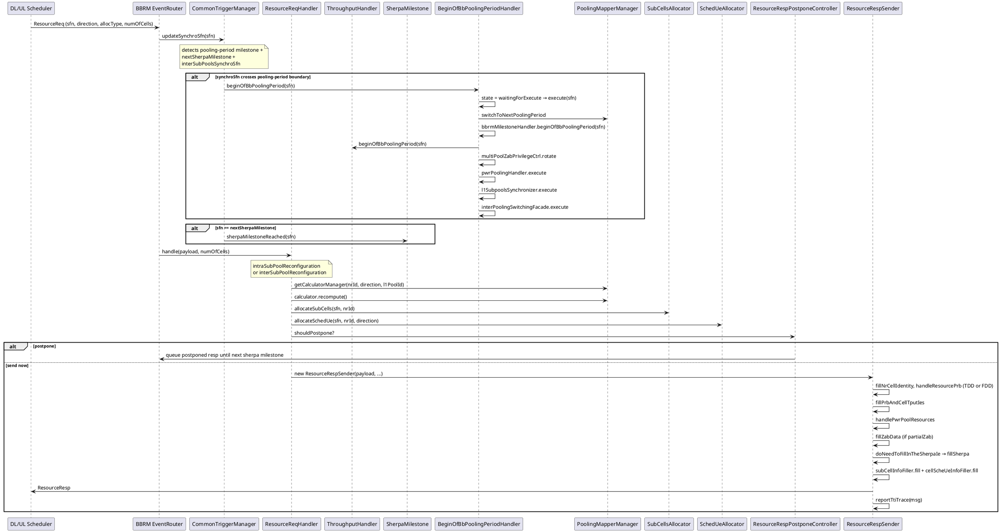

# L2PS BBRM Resource Request / Response Flow (Per-Slot Hot Path)

```plantuml
@startuml L2PS BBRM Resource Request / Response Flow (Per-Slot Hot Path)
participant "DL/UL Scheduler" as Sched
participant "BBRM EventRouter" as BBRM
participant "CommonTriggerManager" as CTM
participant "ResourceReqHandler" as ReqH
participant "ThroughputHandler" as Tput
participant "SherpaMilestone" as Sherpa
participant "BeginOfBbPoolingPeriodHandler" as BopP
participant "PoolingMapperManager" as Pooling
participant "SubCellsAllocator" as SubCell
participant "SchedUeAllocator" as SchedUe
participant "ResourceRespPostponeController" as PostpC
participant "ResourceRespSender" as RespS

    Sched->BBRM: ResourceReq (sfn, direction, allocType, numOfCells)
    BBRM->CTM: updateSynchroSfn(sfn)
    note over CTM: detects pooling-period milestone +\nnextSherpaMilestone +\ninterSubPoolsSynchroSfn
    alt synchroSfn crosses pooling-period boundary
        CTM->BopP: beginOfBbPoolingPeriod(sfn)
        BopP->BopP: state = waitingForExecute → execute(sfn)
        BopP->Pooling: switchToNextPoolingPeriod
        BopP->BopP: bbrmMilestoneHandler.beginOfBbPoolingPeriod(sfn)
        BopP->Tput: beginOfBbPoolingPeriod(sfn)
        BopP->BopP: multiPoolZabPrivilegeCtrl.rotate
        BopP->BopP: pwrPoolingHandler.execute
        BopP->BopP: l1SubpoolsSynchronizer.execute
        BopP->BopP: interPoolingSwitchingFacade.execute
    end
    alt sfn == nextSherpaMilestone
        CTM->Sherpa: sherpaMilestoneReached(sfn)
    end
    BBRM->ReqH: handle(payload, numOfCells)
    note over ReqH: intraSubPoolReconfiguration\nor interSubPoolReconfiguration
    ReqH->Pooling: getCalculatorManager(nrId, direction, l1PoolId)
    ReqH->Pooling: calculator.recompute()
    ReqH->SubCell: allocateSubCells(sfn, nrId)
    ReqH->SchedUe: allocateSchedUe(sfn, nrId, direction)
    ReqH->PostpC: shouldPostpone?
    alt postpone
        PostpC->BBRM: queue postponed resp until next sherpa milestone
    else send now
        ReqH->RespS: new ResourceRespSender(payload, ...)
        RespS->RespS: fillNrCellIdentity, handleResourcePrb (TDD or FDD)
        RespS->RespS: fillPrbAndCellTputIes
        RespS->RespS: handlePwrPoolResources
        RespS->RespS: fillZabData (if partialZab)
        RespS->RespS: doNeedToFillInTheSherpaIe → fillSherpa
        RespS->RespS: subCellInfoFiller.fill + cellScheUeInfoFiller.fill
        RespS->Sched: ResourceResp
        RespS->RespS: reportTtiTrace(msg)
    end
@enduml
```
