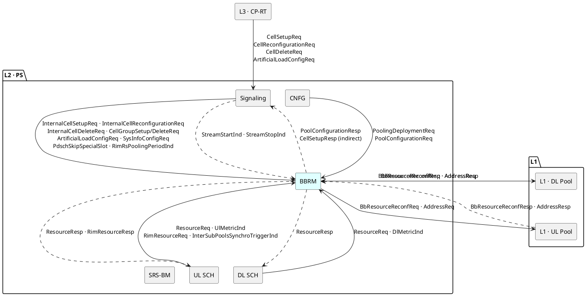

# L2PS BBRM Runtime Position

```plantuml
@startuml L2PS BBRM Runtime Position
!pragma graphviz svg
' scale 1920*1080

' skinparam linetype ortho
set namespaceSeparator ::
skinparam componentStyle rectangle

' top to bottom direction

component "L3 · CP-RT" as CPRT

package "L2 · PS" as L2PS {
  together {
    component "Signaling" as SGNL
    component "CNFG" as CNFG
  }

  together {
    component "DL SCH" as DLSCH
    component "UL SCH" as ULSCH
    component "SRS-BM" as SRSBM    
  }

  component "BBRM" as BBRM #LightCyan
}

package "L1" as L1 {
  component "L1 · DL Pool" as L1DLPOOL
  component "L1 · UL Pool" as L1ULPOOL
  L1DLPOOL -[hidden]d-> L1ULPOOL
}

CPRT --> SGNL : CellSetupReq\nCellReconfigurationReq\nCellDeleteReq\nArtificialLoadConfigReq
SGNL --> BBRM : InternalCellSetupReq · InternalCellReconfigurationReq\nInternalCellDeleteReq · CellGroupSetup/DeleteReq\nArtificialLoadConfigReq · SysInfoConfigReq\nPdschSkipSpecialSlot · RimRsPoolingPeriodInd
SGNL ..> BBRM : StreamStartInd · StreamStopInd
CNFG --> BBRM : PoolingDeploymentReq\nPoolConfigurationReq
DLSCH --> BBRM : ResourceReq · DlMetricInd
ULSCH --> BBRM : ResourceReq · UlMetricInd\nRimResourceReq · InterSubPoolsSynchroTriggerInd
BBRM ...> DLSCH : ResourceResp
BBRM ...> ULSCH : ResourceResp · RimResourceResp
BBRM ...> SGNL : PoolConfigurationResp\nCellSetupResp (indirect)
BBRM --> L1DLPOOL : BbResourceReconfReq · AddressReq
BBRM --> L1ULPOOL : BbResourceReconfReq · AddressReq
L1DLPOOL ...> BBRM : BbResourceReconfResp · AddressResp
L1ULPOOL ...> BBRM : BbResourceReconfResp · AddressResp

@enduml
```
