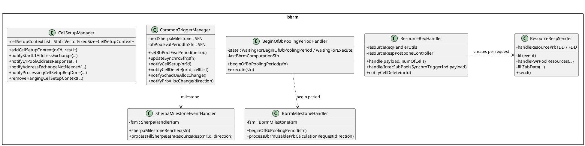

# L2PS BBRM Top-Level BBRM

```plantuml
@startuml L2PS BBRM Top-Level BBRM
!pragma graphviz svg
' scale 1920*1080

' skinparam linetype ortho
set namespaceSeparator ::
skinparam classAttributeIconSize 0
skinparam packageStyle rectangle

package bbrm {
  class CellSetupManager {
    -cellSetupContextList : StaticVectorFixedSize~CellSetupContext~
    +addCellSetupContext(nrId, result)
    +notifyStartL1AddressExchange(...)
    +notifyL1PoolAddressResponse(...)
    +notifyAddressExchangeNotNeeded(...)
    +notifyProcessingCellSetupReqDone(...)
    +removeHangingCellSetupContext(...)
  }

  class CommonTriggerManager {
    -nextSherpaMilestone : SFN
    -bbPoolEvalPeriodInSfn : SFN
    +setBbPoolEvalPeriod(period)
    +updateSynchroSfn(sfn)
    +notifyCellSetup(nrId)
    +notifyCellDelete(nrId, cellList)
    +notifySchedUeAllocChange()
    +notifyPrbAllocChange(direction)
  }

  class ResourceReqHandler {
    -resourceReqHandlerUtils
    -resourceRespPostponeController
    +handle(payload, numOfCells)
    +handle(InterSubPoolsSynchroTriggerInd payload)
    +notifyCellDelete(nrId)
  }

  class ResourceRespSender {
    -fill(event)
    -handleResourcePrbTDD / FDD
    -handlePwrPoolResources(...)
    -fillZabData(...)
    +send()
  }

  class BeginOfBbPoolingPeriodHandler {
    -state : waitingForBeginOfBbPoolingPeriod / waitingForExecute
    -lastBbrmComputationSfn
    +beginOfBbPoolingPeriod(sfn)
    +execute(sfn)
  }

  class SherpaMilestoneEventHandler {
    -fsm : SherpaHandlerFsm
    +sherpaMilestoneReached(sfn)
    +processFillSherpaIeInResourceResp(nrId, direction)
  }

  class BbrmMilestoneHandler {
    -fsm : BbrmMilestoneFsm
    +beginOfBbPoolingPeriod(sfn)
    +processBbrmUsablePrbCalculationRequest(direction)
  }

  ResourceReqHandler .r.> ResourceRespSender : creates per request
  CommonTriggerManager .d.> SherpaMilestoneEventHandler : milestone
  BeginOfBbPoolingPeriodHandler .d.> BbrmMilestoneHandler : begin period

  CellSetupManager -[hidden]r-> CommonTriggerManager
  CommonTriggerManager -[hidden]r-> ResourceReqHandler
  ResourceReqHandler -[hidden]r-> ResourceRespSender
  BeginOfBbPoolingPeriodHandler -[hidden]r-> SherpaMilestoneEventHandler
  SherpaMilestoneEventHandler -[hidden]r-> BbrmMilestoneHandler
}
@enduml
```
