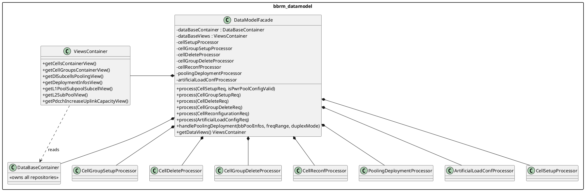

# L2PS BBRM Top-Level bbrm_datamodel

```plantuml
@startuml L2PS BBRM Top-Level bbrm_datamodel
!pragma graphviz svg
' scale 1920*1080

' skinparam linetype ortho
set namespaceSeparator ::
skinparam classAttributeIconSize 0
skinparam packageStyle rectangle

package bbrm_datamodel {
  class DataModelFacade {
    -dataBaseContainer : DataBaseContainer
    -dataBaseViews : ViewsContainer
    -cellSetupProcessor
    -cellGroupSetupProcessor
    -cellDeleteProcessor
    -cellGroupDeleteProcessor
    -cellReconfProcessor
    -poolingDeploymentProcessor
    -artificialLoadConfProcessor
    +process(CellSetupReq, isPwrPoolConfigValid)
    +process(CellGroupSetupReq)
    +process(CellDeleteReq)
    +process(CellGroupDeleteReq)
    +process(CellReconfigurationReq)
    +process(ArtificialLoadConfigReq)
    +handlePoolingDeployment(bbPoolInfos, freqRange, duplexMode)
    +getDataViews() ViewsContainer
  }

  class DataBaseContainer {
    <<owns all repositories>>
  }

  class ViewsContainer {
    +getCellsContainerView()
    +getCellGroupsContainerView()
    +getDlSubcellsPoolingView()
    +getDeploymentInfosView()
    +getL1PoolSubpoolSubcellView()
    +getL2SubPoolView()
    +getPdcchIncreaseUplinkCapacityView()
  }

  class CellSetupProcessor
  class CellGroupSetupProcessor
  class CellDeleteProcessor
  class CellGroupDeleteProcessor
  class CellReconfProcessor
  class PoolingDeploymentProcessor
  class ArtificialLoadConfProcessor

  DataModelFacade *-d- DataBaseContainer
  DataModelFacade *-l- ViewsContainer
  DataModelFacade *-d- CellSetupProcessor
  DataModelFacade *-d- CellGroupSetupProcessor
  DataModelFacade *-d- CellDeleteProcessor
  DataModelFacade *-d- CellGroupDeleteProcessor
  DataModelFacade *-d- CellReconfProcessor
  DataModelFacade *-d- PoolingDeploymentProcessor
  DataModelFacade *-d- ArtificialLoadConfProcessor
  ViewsContainer .u.> DataBaseContainer : reads
}
@enduml
```
