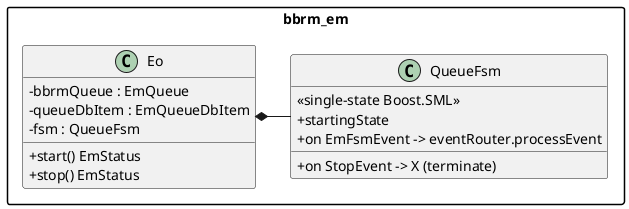

# L2PS BBRM Top-Level bbrm_em

```plantuml
@startuml L2PS BBRM Top-Level bbrm_em
!pragma graphviz svg
' scale 1920*1080

' skinparam linetype ortho
set namespaceSeparator ::
skinparam classAttributeIconSize 0
skinparam packageStyle rectangle

package bbrm_em {
  class Eo {
    -bbrmQueue : EmQueue
    -queueDbItem : EmQueueDbItem
    -fsm : QueueFsm
    +start() EmStatus
    +stop() EmStatus
  }

  class QueueFsm {
    <<single-state Boost.SML>>
    +startingState
    +on EmFsmEvent -> eventRouter.processEvent
    +on StopEvent -> X (terminate)
  }

  Eo *-r- QueueFsm
}
@enduml
```
