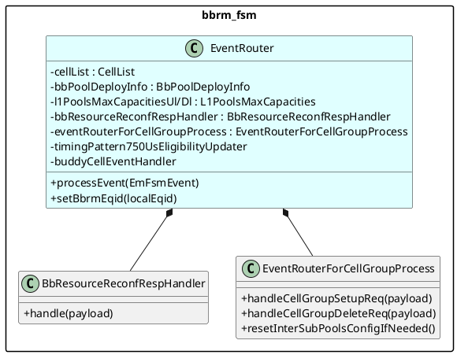

# L2PS BBRM Top-Level bbrm_fsm

```plantuml
@startuml L2PS BBRM Top-Level bbrm_fsm
!pragma graphviz svg
' scale 1920*1080

' skinparam linetype ortho
set namespaceSeparator ::
skinparam classAttributeIconSize 0
skinparam packageStyle rectangle

package bbrm_fsm {
  class EventRouter #LightCyan {
    -cellList : CellList
    -bbPoolDeployInfo : BbPoolDeployInfo
    -l1PoolsMaxCapacitiesUl/Dl : L1PoolsMaxCapacities
    -bbResourceReconfRespHandler : BbResourceReconfRespHandler
    -eventRouterForCellGroupProcess : EventRouterForCellGroupProcess
    -timingPattern750UsEligibilityUpdater
    -buddyCellEventHandler
    +processEvent(EmFsmEvent)
    +setBbrmEqid(localEqid)
  }

  class BbResourceReconfRespHandler {
    +handle(payload)
  }

  class EventRouterForCellGroupProcess {
    +handleCellGroupSetupReq(payload)
    +handleCellGroupDeleteReq(payload)
    +resetInterSubPoolsConfigIfNeeded()
  }

  EventRouter *-d- BbResourceReconfRespHandler
  EventRouter *-d- EventRouterForCellGroupProcess
}
@enduml
```
