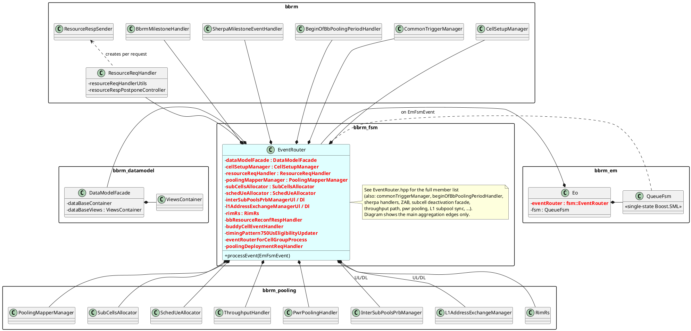

# L2PS BBRM Top-Level Overview

```plantuml
@startuml L2PS BBRM Top-Level Overview
!pragma graphviz svg
' scale 1920*1080

' skinparam linetype ortho
set namespaceSeparator ::
skinparam classAttributeIconSize 0
skinparam packageStyle rectangle

together {
  package bbrm_em {
    class Eo {
      - <color:red><b>eventRouter : fsm::EventRouter</b></color>
      - fsm : QueueFsm
    }

    class QueueFsm {
      <<single-state Boost.SML>>
    }

    Eo *-r- QueueFsm
  }

package bbrm_fsm {
  class EventRouter #LightCyan {
    - <color:red><b>dataModelFacade : DataModelFacade</b></color>
    - <color:red><b>cellSetupManager : CellSetupManager</b></color>
    - <color:red><b>resourceReqHandler : ResourceReqHandler</b></color>
    - <color:red><b>poolingMapperManager : PoolingMapperManager</b></color>
    - <color:red><b>subCellsAllocator : SubCellsAllocator</b></color>
    - <color:red><b>schedUeAllocator : SchedUeAllocator</b></color>
    - <color:red><b>interSubPoolsPrbManagerUl / Dl</b></color>
    - <color:red><b>l1AddressExchangeManagerUl / Dl</b></color>
    - <color:red><b>rimRs : RimRs</b></color>
    - <color:red><b>bbResourceReconfRespHandler</b></color>
    - <color:red><b>buddyCellEventHandler</b></color>
    - <color:red><b>timingPattern750UsEligibilityUpdater</b></color>
    - <color:red><b>eventRouterForCellGroupProcess</b></color>
    - <color:red><b>poolingDeploymentReqHandler</b></color>
    + processEvent(EmFsmEvent)
  }

  note right of EventRouter
    See EventRouter.hpp for the full member list
    (also: commonTriggerManager, beginOfBbPoolingPeriodHandler,
    sherpa handlers, ZAB, subcell deactivation facade,
    throughput path, pwr pooling, L1 subpool sync, ...).
    Diagram shows the main aggregation edges only.
  end note
}

  package bbrm_datamodel {
    class DataModelFacade {
      - dataBaseContainer
      - dataBaseViews : ViewsContainer
    }

    class ViewsContainer

    DataModelFacade *-r- ViewsContainer
  }
}


package bbrm {
  class CellSetupManager
  class CommonTriggerManager
  class ResourceReqHandler {
    - resourceReqHandlerUtils
    - resourceRespPostponeController
  }
  class ResourceRespSender
  class BeginOfBbPoolingPeriodHandler
  class SherpaMilestoneEventHandler
  class BbrmMilestoneHandler

  ResourceReqHandler .u.> ResourceRespSender : creates per request
  ' BeginOfBbPoolingPeriodHandler ..> BbrmMilestoneHandler : triggers
  ' CommonTriggerManager ..> SherpaMilestoneEventHandler : milestone
}

package bbrm_pooling {
  class PoolingMapperManager
  class SubCellsAllocator
  class SchedUeAllocator
  class ThroughputHandler
  class PwrPoolingHandler
  class InterSubPoolsPrbManager
  class L1AddressExchangeManager
  class RimRs

  PoolingMapperManager -[hidden]r-> SubCellsAllocator
  SubCellsAllocator -[hidden]r-> SchedUeAllocator
  SchedUeAllocator -[hidden]r-> ThroughputHandler
  ThroughputHandler -[hidden]r-> PwrPoolingHandler
  PwrPoolingHandler -[hidden]r-> InterSubPoolsPrbManager
  InterSubPoolsPrbManager -[hidden]r-> L1AddressExchangeManager
  L1AddressExchangeManager -[hidden]r-> RimRs
}


Eo *-r- EventRouter
QueueFsm ..r.> EventRouter : on EmFsmEvent
EventRouter *-r- DataModelFacade

EventRouter *-u- CellSetupManager
EventRouter *-u- CommonTriggerManager
EventRouter *-u- ResourceReqHandler
EventRouter *-u- BeginOfBbPoolingPeriodHandler
EventRouter *-u- SherpaMilestoneEventHandler
EventRouter *-u- BbrmMilestoneHandler


EventRouter *-d- PoolingMapperManager
EventRouter *-d- SubCellsAllocator
EventRouter *-d- SchedUeAllocator
EventRouter *-d- ThroughputHandler
EventRouter *-d- PwrPoolingHandler
EventRouter *-d- InterSubPoolsPrbManager : UL/DL
EventRouter *-d- L1AddressExchangeManager : UL/DL
EventRouter *-d- RimRs

@enduml
```
