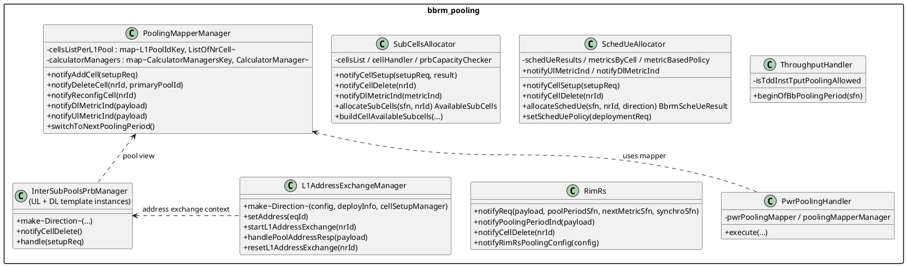

# L2PS BBRM Top-Level bbrm_pooling

```plantuml
@startuml L2PS BBRM Top-Level bbrm_pooling
!pragma graphviz svg
' scale 1920*1080

' skinparam linetype ortho
set namespaceSeparator ::
skinparam classAttributeIconSize 0
skinparam packageStyle rectangle

package bbrm_pooling {
  class PoolingMapperManager {
    -cellsListPerL1Pool : map~L1PoolIdKey, ListOfNrCell~
    -calculatorManagers : map~CalculatorManagersKey, CalculatorManager~
    +notifyAddCell(setupReq)
    +notifyDeleteCell(nrId, primaryPoolId)
    +notifyReconfigCell(nrId)
    +notifyDlMetricInd(payload)
    +notifyUlMetricInd(payload)
    +switchToNextPoolingPeriod()
  }

  class SubCellsAllocator {
    -cellsList / cellHandler / prbCapacityChecker
    +notifyCellSetup(setupReq, result)
    +notifyCellDelete(nrId)
    +notifyDlMetricInd(metricInd)
    +allocateSubCells(sfn, nrId) AvailableSubCells
    +buildCellAvailableSubcells(...)
  }

  class SchedUeAllocator {
    -schedUeResults / metricsByCell / metricBasedPolicy
    +notifyCellSetup(setupReq)
    +notifyCellDelete(nrId)
    +notifyUlMetricInd / notifyDlMetricInd
    +allocateSchedUe(sfn, nrId, direction) BbrmScheUeResult
    +setSchedUePolicy(deploymentReq)
  }

  class ThroughputHandler {
    -isTddInstTputPoolingAllowed
    +beginOfBbPoolingPeriod(sfn)
  }

  class PwrPoolingHandler {
    -pwrPoolingMapper / poolingMapperManager
    +execute(...)
  }

  class "InterSubPoolsPrbManager\n(UL + DL template instances)" as InterSubPoolsPrbManager {
    +make~Direction~(...)
    +notifyCellDelete()
    +handle(setupReq)
  }

  class L1AddressExchangeManager {
    +make~Direction~(config, deployInfo, cellSetupManager)
    +setAddress(eqId)
    +startL1AddressExchange(nrId)
    +handlePoolAddressResp(payload)
    +resetL1AddressExchange(nrId)
  }

  class RimRs {
    +notifyReq(payload, poolPeriodSfn, nextMetricSfn, synchroSfn)
    +notifyPoolingPeriodInd(payload)
    +notifyCellDelete(nrId)
    +notifyRimRsPoolingConfig(config)
  }

  PwrPoolingHandler .u.> PoolingMapperManager : uses mapper
  InterSubPoolsPrbManager .u.> PoolingMapperManager : pool view
  L1AddressExchangeManager .u.> InterSubPoolsPrbManager : address exchange context

  PoolingMapperManager -[hidden]r-> SubCellsAllocator
  SubCellsAllocator -[hidden]r-> SchedUeAllocator
  SchedUeAllocator -[hidden]r-> ThroughputHandler
  ThroughputHandler -[hidden]d-> PwrPoolingHandler
  PwrPoolingHandler -[hidden]r-> InterSubPoolsPrbManager
  InterSubPoolsPrbManager -[hidden]r-> L1AddressExchangeManager
  L1AddressExchangeManager -[hidden]r-> RimRs
}
@enduml
```
