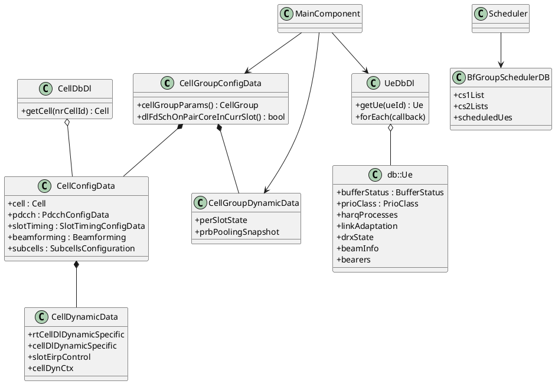

# L2PS DLSCH DB Model

```plantuml
@startuml L2PS DLSCH DB Model
!pragma graphviz svg
' scale 1920*1080

' skinparam linetype ortho
set namespaceSeparator ::
skinparam classAttributeIconSize 0
skinparam packageStyle rectangle

class CellGroupConfigData {
    +cellGroupParams() : CellGroup
    +dlFdSchOnPairCoreInCurrSlot() : bool
}
class CellConfigData {
    +cell : Cell
    +pdcch : PdcchConfigData
    +slotTiming : SlotTimingConfigData
    +beamforming : Beamforming
    +subcells : SubcellsConfiguration
}
class CellDynamicData {
    +rtCellDlDynamicSpecific
    +cellDlDynamicSpecific
    +slotEirpControl
    +cellDynCtx
}
class CellDbDl {
    +getCell(nrCellId) : Cell
}
class CellGroupDynamicData {
    +perSlotState
    +prbPoolingSnapshot
}
class UeDbDl {
    +getUe(ueId) : Ue
    +forEach(callback)
}
class "db::Ue" as UeData {
    +bufferStatus : BufferStatus
    +prioClass : PrioClass
    +harqProcesses
    +linkAdaptation
    +drxState
    +beamInfo
    +bearers
}
class BfGroupSchedulerDB {
    +cs1List
    +cs2Lists
    +scheduledUes
}
CellGroupConfigData *-- CellConfigData
CellConfigData *-- CellDynamicData
CellDbDl o-- CellConfigData
CellGroupConfigData *-- CellGroupDynamicData
UeDbDl o-- UeData
MainComponent --> CellGroupConfigData
MainComponent --> CellGroupDynamicData
MainComponent --> UeDbDl
Scheduler --> BfGroupSchedulerDB
@enduml
```
