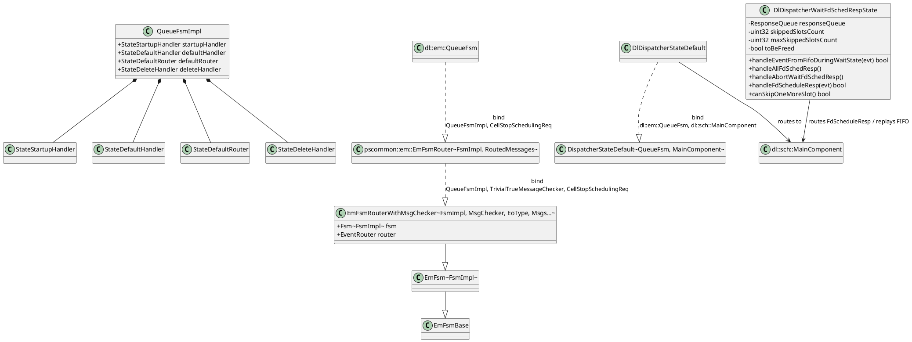

# L2PS DLSCH Dispatcher Class Hierarchy

```plantuml
@startuml L2PS DLSCH Dispatcher Class Hierarchy
!pragma graphviz svg
' scale 1920*1080

' skinparam linetype ortho
set namespaceSeparator ::
skinparam classAttributeIconSize 0
skinparam packageStyle rectangle

class StateStartupHandler
class StateDefaultHandler
class StateDefaultRouter
class StateDeleteHandler
class QueueFsmImpl {
    +StateStartupHandler startupHandler
    +StateDefaultHandler defaultHandler
    +StateDefaultRouter defaultRouter
    +StateDeleteHandler deleteHandler
}
QueueFsmImpl *-- StateStartupHandler
QueueFsmImpl *-- StateDefaultHandler
QueueFsmImpl *-- StateDefaultRouter
QueueFsmImpl *-- StateDeleteHandler
class EmFsmBase
class "EmFsm~FsmImpl~" as EmFsm
class "EmFsmRouterWithMsgChecker~FsmImpl, MsgChecker, EoType, Msgs...~" as EmFsmRouterWithMsgChecker {
    +Fsm~FsmImpl~ fsm
    +EventRouter router
}
class "pscommon::em::EmFsmRouter~FsmImpl, RoutedMessages~" as EmFsmRouter
class "DispatcherStateDefault~QueueFsm, MainComponent~" as DispatcherStateDefault
class "dl::em::QueueFsm" as QueueFsm
class DlDispatcherStateDefault
class "dl::sch::MainComponent" as DlMainComponent
class DlDispatcherWaitFdSchedRespState {
    -ResponseQueue responseQueue
    -uint32 skippedSlotsCount
    -uint32 maxSkippedSlotsCount
    -bool toBeFreed
    +handleEventFromFifoDuringWaitState(evt) bool
    +handleAllFdSchedResp()
    +handleAbortWaitFdSchedResp()
    +handleFdScheduleResp(evt) bool
    +canSkipOneMoreSlot() bool
}
EmFsm --|> EmFsmBase
EmFsmRouterWithMsgChecker --|> EmFsm
EmFsmRouter ..|> EmFsmRouterWithMsgChecker : bind\nQueueFsmImpl, TrivialTrueMessageChecker, CellStopSchedulingReq
QueueFsm ..|> EmFsmRouter : bind\nQueueFsmImpl, CellStopSchedulingReq
DlDispatcherStateDefault ..|> DispatcherStateDefault : bind\ndl::em::QueueFsm, dl::sch::MainComponent
DlDispatcherStateDefault --> DlMainComponent : routes to
DlDispatcherWaitFdSchedRespState --> DlMainComponent : routes FdScheduleResp / replays FIFO
@enduml
```
