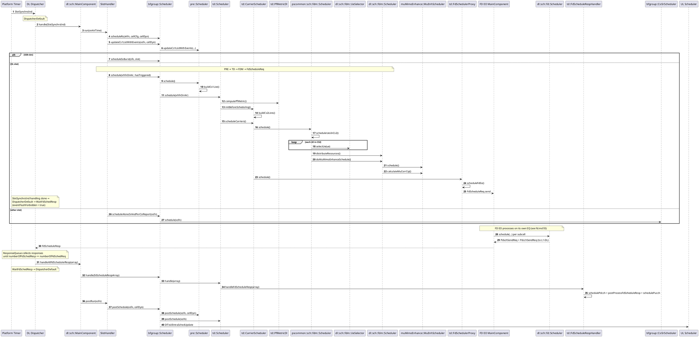

# L2PS DLSCH End-to-End Per-Slot Sequence

```plantuml
@startuml L2PS DLSCH End-to-End Per-Slot Sequence
!pragma graphviz svg
' scale 1920*1080

    autonumber
participant "Platform Timer" as PLAT
participant "DL Dispatcher" as DLDISP
participant "dl::sch::MainComponent" as MC
participant "SlotHandler" as SH
participant "bfgroup::Scheduler" as BFG
participant "pre::Scheduler" as PRE
participant "td::Scheduler" as TD
participant "td::CarrierScheduler" as CAR
participant "td::PfMetricDl" as PF
participant "pscommon::sch::fdm::Scheduler" as FDMC
participant "dl::sch::fdm::UeSelector" as SEL
participant "dl::sch::fdm::Scheduler" as FDM
participant "muMimoEnhance::MuEnhScheduler" as MU
participant "td::FdSchedulerProxy" as FPRX
participant "FD EO MainComponent" as FD
participant "dl::sch::fd::Scheduler" as FDSCH
participant "td::FdScheduleRespHandler" as FRH
participant "bfgroup::CsiSrScheduler" as CSISR
participant "UL Scheduler" as UL
    PLAT->DLDISP: SlotSynchroInd
    note over DLDISP
      DispatcherDefault
    end note
    DLDISP->MC: handle(SlotSynchroInd)
    MC->SH: run(onAirTime)
    SH->BFG: scheduleRs(xhfn, cellCfg, cellDyn)
    SH->BFG: updateCs1ListWithEvents(xsfn, cellDyn)
    BFG->PRE: updateCs1ListWithEvents(...)
    alt SSB slot
        SH->BFG: scheduleSsBurst(sfn, slot)
    else DL slot
        note over SH,FDM
          PRE → TD → FDM → FdScheduleReq
        end note
        SH->BFG: schedule(xhfnOnAir, hasTriggered)
        BFG->PRE: schedule()
        PRE->PRE: buildCs1List()
        BFG->TD: schedule(xhfnOnAir)
        TD->PF: computePfMetric()
        TD->CAR: initBeforeScheduling()
        CAR->CAR: buildCs2Lists()
        TD->CAR: scheduleCarriers()
        CAR->FDMC: schedule()
        FDMC->FDMC: scheduleUesInCs2()
        loop each UE in CS2
            FDMC->SEL: selectUe(ue)
        end
        FDMC->FDM: distributeResources()
        FDMC->FDM: doMuMimoEnhanceSchedule()
        FDM->MU: schedule()
        FDM->MU: calculateMuCorrCqi()
        CAR->FPRX: schedule()
        FPRX->FPRX: scheduleFdEo()
        FPRX-->FD: FdScheduleReq.send
        note over DLDISP
          SlotSynchroInd handling done →
          DispatcherDefault → WaitFdSchedResp
          (eventFlushForbidden = true)
        end note
    else other slot
        SH->BFG: scheduleAloneSrAndPerCsiReport(xsfn)
        BFG->CSISR: schedule(xsfn)
    end
    note over FD,FDSCH
      FD EO processes on its own EQ (see fd.md §5)
    end note
    FD->FDSCH: schedule(...) per subcell
    FDSCH-->FD: PdschSendReq + PdcchSendReq (to L1-DL)
    FD-->DLDISP: FdScheduleResp
    note over DLDISP
      ResponseQueue collects responses
      until numberOfFdSchedResp == numberOfFdSchedReq
    end note
    DLDISP->MC: handleAllFdSchedulerResp(array)
    note over DLDISP
      WaitFdSchedResp → DispatcherDefault
    end note
    MC->BFG: handle(fdScheduleRespArray)
    BFG->TD: handle(array)
    TD->FRH: handleFdScheduleResp(array)
    FRH->FRH: schedulePdcch + postProcessFdScheduleResp + schedulePucch
    MC->SH: postRun(xsfn)
    SH->BFG: postSchedule(xsfn, cellDyn)
    BFG->PRE: postSchedule(xsfn, cellDyn)
    BFG->TD: postSchedule(xsfn)
    BFG->UL: DlToUlIntraSchedUpdate
@enduml
```
