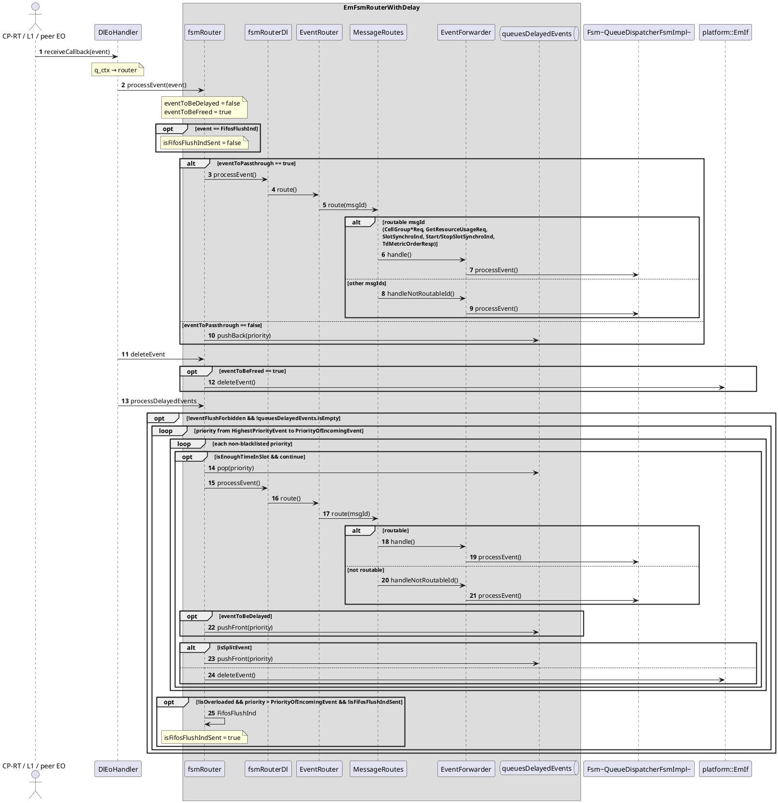

# L2PS DLSCH FIFO Event Dispatch Sequence

```plantuml
@startuml L2PS DLSCH FIFO Event Dispatch Sequence
!pragma graphviz svg
' scale 1920*1080

    autonumber
    actor "CP-RT / L1 / peer EO" as Sender
participant "DlEoHandler" as EH
    box "EmFsmRouterWithDelay"
participant "fsmRouter" as FR
participant "fsmRouterDl" as FRDL
participant "EventRouter" as ROUT
participant "MessageRoutes" as ROUTES
participant "EventForwarder" as FWD
    queue "queuesDelayedEvents" as QQ
    end box
participant "Fsm~QueueDispatcherFsmImpl~" as FSM
participant "platform::EmIf" as PLAT
    Sender->EH: receiveCallback(event)
    note over EH
      q_ctx → router
    end note
    EH->FR: processEvent(event)
    note over FR
      eventToBeDelayed = false
      eventToBeFreed = true
    end note
    opt event == FifosFlushInd
        note over FR
          isFifosFlushIndSent = false
        end note
    end
    alt eventToPassthrough == true
        FR->FRDL: processEvent()
        FRDL->ROUT: route()
        ROUT->ROUTES: route(msgId)
        alt routable msgId\n(CellGroup*Req, GetResourceUsageReq,\nSlotSynchroInd, Start/StopSlotSynchroInd,\nTdMetricOrderResp)
            ROUTES->FWD: handle()
            FWD->FSM: processEvent()
        else other msgIds
            ROUTES->FWD: handleNotRoutableId()
            FWD->FSM: processEvent()
        end
    else eventToPassthrough == false
        FR->QQ: pushBack(priority)
    end
    EH->FR: deleteEvent
    opt eventToBeFreed == true
        FR->PLAT: deleteEvent()
    end
    EH->FR: processDelayedEvents
    opt !eventFlushForbidden && !queuesDelayedEvents.isEmpty
        loop priority from HighestPriorityEvent to PriorityOfIncomingEvent
            loop each non-blacklisted priority
                opt isEnoughTimeInSlot && continue
                    FR->QQ: pop(priority)
                    FR->FRDL: processEvent()
                    FRDL->ROUT: route()
                    ROUT->ROUTES: route(msgId)
                    alt routable
                        ROUTES->FWD: handle()
                        FWD->FSM: processEvent()
                    else not routable
                        ROUTES->FWD: handleNotRoutableId()
                        FWD->FSM: processEvent()
                    end
                    opt eventToBeDelayed
                        FR->QQ: pushFront(priority)
                    end
                    alt isSplitEvent
                        FR->QQ: pushFront(priority)
                    else
                        FR->PLAT: deleteEvent()
                    end
                end
            end
            opt !isOverloaded && priority > PriorityOfIncomingEvent && !isFifosFlushIndSent
                FR->FR: FifosFlushInd
                note over FR
                  isFifosFlushIndSent = true
                end note
            end
        end
    end
@enduml
```
