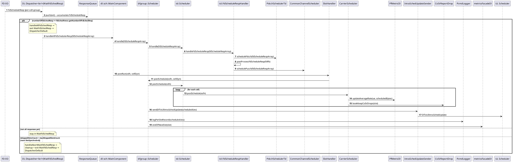

# L2PS DLSCH Post Stage Sequence

```plantuml
@startuml L2PS DLSCH Post Stage Sequence
!pragma graphviz svg
' scale 1920*1080

    autonumber
participant "FD EO" as FD
participant "DL Dispatcher<br/>(WaitFdSchedResp)" as DLDISP
participant "ResponseQueue" as RQ
participant "dl::sch::MainComponent" as MC
participant "bfgroup::Scheduler" as BFG
participant "td::Scheduler" as TD
participant "td::FdScheduleRespHandler" as FRH
participant "PdcchSchedulerTd" as PDCT
participant "CommonChannelScheduler" as CC
participant "SlotHandler" as SH
participant "CarrierScheduler" as CAR
participant "PfMetricDl" as PF
participant "IntraSchedUpdateSender" as ISCH
participant "CsiSrReportDrop" as CSI
participant "PcmdLogger" as PCMD
participant "metricsFacadeDl" as METR
participant "UL Scheduler" as UL
    FD->DLDISP: FdScheduleResp (per-cell-group)
    DLDISP->RQ: push(evt) -- accumulate FdScheduleResp
    alt numberOfFdSchedResp == fdSchedFence.getNumberOfFdSchedReq
        note over DLDISP
          handleAllFdSchedResp →
          exit WaitFdSchedResp →
          DispatcherDefault
        end note
        DLDISP->MC: handleAllFdSchedulerResp(fdScheduleRespArray)
        MC->BFG: handle(fdScheduleRespArray)
        BFG->TD: handle(fdScheduleRespArray)
        TD->FRH: handleFdScheduleResp(fdScheduleRespArray)
        FRH->PDCT: schedulePdcch(fdScheduleRespArray)
        FRH->FRH: postProcessFdScheduleResp(fdFb)
        FRH->CC: schedulePucch(fdScheduleRespArray)
        MC->SH: postRun(xsfn, cellDyn)
        SH->BFG: postSchedule(xsfn, cellDyn)
        BFG->TD: postSchedule(xsfn)
        loop for each cell
            TD->CAR: postSchedule(xsfn)
            CAR->PF: updateAverageRate(ue, scheduledBytes)
            CAR->CSI: bookKeepCsiSrDrops(slot)
        end
        BFG->ISCH: sendDlToUlIntraSchedUpdate(scheduledUes)
        ISCH->UL: DlToUlIntraSchedUpdate
        BFG->PCMD: logPerSlotRecord(scheduledUes)
        BFG->METR: endOfNewSlot(slot)
    else not all responses yet
        note over DLDISP
          stay in WaitFdSchedResp
        end note
    else skippedSlotsCount > maxSkippedSlotsCount\n(next SlotSynchroInd)
        note over DLDISP
          handleAbortWaitFdSchedResp →
          cleanup + exit WaitFdSchedResp →
          DispatcherDefault
        end note
    end
@enduml
```
